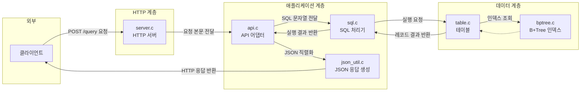
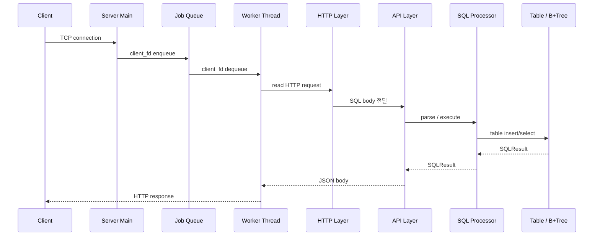
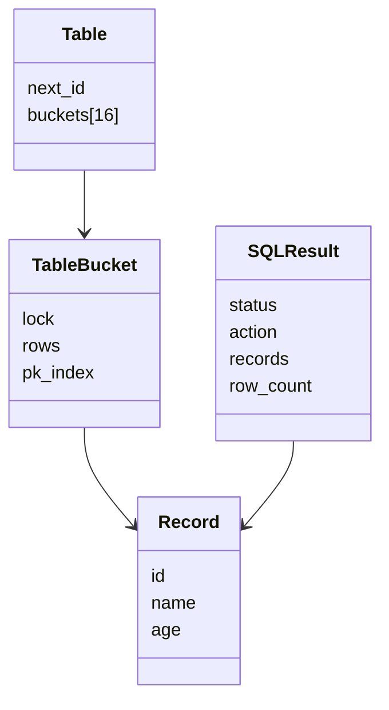
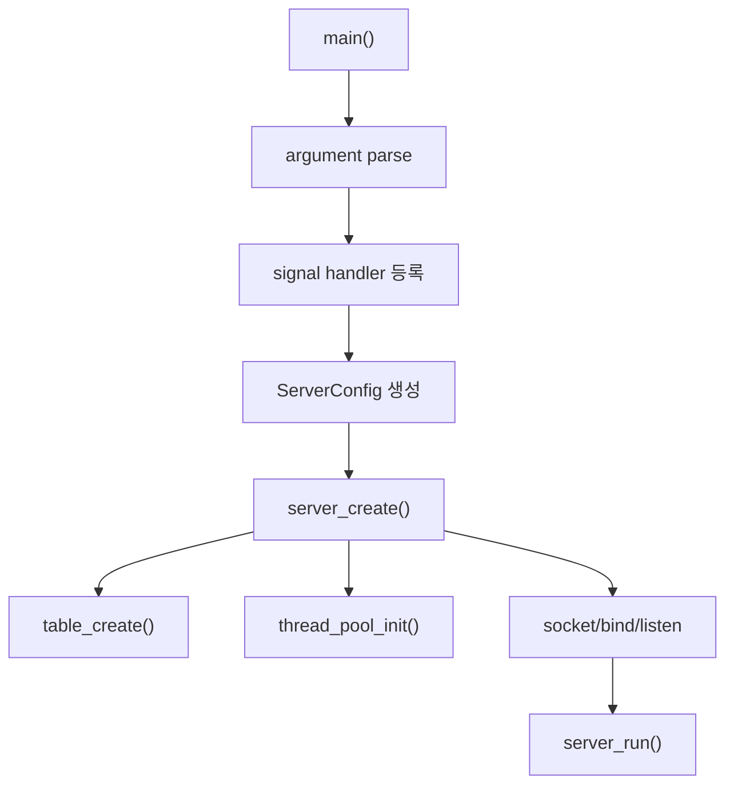
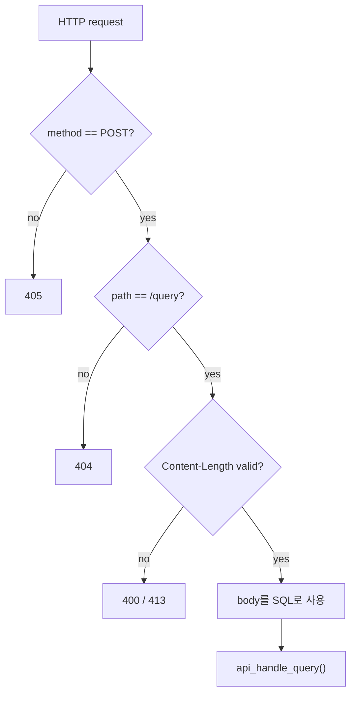
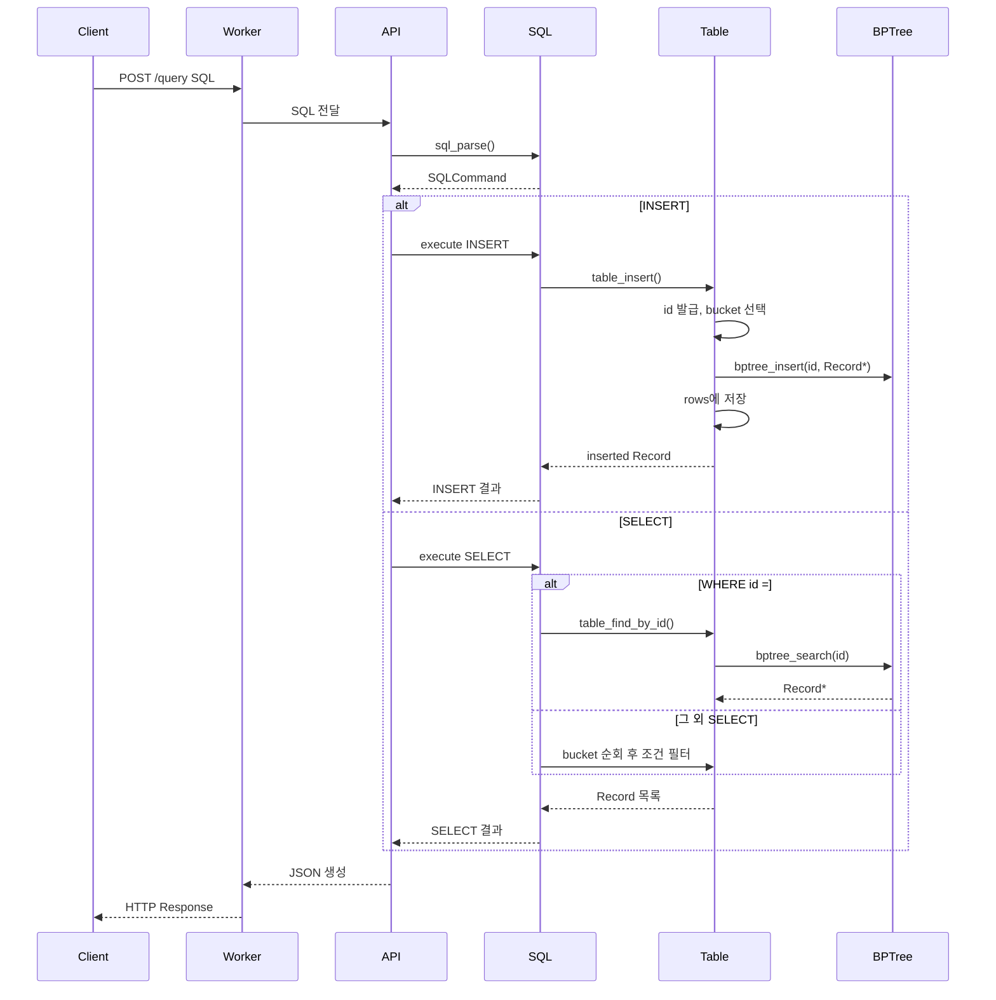
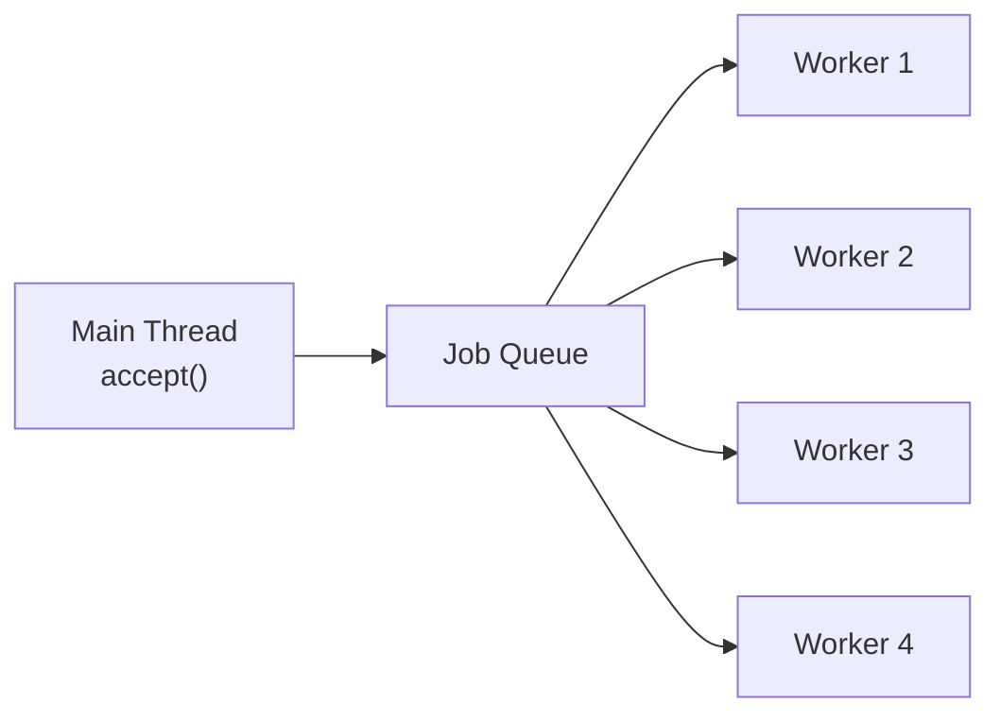
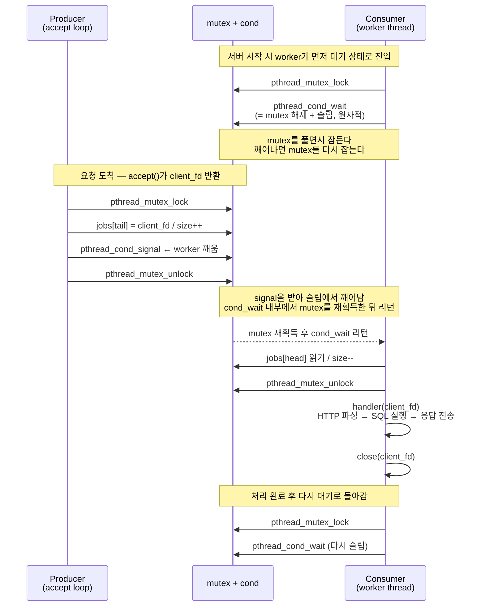
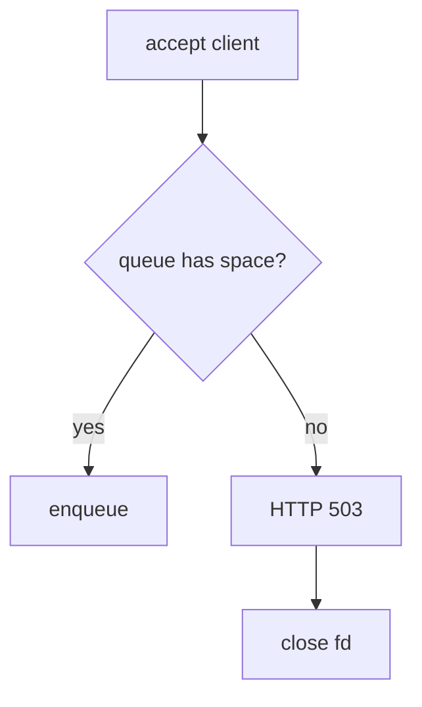
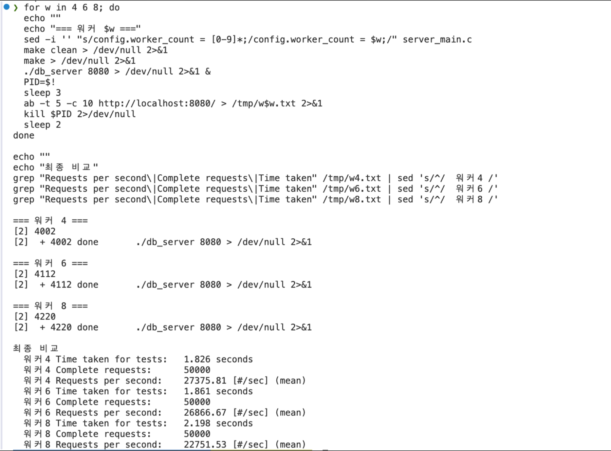

# Mini DBMS API Server with SQL Processor and B+Tree Index

> 발표용 분석 문서입니다.  
> 목표는 코드를 많이 보여주는 것이 아니라, **요청이 서버를 거쳐 SQL Processor와 B+Tree까지 흘러가는 이유와 구조**를 설명하는 것입니다.

---

## 발표 전 체크

현재 소스 기준으로 `sql_processor` 단위 테스트는 통과합니다.

```bash
make -C sql_processor clean
make -C sql_processor unit_test
./sql_processor/unit_test
```

결과:

```text
All unit tests passed.
```

서버도 클린 빌드 기준으로 통과합니다.

```bash
make clean
make db_server
```

현재 구조는 `api_handle_query(Table *table, const char *sql, ApiResult *result)` 형태로 API 계층에 SQL 문자열을 넘기고, DB 보호는 `Table` 내부 bucket lock이 담당합니다.

---

## 1. 어떤 프로젝트인가

### 1-1. 프로젝트 목적

이 프로젝트는 C로 구현한 **메모리 기반 Mini DBMS API Server**입니다.

기존 `sql_processor`는 터미널에서 SQL을 입력받아 실행하는 구조였습니다. 이번 프로젝트는 그 위에 HTTP 서버를 붙여, 클라이언트가 SQL을 API로 보내면 서버가 SQL Processor를 호출하고 JSON 응답을 돌려주는 구조로 확장했습니다.



### 1-2. 기존 SQL Processor와 달라진 점

기존 구조:

```text
사용자 입력
 -> SQL 파싱
 -> Table / B+Tree 실행
 -> 콘솔 출력
```

API 서버 구조:

```text
HTTP 요청
 -> 소켓 accept
 -> Thread Pool
 -> HTTP request 파싱
 -> SQL 실행
 -> JSON 응답
```

달라진 핵심은 SQL 엔진 자체보다 **SQL 엔진을 네트워크 요청 처리 흐름 안에 연결했다는 점**입니다.

### 1-3. 현재 지원 범위

현재 지원하는 테이블은 `users` 하나입니다.

| 구분 | 지원 범위 |
|---|---|
| 테이블 | `users` |
| 컬럼 | `id`, `name`, `age` |
| INSERT | `INSERT INTO users VALUES ('Alice', 20);` |
| SELECT 전체 | `SELECT * FROM users;` |
| id 조건 | `=`, `<`, `<=`, `>`, `>=` |
| name 조건 | `=` |
| age 조건 | `=`, `<`, `<=`, `>`, `>=` |
| 저장 방식 | 메모리 기반 |
| id 인덱스 | B+Tree |

---

## 2. 팀 목표와 발표 포인트

### 2-1. 구현 목표

- C 기반 HTTP API 서버 구현
- 기존 SQL Processor 재사용
- Thread Pool로 동시 요청 처리
- `id` 기반 B+Tree 인덱스 활용
- SQL 실행 결과를 JSON으로 반환
- Docker 기반 실행 환경 제공

### 2-2. 학습 목표

- 소켓 서버의 기본 흐름 이해
- HTTP 요청이 직접 파싱되는 과정 이해
- Thread Pool과 Job Queue의 producer-consumer 구조 이해
- B+Tree 인덱스가 왜 필요한지 이해
- 공유 메모리 구조에서 lock이 왜 필요한지 이해

### 2-3. 발표에서 강조할 핵심

> 완성형 DBMS를 만든 것이 아니라, HTTP 서버에서 SQL Processor와 B+Tree 인덱스까지 이어지는 핵심 흐름을 작게 재현했다.

발표에서는 아래 세 가지를 중심으로 설명하면 좋습니다.

- HTTP 요청이 어떻게 SQL 실행으로 이어지는가
- Thread Pool이 왜 필요한가
- `WHERE id = ...`에서 B+Tree가 어떻게 사용되는가

---

## 3. 전체 아키텍처

### 3-1. 전체 요청 처리 흐름



### 3-2. 계층 구조

```text
server_main.c
  -> server/
      server.c
      http.c
      api.c
      thread_pool.c
      json_util.c

  -> sql_processor/
      sql.c
      table.c
      bptree.c
```

이 구조를 나눈 이유는 각 파일의 책임을 분리하기 위해서입니다.

- `server_main.c`: 실행 시작점
- `server.c`: 소켓과 서버 생명주기
- `http.c`: HTTP 문법 처리
- `api.c`: SQL 결과를 HTTP JSON으로 변환
- `thread_pool.c`: 동시 요청 처리
- `sql.c`: SQL 파싱과 실행 계획
- `table.c`: 실제 row 저장
- `bptree.c`: 인덱스 검색


### 3-3. API 서버와 DB 엔진 연결 구조

이렇게 분리한 이유는 서버 코드가 SQL 문법 세부 사항까지 알 필요가 없기 때문입니다. 서버는 네트워크와 응답 형식에 집중하고, DB 엔진은 데이터 처리에 집중합니다.

---

## 4. 코드 구조

### 4-1. 서버 진입점

파일: `server_main.c`

역할:

- 포트 번호 파싱
- worker 수 설정
- queue 크기 설정
- signal handler 등록
- `server_create()`와 `server_run()` 호출

왜 필요한가:

서버 실행 설정을 한 곳에 모아야 실행 방식이 명확해집니다. 포트, worker 수, queue 크기는 서버 운영 정책이므로 SQL 엔진 내부에 두면 책임이 섞입니다.

### 4-2. HTTP 계층

파일: `server/http.c`, `server/http.h`

역할:

- request line 파싱
- method/path 검증
- `Content-Length` 확인
- body 읽기
- HTTP response 작성

왜 필요한가:

SQL Processor는 HTTP를 알 필요가 없습니다. HTTP 문법 오류와 SQL 문법 오류를 분리하기 위해 HTTP 계층이 따로 필요합니다.

### 4-3. API 계층

파일: `server/api.c`, `server/api.h`

역할:

- SQL 문자열을 SQL Processor에 전달
- `SQLResult`를 JSON으로 변환
- SQL 오류를 JSON 응답으로 표준화

왜 필요한가:

DB 엔진 결과는 C 구조체이고, 클라이언트는 JSON을 기대합니다. 이 둘 사이를 변환하는 adapter가 있어야 서버와 DB 엔진이 서로 독립적으로 유지됩니다.

### 4-4. Thread Pool 계층

파일: `server/thread_pool.c`, `server/thread_pool.h`

역할:

- worker thread 생성
- client fd queue 관리
- queue full 감지
- shutdown 시 worker 정리

왜 필요한가:

요청마다 스레드를 만들면 요청이 몰릴 때 스레드 생성 비용과 메모리 사용량이 커집니다. Thread Pool은 미리 만든 worker를 재사용하므로 처리량을 더 예측 가능하게 만듭니다.

### 4-5. DB 엔진 계층

파일:

- `sql_processor/sql.c`
- `sql_processor/table.c`
- `sql_processor/bptree.c`

역할:

- SQL 파싱
- INSERT / SELECT 실행
- row 저장
- id 기반 B+Tree 인덱스 검색

왜 필요한가:

서버가 커져도 DB 엔진은 독립적으로 테스트할 수 있어야 합니다. 실제로 `sql_processor/unit_test.c`는 서버 없이 SQL 엔진만 검증합니다.

### 4-6. 테스트 / 스크립트 / 배포 파일

| 파일/폴더 | 역할 |
|---|---|
| `scripts/tests/sql/unit-tests.sh` | SQL Processor 단위 테스트 |
| `scripts/tests/http/smoke-test.sh` | 기본 API 동작 확인 |
| `scripts/tests/http/integration-test.sh` | HTTP 상태 코드 확인 |
| `scripts/tests/http/protocol-edge-cases.sh` | HTTP 경계값 테스트 |
| `scripts/tests/http/timeout-test.sh` | 느린 요청 timeout 확인 |
| `scripts/tests/concurrency/rwlock-stress-test.sh` | 동시 요청 안정성 확인 |
| `Dockerfile` | 컨테이너 빌드 |
| `docker-compose.yml` | 로컬 컨테이너 실행 |

---

## 5. API 명세

### 5-1. Endpoint

```http
POST /query
```

### 5-2. Request 형식

```http
POST /query HTTP/1.1
Host: localhost:8080
Content-Type: text/plain
Content-Length: 39

INSERT INTO users VALUES ('Alice', 20);
```

`text/plain`을 선택한 이유는 현재 API가 SQL 문자열 하나만 받기 때문입니다. JSON으로 감싸면 구조는 확장하기 쉽지만, MVP에서는 SQL 실행 흐름을 보여주는 데 불필요한 파싱 복잡도가 생깁니다.

### 5-3. Response 형식

INSERT 성공:

```json
{
  "ok": true,
  "action": "insert",
  "inserted_id": 1,
  "row_count": 1
}
```

SELECT 성공:

```json
{
  "ok": true,
  "action": "select",
  "row_count": 1,
  "rows": [
    {
      "id": 1,
      "name": "Alice",
      "age": 20
    }
  ]
}
```

### 5-4. HTTP 오류 응답

| 상황 | HTTP status | JSON status |
|---|---:|---|
| 지원하지 않는 method | 405 | `method_not_allowed` |
| 지원하지 않는 path | 404 | `not_found` |
| Content-Length 없음 | 400 | `bad_request` |
| body 너무 큼 | 413 | `payload_too_large` |
| 요청 timeout | 408 | `request_timeout` |
| queue full | 503 | `queue_full` |
| 서버 내부 오류 | 500 | `internal_error` |

### 5-5. SQL 오류 응답

SQL 오류는 HTTP 요청 자체는 정상 도착한 경우가 많습니다. 그래서 SQL 오류는 보통 `200 OK`와 함께 JSON 내부에서 `ok:false`로 표현합니다.

```json
{
  "ok": false,
  "status": "syntax_error",
  "error_code": 1064,
  "sql_state": "42000",
  "message": "ERROR 1064 (42000): ..."
}
```

이렇게 분리한 이유는 HTTP 오류와 SQL 오류의 원인이 다르기 때문입니다.

- HTTP 오류: 요청 형식, path, method, body 길이 문제
- SQL 오류: body 안에 들어온 SQL 문법 또는 컬럼 문제

### 5-6. 지원 SQL

```sql
INSERT INTO users VALUES ('Alice', 20);
SELECT * FROM users;
SELECT * FROM users WHERE id = 1;
SELECT * FROM users WHERE id >= 10;
SELECT * FROM users WHERE name = 'Alice';
SELECT * FROM users WHERE age = 20;
SELECT * FROM users WHERE age > 20;
SELECT * FROM users WHERE age <= 20;
```

---
 

## 6. 핵심 자료구조

### 6-1. ServerConfig / Server

`ServerConfig`는 서버 실행 정책을 담습니다.

```c
typedef struct ServerConfig {
    unsigned short port;
    size_t worker_count;
    size_t queue_capacity;
    int backlog;
} ServerConfig;
```

이 구조가 필요한 이유는 포트, worker 수, queue 크기, backlog처럼 서버 실행 조건을 한 곳에서 관리하기 위해서입니다.

### 6-2. HttpRequest

`HttpRequest`는 raw socket에서 읽은 HTTP 요청을 구조화한 값입니다.

```text
method / path / version / content_length / body
```

이 구조를 쓰면 HTTP 계층 이후에는 `body`에 담긴 SQL 문자열만 API 계층으로 넘기면 됩니다.

### 6-3. ThreadPool / ThreadPoolJob

`ThreadPoolJob`은 `client_fd`를 담습니다.

```text
accept loop -> client_fd enqueue -> worker가 dequeue
```

요청 전체를 queue에 넣지 않고 `client_fd`만 넣는 이유는 HTTP 읽기와 응답 전송을 worker가 담당하게 하기 위해서입니다.

### 6-4. ApiResult

`ApiResult`는 API 계층이 HTTP 계층에 돌려주는 결과입니다.

```text
http_status + JSON body
```

SQL 실행 결과는 C 구조체이지만, 클라이언트는 JSON을 받기 때문에 중간 변환 결과가 필요합니다.

### 6-5. Table / Record / SQLResult



`Table`은 실제 `Record`를 소유하고, `SQLResult`는 조회된 `Record*` 목록을 응답 생성 단계까지 잠시 들고 있습니다.

### 6-6. BPTree / BPTreeNode

B+Tree는 `id -> Record*` 검색을 빠르게 하기 위한 인덱스입니다.

```text
internal node: 탐색 방향 결정
leaf node: 실제 id와 Record* 저장
next pointer: leaf 사이 연결
```

`WHERE id = ...` 조건에서는 전체 row를 훑지 않고 B+Tree를 통해 대상 record를 찾습니다.

---

## 7. 실제 실행 흐름

### 7-1. 서버 시작 흐름



### 7-2. 클라이언트 요청 처리 흐름

```text
client connect
 -> accept()
 -> thread_pool_submit(client_fd)
 -> worker가 client_fd 처리
 -> HTTP request parse
 -> SQL 실행
 -> HTTP response 전송
 -> close(client_fd)
```

### 7-3. POST /query 처리 흐름


### 7-4. INSERT / SELECT 처리 흐름

---

## 8. 동시성 설계

### 8-1. Thread Pool 구조

Thread Pool은 고정된 수의 worker thread를 미리 만들어두고, main thread가 받은 client fd를 queue에 넣는 구조입니다.



왜 이 구조인가:

요청마다 스레드를 만들면 요청 수가 곧 스레드 수가 됩니다. Thread Pool은 최대 동시 실행 수를 제한해서 서버가 과도한 요청에 무너지지 않도록 합니다.

### 8-2. Job Queue 구조

queue는 `head`, `tail`, `size`, `capacity`를 가진 ring buffer입니다.

```text
submit:
  jobs[tail] = client_fd
  tail = (tail + 1) % capacity
  size++

dequeue:
  client_fd = jobs[head]
  head = (head + 1) % capacity
  size--
```

ring buffer를 쓰는 이유는 배열을 매번 앞으로 당기지 않고도 FIFO queue를 구현할 수 있기 때문입니다.

### 8-3. Producer-Consumer 흐름

Producer(accept loop)와 Consumer(worker)는 **서로 다른 스레드**에서 동시에 실행된다.
Queue는 공유 자원이므로 양쪽 모두 접근 전에 mutex를 잡아야 한다.



**핵심 포인트**

| 포인트 | 설명 |
|--------|------|
| Consumer도 lock을 잡고 wait에 진입 | `cond_wait`는 mutex를 보유한 상태에서만 호출할 수 있다 |
| `cond_wait` = unlock + sleep (원자적) | 두 동작이 분리되면 signal을 놓칠 수 있어서 원자적으로 처리된다 |
| 깨어나면 mutex를 재획득한 뒤 리턴 | wake up 이후 dequeue 전까지 mutex를 계속 보유한다 |
| signal은 mutex 보유 중에 호출 | Producer가 unlock 전에 signal을 보내 wake-up 타이밍을 보장한다 |

### 8-4. DB Mutex 보호 범위

초기 설계에서는 DB 전체를 하나의 mutex 또는 rwlock으로 보호하는 방식이었습니다. 현재 `Table` 구조는 더 나아가 bucket 단위 lock을 가집니다.

```text
Table
  bucket[0]  -> rows + B+Tree + rwlock
  bucket[1]  -> rows + B+Tree + rwlock
  ...
  bucket[15] -> rows + B+Tree + rwlock
```

이 구조를 선택한 이유는 모든 요청이 하나의 lock을 기다리지 않게 하기 위해서입니다. 서로 다른 bucket을 건드리는 요청은 더 작은 범위에서 충돌합니다.

### 8-5. Queue Full 처리

queue가 꽉 차면 main thread는 더 이상 job을 넣지 않고 바로 `503 Service Unavailable`을 반환합니다.



이 처리가 필요한 이유는 서버가 처리할 수 없는 요청을 무한히 쌓아두면 메모리와 fd가 고갈되기 때문입니다.

### 9. 동시성 설계의 한계

- HTTP body를 기다리는 worker는 그 시간 동안 묶입니다.
- timeout은 있지만 event-driven 구조는 아닙니다.
- `SELECT *`, `name`, `age`, `id range` 조건은 여러 bucket을 순회합니다.
- bucket lock은 전역 lock보다 낫지만, 완전한 고성능 DB 동시성 모델은 아닙니다.

---


### 10. 구현하면서 든 고민과 현재 답

### 10-1. 워커 수를 왜 4로 정했는가

현재 서버는 단순 계산만 수행하는 구조가 아니라, 소켓 I/O와 요청 대기 시간이 함께 있는 구조입니다. 이런 경우에는 worker 수를 CPU 코어 수만 보고 정하기보다, 실제 실행 환경에서 측정해 보는 것이 더 중요하다고 판단했습니다.

팀의 최소 개발 환경인 8코어 노트북을 기준으로 실험한 결과, `worker_count = 4`일 때 가장 높은 처리량과 가장 안정적인 동작을 확인했습니다. 그래서 현재 기본값을 `4`로 설정했습니다.



#### 실험 결과

| 워커 수 | 결과 |
|---:|---:|
| 4 | `27,375.81 RPS` |
| 6 | `26,866.67 RPS` |
| 8 | `22,751.53 RPS` |

#### 결과 해석

- `워커 4`에서 가장 높은 처리량이 나왔습니다.
- `워커 6`에서는 처리량이 소폭 감소했습니다.
- `워커 8`에서는 성능 향상 없이 처리량이 더 크게 떨어졌습니다.

즉, 이 서버에서는 worker 수를 무작정 늘리는 것이 성능 향상으로 이어지지 않았습니다. worker가 너무 많아지면 스레드 전환 비용, 대기 경쟁, queue 접근 경쟁, DB/Table 접근 경합이 함께 늘어날 수 있습니다.

그래서 현재 실험 결과 기준으로는 `4`가 처리량과 안정성을 가장 균형 있게 만족하는 값입니다.


---

## 11. 빌드와 실행

### 11-1. 로컬 빌드

```bash
make db_server
```

현재 서버는 `make clean && make db_server` 기준으로 빌드가 통과합니다.

### 11-2. 로컬 실행

```bash
./db_server 8080
```

### 11-3. 시연 스크립트

```bash
sh scripts/team_users_demo.sh
```

```bash
make demo
```

---

## 12. 테스트와 검증

### 12-1. 기존 SQL Processor 단위 테스트

```bash
sh scripts/tests/sql/unit-tests.sh
```

검증 항목:

- B+Tree insert/search
- duplicate key 거부
- leaf split
- internal split
- auto increment
- SQL parse
- SELECT condition
- detailed SQL error

### 12-2. API Smoke Test

```bash
sh scripts/tests/http/smoke-test.sh 8080
```

확인:

- INSERT 성공
- inserted id 반환
- SELECT 성공
- row JSON 반환

### 12-3. HTTP Edge Case Test

```bash
sh scripts/tests/http/protocol-edge-cases.sh
```

확인:

- empty body
- missing Content-Length
- malformed request line
- Content-Length mismatch

### 12-4. 동시 요청 테스트

```bash
sh scripts/tests/concurrency/rwlock-stress-test.sh
```

확인:

- 여러 SELECT / INSERT 요청을 동시에 보내도 서버가 죽지 않는지
- 최종 row_count가 기대값과 맞는지
- bucket lock 구조가 안정적으로 동작하는지

### 12-5. 테스트 결과 요약

| 테스트 | 목적 | 현재 상태 |
|---|---|---|
| SQL unit test | SQL 엔진 검증 | 통과 확인 |
| HTTP smoke | 기본 API 검증 | 서버 실행 후 확인 가능 |
| HTTP integration | 상태 코드 검증 | 서버 실행 후 확인 가능 |
| HTTP timeout | 느린 요청 처리 | 서버 실행 후 확인 가능 |
| rwlock stress | 동시성 검증 | 서버 실행 후 확인 가능 |

---

## 13. 데모 시나리오

### 13-1. 서버 실행

```bash
./db_server 8080
```

### 13-2. INSERT API 호출

```bash
curl -X POST http://localhost:8080/query \
  -H "Content-Type: text/plain" \
  --data "INSERT INTO users VALUES ('Alice', 20);"
```

예상 응답:

```json
{
  "ok": true,
  "action": "insert",
  "inserted_id": 1,
  "row_count": 1
}
```

### 13-3. SELECT API 호출

```bash
curl -X POST http://localhost:8080/query \
  -H "Content-Type: text/plain" \
  --data "SELECT * FROM users;"
```

### 13-4. 조건 조회 API 호출

```bash
curl -X POST http://localhost:8080/query \
  -H "Content-Type: text/plain" \
  --data "SELECT * FROM users WHERE id = 1;"
```

발표 설명:

```text
id = 1 조건
 -> bucket 선택
 -> B+Tree 검색
 -> Record 반환
```

### 13-5. 잘못된 요청 처리

```bash
curl -X GET http://localhost:8080/query
```

예상:

```text
405 Method Not Allowed
```

### 13-6. 동시 요청 처리

```bash
sh scripts/tests/concurrency/rwlock-stress-test.sh
```

발표 설명:

> 여러 요청이 들어와도 main thread는 accept를 계속 수행하고, worker들이 queue에서 client fd를 꺼내 병렬로 처리한다.

---

## 14. 한계와 개선 방향

### 14-1. 현재 한계

- 메모리 기반이라 서버 종료 시 데이터가 사라짐
- `users` 테이블 하나만 지원
- `UPDATE`, `DELETE`, `CREATE TABLE` 미지원
- SQL 문법이 제한적
- `name`, `age` 인덱스 없음

### 14-2. 성능 개선 방향

- `name`, `age` 보조 인덱스 추가
- B+Tree range scan 직접 지원
- `SELECT *` 응답 크기 제한
- non-blocking I/O 또는 event loop 도입
- worker starvation 완화

### 14-3. API 확장 방향

- `GET /health`
- `GET /metrics`
- JSON request body 지원
- SQL 실행 시간 응답에 포함
- batch query 지원

### 14-4. DB 엔진 확장 방향

- 파일 기반 저장
- WAL
- transaction
- schema 관리
- multi-table
- update/delete
- join

---

## 발표 마무리 문장

이 프로젝트의 핵심은 완성형 DBMS를 만드는 것이 아니라, **HTTP 서버, Thread Pool, SQL Processor, Table, B+Tree 인덱스가 하나의 요청 처리 흐름 안에서 어떻게 연결되는지**를 직접 구현하고 설명하는 것입니다.

특히 `WHERE id = ...` 요청이 B+Tree 인덱스를 타고, `name`과 `age` 조건은 선형 탐색을 한다는 차이를 보여주면 DB 인덱스의 필요성을 발표에서 명확하게 전달할 수 있습니다.
