# Mini DBMS API Server with SQL Processor and B+Tree Index

> 발표용 분석 문서입니다.  
> 목표는 코드를 많이 보여주는 것이 아니라, **요청이 서버를 거쳐 SQL Processor와 B+Tree까지 흘러가는 이유와 구조**를 설명하는 것입니다.

---

## 발표 전 체크

현재 소스 기준으로 `sql_processor` 단위 테스트는 통과합니다.

```bash
make -C sql_processor clean
make -C sql_processor unit_test
./sql_processor/unit_test
```

결과:

```text
All unit tests passed.
```

다만 서버 빌드는 현재 한 곳에서 시그니처가 맞지 않아 실패합니다.

```text
server/server.c
  api_handle_query(server->table, &server->db_lock, request.body, &api_result)

server/api.h
  api_handle_query(Table *table, const char *sql, ApiResult *result)
```

즉, `server.c`는 `db_lock`까지 넘기는 예전 구조를 기대하고 있고, `api.h/api.c`는 이미 `Table` 내부 bucket lock을 쓰는 구조에 맞춰 `db_lock` 인자를 제거한 상태입니다.  
발표 데모 전에는 이 불일치를 먼저 맞춰야 합니다.

---

## 1. 어떤 프로젝트인가

### 1-1. 프로젝트 목적

이 프로젝트는 C로 구현한 **메모리 기반 Mini DBMS API Server**입니다.

기존 `sql_processor`는 터미널에서 SQL을 입력받아 실행하는 구조였습니다. 이번 프로젝트는 그 위에 HTTP 서버를 붙여, 클라이언트가 SQL을 API로 보내면 서버가 SQL Processor를 호출하고 JSON 응답을 돌려주는 구조로 확장했습니다.

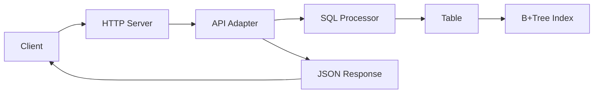

### 1-2. 기존 SQL Processor와 달라진 점

기존 구조:

```text
사용자 입력
 -> SQL 파싱
 -> Table / B+Tree 실행
 -> 콘솔 출력
```

API 서버 구조:

```text
HTTP 요청
 -> 소켓 accept
 -> Thread Pool
 -> HTTP request 파싱
 -> SQL 실행
 -> JSON 응답
```

달라진 핵심은 SQL 엔진 자체보다 **SQL 엔진을 네트워크 요청 처리 흐름 안에 연결했다는 점**입니다.

### 1-3. 현재 지원 범위

현재 지원하는 테이블은 `users` 하나입니다.

| 구분 | 지원 범위 |
|---|---|
| 테이블 | `users` |
| 컬럼 | `id`, `name`, `age` |
| INSERT | `INSERT INTO users VALUES ('Alice', 20);` |
| SELECT 전체 | `SELECT * FROM users;` |
| id 조건 | `=`, `<`, `<=`, `>`, `>=` |
| name 조건 | `=` |
| age 조건 | `=`, `<`, `<=`, `>`, `>=` |
| 저장 방식 | 메모리 기반 |
| id 인덱스 | B+Tree |

---

## 2. 팀 목표와 발표 포인트

### 2-1. 구현 목표

- C 기반 HTTP API 서버 구현
- 기존 SQL Processor 재사용
- Thread Pool로 동시 요청 처리
- `id` 기반 B+Tree 인덱스 활용
- SQL 실행 결과를 JSON으로 반환
- Docker 기반 실행 환경 제공

### 2-2. 학습 목표

- 소켓 서버의 기본 흐름 이해
- HTTP 요청이 직접 파싱되는 과정 이해
- Thread Pool과 Job Queue의 producer-consumer 구조 이해
- B+Tree 인덱스가 왜 필요한지 이해
- 공유 메모리 구조에서 lock이 왜 필요한지 이해

### 2-3. 발표에서 강조할 핵심

> 완성형 DBMS를 만든 것이 아니라, DBMS 서버의 핵심 흐름을 작게 재현했다.

발표에서는 아래 세 가지를 중심으로 설명하는 것이 좋습니다.

1. HTTP 요청이 어떻게 SQL 실행으로 이어지는가
2. Thread Pool이 왜 필요한가
3. `WHERE id = ...`에서 B+Tree가 어떻게 사용되는가

---

## 3. 전체 아키텍처

### 3-1. 전체 요청 처리 흐름

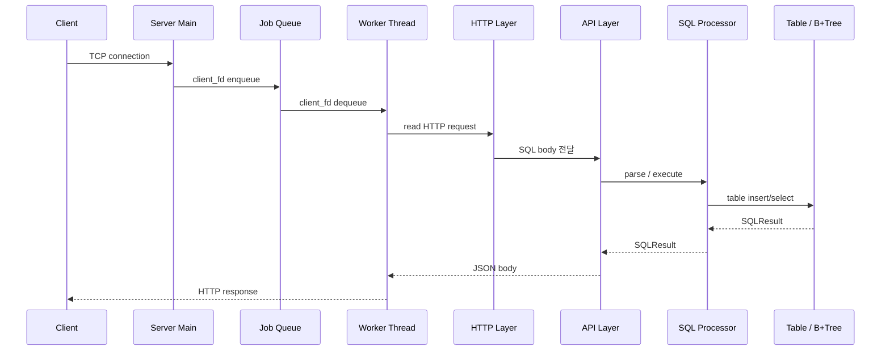

### 3-2. 계층 구조

```text
server_main.c
  -> server/
      server.c
      http.c
      api.c
      thread_pool.c
      json_util.c

  -> sql_processor/
      sql.c
      table.c
      bptree.c
```

이 구조를 나눈 이유는 각 파일의 책임을 분리하기 위해서입니다.

- `server_main.c`: 실행 시작점
- `server.c`: 소켓과 서버 생명주기
- `http.c`: HTTP 문법 처리
- `api.c`: SQL 결과를 HTTP JSON으로 변환
- `thread_pool.c`: 동시 요청 처리
- `sql.c`: SQL 파싱과 실행 계획
- `table.c`: 실제 row 저장
- `bptree.c`: 인덱스 검색

### 3-3. API 서버와 DB 엔진 연결 구조

API 서버는 SQL을 직접 해석하지 않습니다. SQL 해석은 기존 `sql_processor`가 담당합니다.

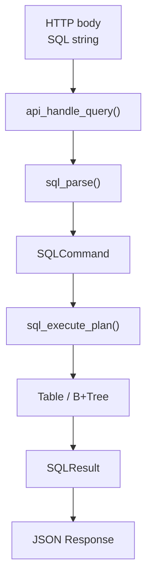

이렇게 분리한 이유는 서버 코드가 SQL 문법 세부 사항까지 알 필요가 없기 때문입니다. 서버는 네트워크와 응답 형식에 집중하고, DB 엔진은 데이터 처리에 집중합니다.

---

## 4. 코드 구조

### 4-1. 서버 진입점

파일: `server_main.c`

역할:

- 포트 번호 파싱
- worker 수 설정
- queue 크기 설정
- signal handler 등록
- `server_create()`와 `server_run()` 호출

왜 필요한가:

서버 실행 설정을 한 곳에 모아야 실행 방식이 명확해집니다. 포트, worker 수, queue 크기는 서버 운영 정책이므로 SQL 엔진 내부에 두면 책임이 섞입니다.

### 4-2. HTTP 계층

파일: `server/http.c`, `server/http.h`

역할:

- request line 파싱
- method/path 검증
- `Content-Length` 확인
- body 읽기
- HTTP response 작성

왜 필요한가:

SQL Processor는 HTTP를 알 필요가 없습니다. HTTP 문법 오류와 SQL 문법 오류를 분리하기 위해 HTTP 계층이 따로 필요합니다.

### 4-3. API 계층

파일: `server/api.c`, `server/api.h`

역할:

- SQL 문자열을 SQL Processor에 전달
- `SQLResult`를 JSON으로 변환
- SQL 오류를 JSON 응답으로 표준화

왜 필요한가:

DB 엔진 결과는 C 구조체이고, 클라이언트는 JSON을 기대합니다. 이 둘 사이를 변환하는 adapter가 있어야 서버와 DB 엔진이 서로 독립적으로 유지됩니다.

### 4-4. Thread Pool 계층

파일: `server/thread_pool.c`, `server/thread_pool.h`

역할:

- worker thread 생성
- client fd queue 관리
- queue full 감지
- shutdown 시 worker 정리

왜 필요한가:

요청마다 스레드를 만들면 요청이 몰릴 때 스레드 생성 비용과 메모리 사용량이 커집니다. Thread Pool은 미리 만든 worker를 재사용하므로 처리량을 더 예측 가능하게 만듭니다.

### 4-5. DB 엔진 계층

파일:

- `sql_processor/sql.c`
- `sql_processor/table.c`
- `sql_processor/bptree.c`

역할:

- SQL 파싱
- INSERT / SELECT 실행
- row 저장
- id 기반 B+Tree 인덱스 검색

왜 필요한가:

서버가 커져도 DB 엔진은 독립적으로 테스트할 수 있어야 합니다. 실제로 `sql_processor/unit_test.c`는 서버 없이 SQL 엔진만 검증합니다.

### 4-6. 테스트 / 스크립트 / 배포 파일

| 파일/폴더 | 역할 |
|---|---|
| `scripts/tests/sql/unit-tests.sh` | SQL Processor 단위 테스트 |
| `scripts/tests/http/smoke-test.sh` | 기본 API 동작 확인 |
| `scripts/tests/http/integration-test.sh` | HTTP 상태 코드 확인 |
| `scripts/tests/http/protocol-edge-cases.sh` | HTTP 경계값 테스트 |
| `scripts/tests/http/timeout-test.sh` | 느린 요청 timeout 확인 |
| `scripts/tests/concurrency/rwlock-stress-test.sh` | 동시 요청 안정성 확인 |
| `Dockerfile` | 컨테이너 빌드 |
| `docker-compose.yml` | 로컬 컨테이너 실행 |

---

## 5. API 명세

### 5-1. Endpoint

```http
POST /query
```

### 5-2. Request 형식

```http
POST /query HTTP/1.1
Host: localhost:8080
Content-Type: text/plain
Content-Length: 39

INSERT INTO users VALUES ('Alice', 20);
```

`text/plain`을 선택한 이유는 현재 API가 SQL 문자열 하나만 받기 때문입니다. JSON으로 감싸면 구조는 확장하기 쉽지만, MVP에서는 SQL 실행 흐름을 보여주는 데 불필요한 파싱 복잡도가 생깁니다.

### 5-3. Response 형식

INSERT 성공:

```json
{
  "ok": true,
  "action": "insert",
  "inserted_id": 1,
  "row_count": 1
}
```

SELECT 성공:

```json
{
  "ok": true,
  "action": "select",
  "row_count": 1,
  "rows": [
    {
      "id": 1,
      "name": "Alice",
      "age": 20
    }
  ]
}
```

### 5-4. HTTP 오류 응답

| 상황 | HTTP status | JSON status |
|---|---:|---|
| 지원하지 않는 method | 405 | `method_not_allowed` |
| 지원하지 않는 path | 404 | `not_found` |
| Content-Length 없음 | 400 | `bad_request` |
| body 너무 큼 | 413 | `payload_too_large` |
| 요청 timeout | 408 | `request_timeout` |
| queue full | 503 | `queue_full` |
| 서버 내부 오류 | 500 | `internal_error` |

### 5-5. SQL 오류 응답

SQL 오류는 HTTP 요청 자체는 정상 도착한 경우가 많습니다. 그래서 SQL 오류는 보통 `200 OK`와 함께 JSON 내부에서 `ok:false`로 표현합니다.

```json
{
  "ok": false,
  "status": "syntax_error",
  "error_code": 1064,
  "sql_state": "42000",
  "message": "ERROR 1064 (42000): ..."
}
```

이렇게 분리한 이유는 HTTP 오류와 SQL 오류의 원인이 다르기 때문입니다.

- HTTP 오류: 요청 형식, path, method, body 길이 문제
- SQL 오류: body 안에 들어온 SQL 문법 또는 컬럼 문제

### 5-6. 지원 SQL

```sql
INSERT INTO users VALUES ('Alice', 20);
SELECT * FROM users;
SELECT * FROM users WHERE id = 1;
SELECT * FROM users WHERE id >= 10;
SELECT * FROM users WHERE name = 'Alice';
SELECT * FROM users WHERE age = 20;
SELECT * FROM users WHERE age > 20;
SELECT * FROM users WHERE age <= 20;
```

---

## 6. 핵심 자료구조

### 6-1. ServerConfig / Server

`ServerConfig`는 서버 실행 정책을 담습니다.

```c
typedef struct ServerConfig {
    unsigned short port;
    size_t worker_count;
    size_t queue_capacity;
    int backlog;
} ServerConfig;
```

왜 필요한가:

포트, worker 수, queue 크기, backlog는 모두 서버 운영 정책입니다. 구조체 하나로 묶으면 `server_create()`가 어떤 설정으로 서버를 만드는지 명확해집니다.

### 6-2. HttpRequest

```c
typedef struct HttpRequest {
    char method[HTTP_MAX_METHOD_SIZE];
    char path[HTTP_MAX_PATH_SIZE];
    char version[HTTP_MAX_VERSION_SIZE];
    size_t content_length;
    char body[HTTP_MAX_BODY_SIZE + 1];
} HttpRequest;
```

왜 필요한가:

raw socket에서 읽은 바이트를 그대로 쓰면 method, path, body를 매번 문자열에서 직접 찾아야 합니다. `HttpRequest`로 구조화하면 HTTP 계층 이후에는 SQL body만 쉽게 넘길 수 있습니다.

### 6-3. ThreadPool / ThreadPoolJob

```c
typedef struct ThreadPoolJob {
    int client_fd;
} ThreadPoolJob;
```

Job에 `client_fd`만 넣는 이유는 worker가 HTTP 요청 읽기부터 응답 쓰기까지 책임지게 하기 위해서입니다. main thread는 accept loop에 집중하고, 느린 client I/O는 worker가 처리합니다.

### 6-4. ApiResult

```c
typedef struct ApiResult {
    int http_status;
    char *body;
} ApiResult;
```

왜 필요한가:

API 계층은 SQL 실행 결과를 JSON 문자열로 만들고, HTTP 계층은 status code와 body를 전송합니다. `ApiResult`는 이 둘 사이의 전달 객체입니다.

### 6-5. Table / Record / SQLResult

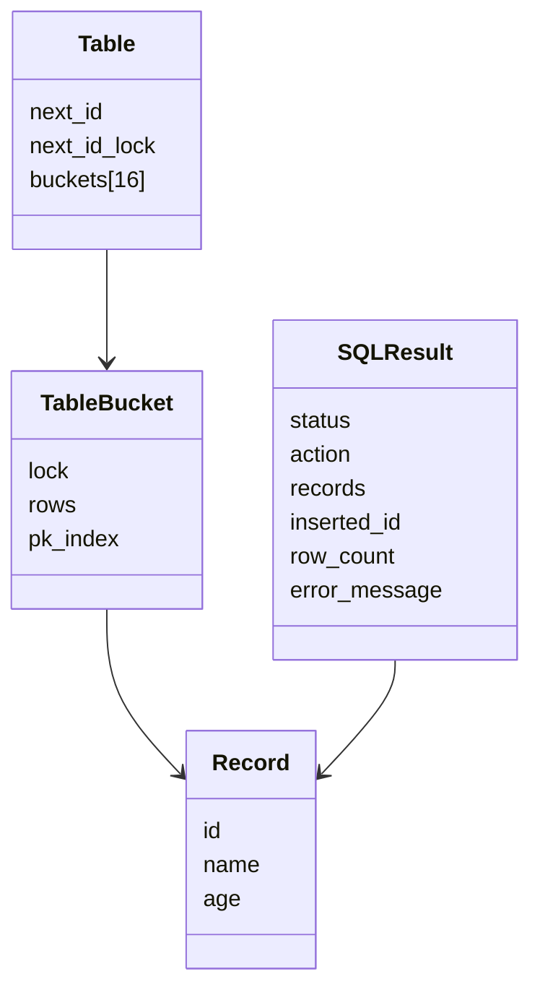

`Table`이 row를 소유하고, `SQLResult`는 조회된 `Record*` 목록만 잠시 들고 있습니다. 이 구조를 쓰는 이유는 SELECT 때 row 전체를 복사하지 않고 포인터만 모아 응답을 만들기 위해서입니다.

### 6-6. BPTree / BPTreeNode

```c
typedef struct BPTreeNode {
    int is_leaf;
    int num_keys;
    int keys[BPTREE_MAX_KEYS];
    void *values[BPTREE_MAX_KEYS];
    struct BPTreeNode *children[BPTREE_ORDER];
    struct BPTreeNode *parent;
    struct BPTreeNode *next;
} BPTreeNode;
```

B+Tree를 쓰는 이유는 `id` 검색을 전체 row scan보다 빠르게 하기 위해서입니다. leaf node에는 실제 `Record*`가 있고, internal node는 탐색 방향을 안내합니다.

---

## 7. 실제 실행 흐름

### 7-1. 서버 시작 흐름

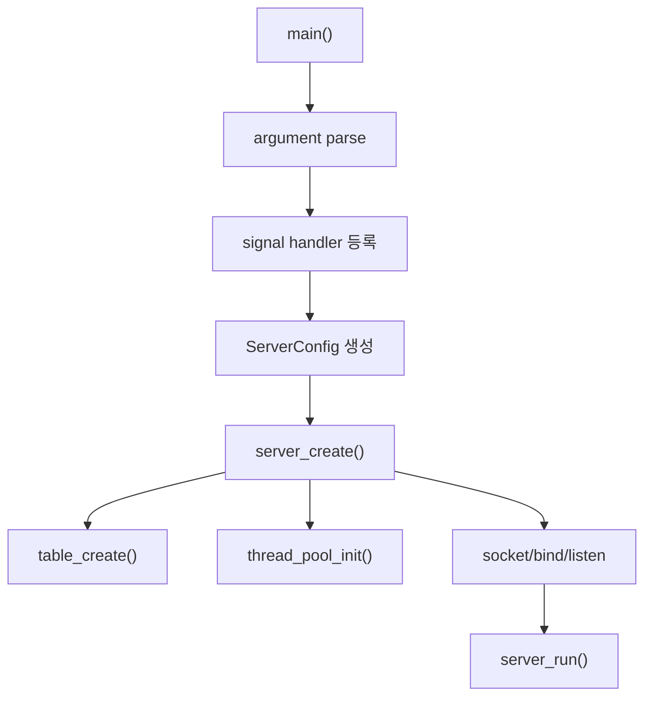

### 7-2. 클라이언트 요청 처리 흐름

```text
client connect
 -> accept()
 -> thread_pool_submit(client_fd)
 -> worker가 client_fd 처리
 -> HTTP request parse
 -> SQL 실행
 -> HTTP response 전송
 -> close(client_fd)
```

### 7-3. POST /query 처리 흐름

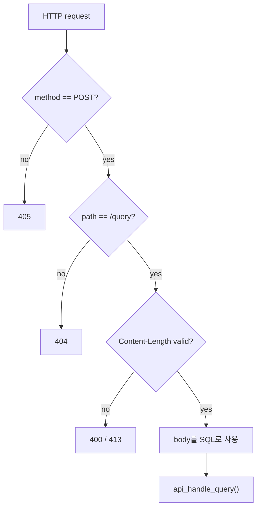

### 7-4. INSERT 요청 흐름

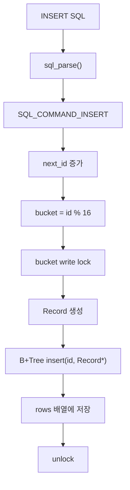

### 7-5. SELECT 요청 흐름

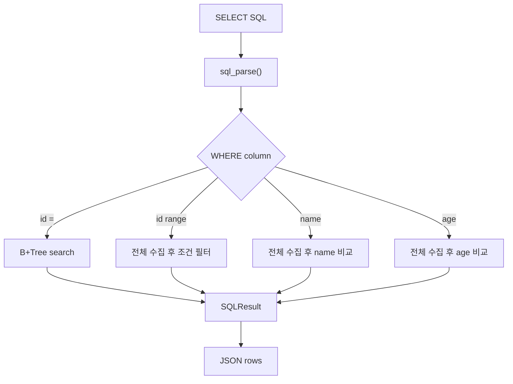

### 7-6. 오류 요청 처리 흐름

```text
HTTP 오류
  -> request 자체가 잘못됨
  -> 400 / 404 / 405 / 408 / 413 / 503

SQL 오류
  -> request는 정상
  -> body 안의 SQL이 잘못됨
  -> 200 OK + ok:false
```

### 7-7. Graceful Shutdown 흐름

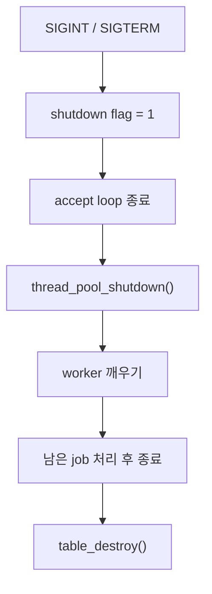

---

## 8. 동시성 설계

### 8-1. Thread Pool 구조

Thread Pool은 고정된 수의 worker thread를 미리 만들어두고, main thread가 받은 client fd를 queue에 넣는 구조입니다.

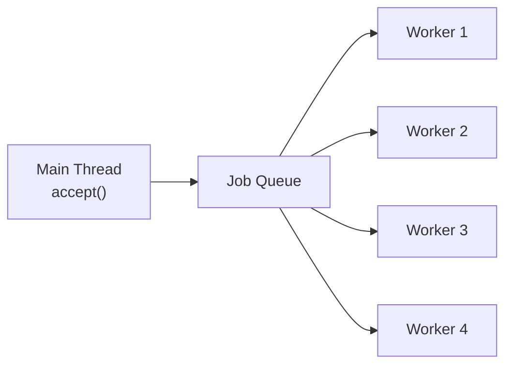

왜 이 구조인가:

요청마다 스레드를 만들면 요청 수가 곧 스레드 수가 됩니다. Thread Pool은 최대 동시 실행 수를 제한해서 서버가 과도한 요청에 무너지지 않도록 합니다.

### 8-2. Job Queue 구조

queue는 `head`, `tail`, `size`, `capacity`를 가진 ring buffer입니다.

```text
submit:
  jobs[tail] = client_fd
  tail = (tail + 1) % capacity
  size++

dequeue:
  client_fd = jobs[head]
  head = (head + 1) % capacity
  size--
```

ring buffer를 쓰는 이유는 배열을 매번 앞으로 당기지 않고도 FIFO queue를 구현할 수 있기 때문입니다.

### 8-3. Producer-Consumer 흐름

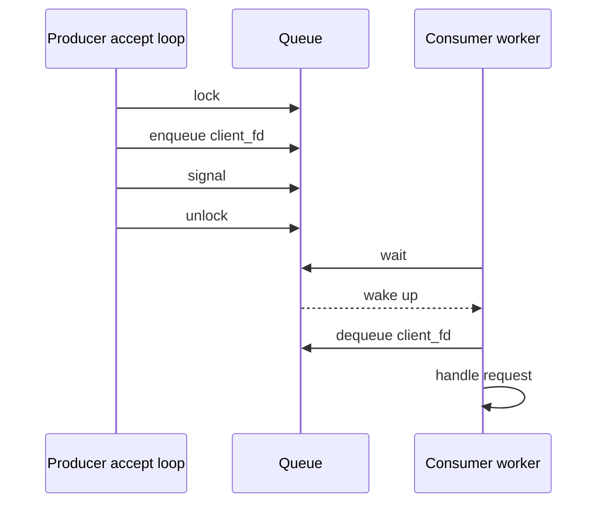

### 8-4. DB Mutex 보호 범위

초기 설계에서는 DB 전체를 하나의 mutex 또는 rwlock으로 보호하는 방식이었습니다. 현재 `Table` 구조는 더 나아가 bucket 단위 lock을 가집니다.

```text
Table
  bucket[0]  -> rows + B+Tree + rwlock
  bucket[1]  -> rows + B+Tree + rwlock
  ...
  bucket[15] -> rows + B+Tree + rwlock
```

이 구조를 선택한 이유는 모든 요청이 하나의 lock을 기다리지 않게 하기 위해서입니다. 서로 다른 bucket을 건드리는 요청은 더 작은 범위에서 충돌합니다.

### 8-5. Queue Full 처리

queue가 꽉 차면 main thread는 더 이상 job을 넣지 않고 바로 `503 Service Unavailable`을 반환합니다.

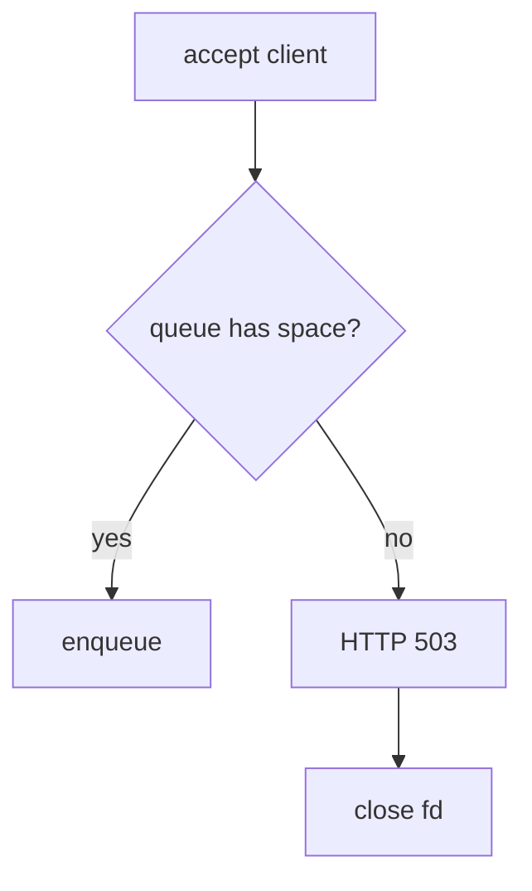

이 처리가 필요한 이유는 서버가 처리할 수 없는 요청을 무한히 쌓아두면 메모리와 fd가 고갈되기 때문입니다.

### 8-6. 동시성 설계의 한계

- HTTP body를 기다리는 worker는 그 시간 동안 묶입니다.
- timeout은 있지만 event-driven 구조는 아닙니다.
- `SELECT *`나 `age/name` 조건은 여러 bucket을 순회합니다.
- bucket lock은 전역 lock보다 낫지만, 완전한 고성능 DB 동시성 모델은 아닙니다.

---

## 9. 기존 SQL 엔진과 B+Tree 활용

### 9-1. 기존 SQL Processor 재사용 방식

기존 엔진의 핵심 함수는 다음입니다.

```text
sql_parse()
sql_execute_plan()
table_insert()
table_find_by_id()
bptree_search()
```

서버가 SQL 문법을 직접 처리하지 않고 SQL Processor를 재사용한 이유는 기존 테스트가 검증한 로직을 유지하기 위해서입니다.

### 9-2. Table과 B+Tree의 역할

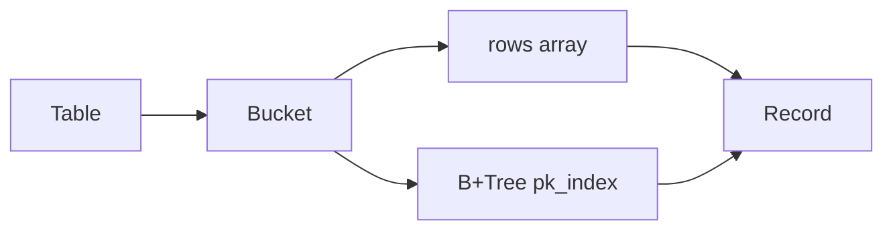

- `rows`: 실제 row를 보관
- `B+Tree`: id로 row를 빠르게 찾기 위한 인덱스
- `Record*`: rows와 B+Tree가 같은 row를 가리킴

### 9-3. WHERE id 조회와 인덱스 사용

`WHERE id = 1`은 B+Tree를 사용할 수 있습니다.

```text
id
 -> bucket 선택
 -> bucket의 B+Tree root부터 leaf까지 이동
 -> leaf에서 key 비교
 -> Record* 반환
```

이 방식이 필요한 이유는 row가 많아질수록 전체 scan보다 인덱스 검색이 유리하기 때문입니다.

### 9-4. name / age 조건 조회와 선형 탐색

`name`과 `age`는 별도 인덱스가 없습니다. 그래서 모든 row를 모은 뒤 조건을 비교합니다.

```text
SELECT * FROM users WHERE age > 20;
  -> 모든 bucket 순회
  -> 모든 Record 확인
  -> age 조건 비교
  -> matching row 수집
```

발표 포인트:

> 같은 SELECT라도 인덱스가 있는 컬럼과 없는 컬럼은 실행 방식이 다르다.

---

## 10. 구현하면서 든 고민과 현재 답

### 고민 1. 왜 요청마다 스레드를 만들지 않고 Thread Pool을 썼나

요청마다 스레드를 만들면 요청 폭증이 곧 스레드 폭증으로 이어집니다. Thread Pool은 worker 수를 제한해서 서버가 감당 가능한 동시 처리량을 정합니다.

### 고민 2. 왜 client fd를 Job Queue에 넣었나

main thread가 HTTP body까지 읽으면 느린 클라이언트 하나가 accept loop를 막을 수 있습니다. client fd만 queue에 넣으면 main thread는 연결 수락에 집중하고, worker가 실제 요청 처리를 담당합니다.

### 고민 3. 왜 DB 전체를 Mutex로 보호했나

초기에는 안전성이 가장 중요했기 때문입니다. 여러 worker가 같은 Table과 B+Tree를 동시에 수정하면 메모리 구조가 깨질 수 있습니다.

현재 구조는 여기서 한 단계 나아가 bucket 단위 `pthread_rwlock_t`를 사용합니다. 이유는 안전성을 유지하면서 lock 경합 범위를 줄이기 위해서입니다.

### 고민 4. 왜 SQL 오류와 HTTP 오류를 분리했나

두 오류는 원인이 다릅니다.

- HTTP 오류: 요청 자체가 서버 규칙에 맞지 않음
- SQL 오류: 요청은 도착했지만 SQL 내용이 잘못됨

이 둘을 분리하면 클라이언트가 문제 원인을 더 정확히 알 수 있습니다.

### 고민 5. 왜 text/plain body를 선택했나

현재 API는 SQL 문자열 하나만 필요합니다. JSON으로 감싸면 확장성은 있지만, 이번 MVP에서는 SQL 실행 흐름을 보여주는 데 집중하는 것이 더 적절합니다.

### 고민 6. 왜 기존 SQL 엔진을 직접 수정하지 않고 API 계층에서 감쌌나

기존 SQL 엔진은 이미 단위 테스트 대상입니다. API 계층에서 감싸면 DB 엔진은 그대로 유지하고, 서버 응답 형식만 바꿀 수 있습니다.

---

## 11. 빌드와 실행

### 11-1. 로컬 빌드

```bash
make db_server
```

현재 서버 빌드는 `api_handle_query()` 인자 불일치 수정 후 실행해야 합니다.

### 11-2. 로컬 실행

```bash
./db_server 8080
```

옵션:

```bash
./db_server <port> <worker_count> <queue_capacity> <backlog>
```

예:

```bash
./db_server 8080 4 16 32
```

### 11-3. Docker 빌드

```bash
docker build -t week8-team2-network .
```

### 11-4. Docker 실행

```bash
docker run --rm -p 8080:8080 week8-team2-network
```

또는:

```bash
docker compose up --build
```

---

## 12. 테스트와 검증

### 12-1. 기존 SQL Processor 단위 테스트

```bash
sh scripts/tests/sql/unit-tests.sh
```

검증 항목:

- B+Tree insert/search
- duplicate key 거부
- leaf split
- internal split
- auto increment
- SQL parse
- SELECT condition
- detailed SQL error

### 12-2. API Smoke Test

```bash
sh scripts/tests/http/smoke-test.sh 8080
```

확인:

- INSERT 성공
- inserted id 반환
- SELECT 성공
- row JSON 반환

### 12-3. HTTP Edge Case Test

```bash
sh scripts/tests/http/protocol-edge-cases.sh
```

확인:

- empty body
- missing Content-Length
- malformed request line
- Content-Length mismatch

### 12-4. 동시 요청 테스트

```bash
sh scripts/tests/concurrency/rwlock-stress-test.sh
```

확인:

- 여러 SELECT / INSERT 요청을 동시에 보내도 서버가 죽지 않는지
- 최종 row_count가 기대값과 맞는지
- bucket lock 구조가 안정적으로 동작하는지

### 12-5. 테스트 결과 요약

| 테스트 | 목적 | 현재 상태 |
|---|---|---|
| SQL unit test | SQL 엔진 검증 | 통과 확인 |
| HTTP smoke | 기본 API 검증 | 서버 빌드 수정 후 실행 필요 |
| HTTP integration | 상태 코드 검증 | 서버 빌드 수정 후 실행 필요 |
| HTTP timeout | 느린 요청 처리 | 서버 빌드 수정 후 실행 필요 |
| rwlock stress | 동시성 검증 | 서버 빌드 수정 후 실행 필요 |

---

## 13. 데모 시나리오

### 13-1. 서버 실행

```bash
./db_server 8080
```

### 13-2. INSERT API 호출

```bash
curl -X POST http://localhost:8080/query \
  -H "Content-Type: text/plain" \
  --data "INSERT INTO users VALUES ('Alice', 20);"
```

예상 응답:

```json
{
  "ok": true,
  "action": "insert",
  "inserted_id": 1,
  "row_count": 1
}
```

### 13-3. SELECT API 호출

```bash
curl -X POST http://localhost:8080/query \
  -H "Content-Type: text/plain" \
  --data "SELECT * FROM users;"
```

### 13-4. 조건 조회 API 호출

```bash
curl -X POST http://localhost:8080/query \
  -H "Content-Type: text/plain" \
  --data "SELECT * FROM users WHERE id = 1;"
```

발표 설명:

```text
id = 1 조건
 -> bucket 선택
 -> B+Tree 검색
 -> Record 반환
```

### 13-5. 잘못된 요청 처리

```bash
curl -X GET http://localhost:8080/query
```

예상:

```text
405 Method Not Allowed
```

### 13-6. 동시 요청 처리

```bash
sh scripts/tests/concurrency/rwlock-stress-test.sh
```

발표 설명:

> 여러 요청이 들어와도 main thread는 accept를 계속 수행하고, worker들이 queue에서 client fd를 꺼내 병렬로 처리한다.

---

## 14. 한계와 개선 방향

### 14-1. 현재 한계

- 서버 빌드 시그니처 불일치 수정 필요
- 메모리 기반이라 서버 종료 시 데이터가 사라짐
- `users` 테이블 하나만 지원
- `UPDATE`, `DELETE`, `CREATE TABLE` 미지원
- SQL 문법이 제한적
- `name`, `age` 인덱스 없음

### 14-2. 성능 개선 방향

- `name`, `age` 보조 인덱스 추가
- B+Tree range scan 직접 지원
- `SELECT *` 응답 크기 제한
- non-blocking I/O 또는 event loop 도입
- worker starvation 완화

### 14-3. API 확장 방향

- `GET /health`
- `GET /metrics`
- JSON request body 지원
- SQL 실행 시간 응답에 포함
- batch query 지원

### 14-4. DB 엔진 확장 방향

- 파일 기반 저장
- WAL
- transaction
- schema 관리
- multi-table
- update/delete
- join

---

## 발표 마무리 문장

이 프로젝트의 핵심은 완성형 DBMS를 만드는 것이 아니라, **HTTP 서버, Thread Pool, SQL Processor, Table, B+Tree 인덱스가 하나의 요청 처리 흐름 안에서 어떻게 연결되는지**를 직접 구현하고 설명하는 것입니다.

특히 `WHERE id = ...` 요청이 B+Tree 인덱스를 타고, `name`과 `age` 조건은 선형 탐색을 한다는 차이를 보여주면 DB 인덱스의 필요성을 발표에서 명확하게 전달할 수 있습니다.
