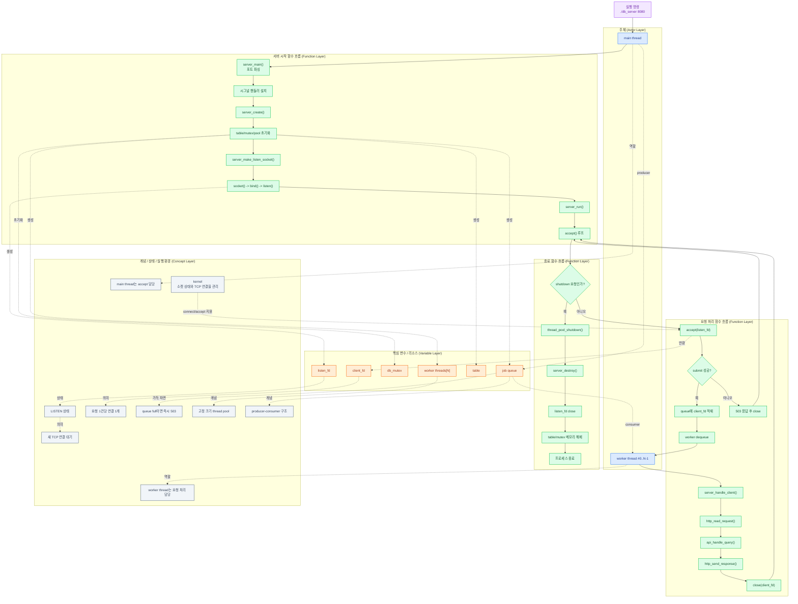
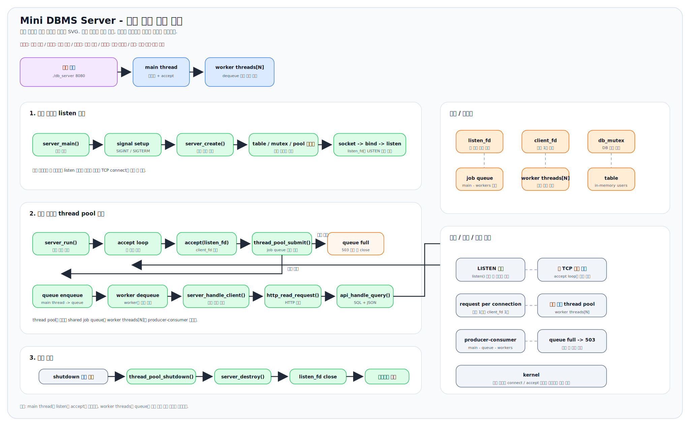
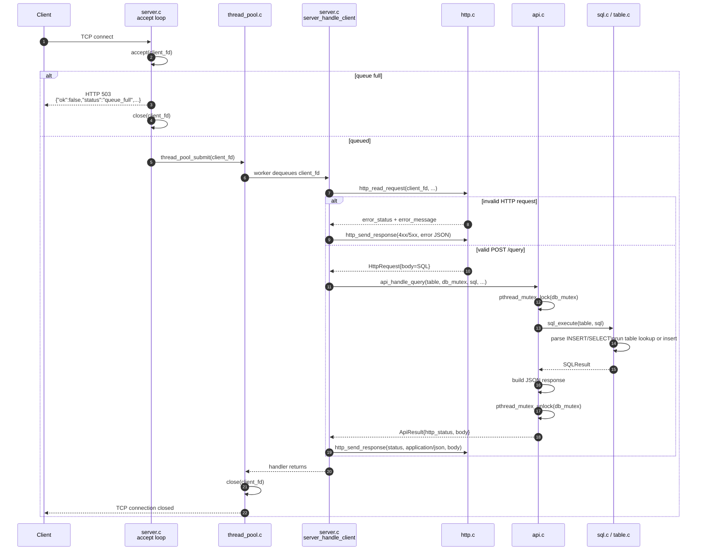
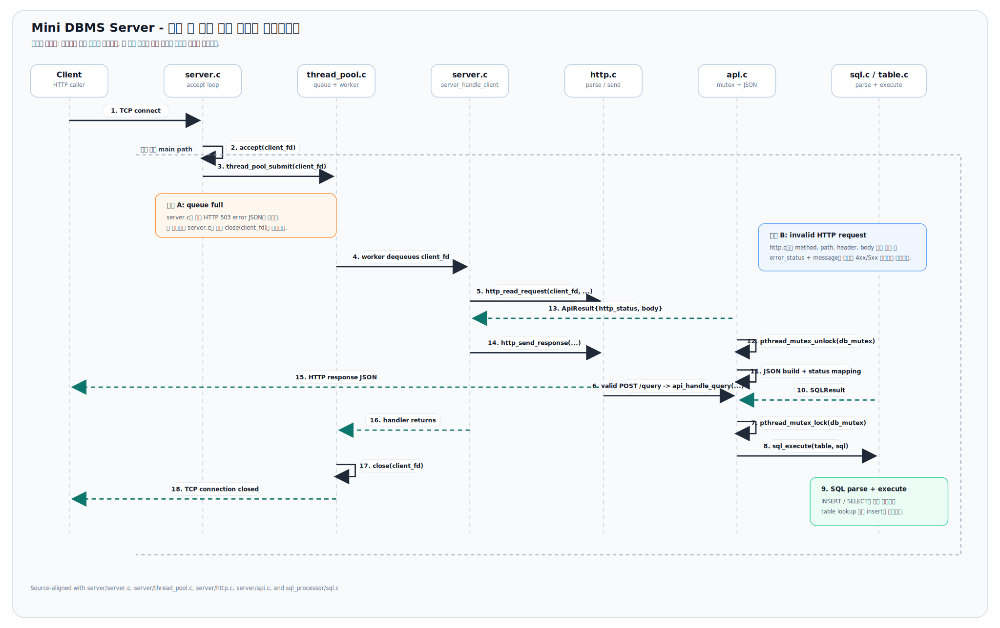

# Mini DBMS Server - 프로젝트 공부 가이드 (CYB)

> 코드를 처음 보는 사람이 "어디서부터 읽어야 하는가"를 빠르게 파악하기 위한 문서다.  
> 아키텍처 전체 흐름 → 계층별 코드 경로 → 공부 순서 → MVP 검토 순으로 구성했다.

---

## 1. 이 프로젝트가 하는 일 (한 줄 요약)

```
HTTP POST /query  →  SQL 파서  →  인메모리 테이블  →  JSON 응답
```

클라이언트가 `INSERT` / `SELECT` SQL 문자열을 HTTP body에 담아 보내면,  
서버가 파싱 → 실행 → 결과를 JSON으로 돌려주는 **인메모리 DBMS over HTTP**.

---

## 2. 전체 시스템 아키텍처

```
┌─────────────────────────────────────────────────────────────┐
│                        클라이언트                             │
│   curl -X POST http://localhost:8080/query --data "SQL..."   │
└─────────────────────────┬───────────────────────────────────┘
                          │ TCP 연결
                          ▼
┌─────────────────────────────────────────────────────────────┐
│                    server_main.c                             │
│   • 포트 파싱 (argv[1])                                       │
│   • SIGINT / SIGTERM 시그널 핸들러 설치                        │
│   • server_create() → server_run() → server_destroy()        │
└─────────────────────────┬───────────────────────────────────┘
                          │
                          ▼
┌─────────────────────────────────────────────────────────────┐
│                    server/server.c                           │
│   socket() → bind() → listen() → accept() 루프               │
│   ┌───────────────────────────────────────────────────┐     │
│   │               ThreadPool (4 workers)               │     │
│   │  ┌──────┐  ┌──────┐  ┌──────┐  ┌──────┐         │     │
│   │  │ W #0 │  │ W #1 │  │ W #2 │  │ W #3 │         │     │
│   │  └──────┘  └──────┘  └──────┘  └──────┘         │     │
│   │       ↑ circular queue (capacity=16) ↑             │     │
│   └───────────────────────────────────────────────────┘     │
│   • accept한 client_fd를 queue에 넣음                         │
│   • 큐가 가득 차면 503 즉시 반환                               │
└─────────────────────────┬───────────────────────────────────┘
                          │ 워커 스레드가 client_fd 꺼냄
                          ▼
┌─────────────────────────────────────────────────────────────┐
│                    server/http.c                             │
│   recv() 루프 → "\r\n\r\n" 탐색 → 헤더 파싱                   │
│   • method 검증 (POST만 허용, 그 외 405)                       │
│   • path 검증 (/query만 허용, 그 외 404)                       │
│   • Content-Length 파싱 → body recv()                         │
└─────────────────────────┬───────────────────────────────────┘
                          │ HttpRequest (SQL 문자열)
                          ▼
┌─────────────────────────────────────────────────────────────┐
│                    server/api.c                              │
│   pthread_mutex_lock(db_mutex)                               │
│   → sql_execute(table, sql)                                  │
│   → JSON 직렬화 (json_util.c 활용)                            │
│   → pthread_mutex_unlock(db_mutex)                           │
└─────────────────────────┬───────────────────────────────────┘
                          │
              ┌───────────┴───────────┐
              ▼                       ▼
┌──────────────────────┐  ┌──────────────────────────────────┐
│  sql_processor/sql.c │  │  sql_processor/table.c           │
│  • INSERT 파서        │  │  • 동적 배열 (rows[])             │
│  • SELECT 파서        │  │  • table_insert()                │
│  • WHERE 조건 파서    │  │  • table_collect_all()           │
│  • 에러 메시지 생성   │  │  • table_find_by_id_condition()  │
└──────────────────────┘  │  • table_find_by_name_matches()  │
                          │  • table_find_by_age_condition() │
                          └────────────┬─────────────────────┘
                                       │ id 기반 검색
                                       ▼
                          ┌──────────────────────────────────┐
                          │  sql_processor/bptree.c          │
                          │  B+ Tree (order=4)               │
                          │  • 삽입: O(log n)                 │
                          │  • 검색: O(log n)  ← id=x 에서   │
                          │  • leaf 연결리스트로 순서 유지     │
                          └──────────────────────────────────┘
```

---

## 3. 서버의 실제 동작 흐름

아래 그림은 **서버 프로세스 입장**에서 본 전체 생명주기다.  
이번 그림은 계층을 구분해서 읽을 수 있게 만들었다.

- 보라색: **실행 명령**
- 파란색: **실행 주체**
- 초록색: **함수 / 실행 단계**
- 주황색: **핵심 변수 / 리소스**
- 회색: **개념 / 상태 / 실행 환경**



### 정적 SVG 버전



### 이 흐름에서 중요한 포인트

- `main thread`와 `worker thread`를 분리해서 봐야 전체 구조가 이해된다.
- `listen_fd`는 "새 연결을 받는 소켓"이고, `client_fd`는 "연결 1건을 처리하는 소켓"이다.
- `./db_server 8080`은 실행 명령이고, `server_create()`나 `accept()`는 그 뒤에 호출되는 함수다.
- `listen()`은 함수 호출이고, `LISTEN 상태`는 그 호출 결과로 커널에 생기는 상태다.
- `kernel`은 서버 코드의 직접 실행 주체가 아니라, 소켓과 TCP 연결을 관리하는 실행 환경으로 보는 편이 정확하다.
- `accept()`는 메인 스레드가 수행하지만, 실제 HTTP/SQL 처리는 워커 스레드가 맡는다.
- `thread pool`은 "worker thread 여러 개 + shared job queue"의 조합이다.
- `job queue`는 단순 자료구조가 아니라, 메인 스레드와 워커 스레드를 이어주는 생산자-소비자 경계다.

---

## 4. 요청 한 건의 전체 여정 (시퀀스 다이어그램)

아래 다이어그램은 실제 코드 기준으로 정리한 최종본이다.  
핵심 수정 포인트는 다음 세 가지다.

- `http_read_request()`와 `api_handle_query()`는 워커가 실행하는 `server_handle_client()` 내부에서 호출된다.
- `db_mutex`는 `api.c`에서 잠그고, `sql_execute()` 및 JSON 직렬화가 끝난 뒤 해제된다.
- `close(client_fd)`는 정상/오류 응답 이후 `thread_pool.c`의 워커 루프에서 수행된다. 단, 큐가 가득 찼을 때만 `server.c`가 즉시 `503`을 보내고 직접 닫는다.



### 최종 이미지



---

## 5. 파일별 역할 정리

| 파일 | 역할 | 핵심 개념 |
|------|------|-----------|
| `server_main.c` | 진입점, 포트 파싱, 시그널 설치 | `sigaction`, `SIGINT`, `SIGTERM` |
| `server/server.c` | TCP 서버 루프, 리소스 생명주기 관리 | `socket`, `bind`, `listen`, `accept` |
| `server/thread_pool.c` | 고정 워커 풀 + 원형 큐 | `pthread_mutex`, `pthread_cond`, circular buffer |
| `server/http.c` | HTTP 요청 파싱, 응답 직렬화 | `recv`, `send`, Content-Length |
| `server/api.c` | SQL 실행과 HTTP 계층 연결 | 뮤텍스 보호, JSON 직렬화 |
| `server/json_util.c` | 동적 JSON 문자열 빌더 | `realloc`, JSON escape |
| `sql_processor/sql.c` | SQL 파서 + 실행기 | 재귀 하강 파서 |
| `sql_processor/table.c` | 인메모리 테이블 | 동적 배열, 선형 스캔 |
| `sql_processor/bptree.c` | B+ 트리 (PK 인덱스) | 노드 분할, leaf 연결리스트 |

---

## 6. 데이터 구조 시각화

### 6-1. Table 구조

```
Table
├── next_id: int        ← 다음 INSERT 시 부여할 ID (자동 증가)
├── rows: Record**      ← 레코드 포인터 배열 (동적 성장)
│   ├── [0] → Record { id=1, name="Alice", age=20 }
│   ├── [1] → Record { id=2, name="Bob",   age=30 }
│   └── [2] → Record { id=3, name="Carol", age=25 }
├── size: 3             ← 현재 레코드 수
├── capacity: 8         ← 배열 용량 (처음 8, 이후 2배씩 성장)
└── pk_index: BPTree*   ← id → Record* 매핑 (O(log n) 검색)
```

### 6-2. B+ Tree (order=4, max_keys=3)

```
                    [  2  |  4  ]          ← 내부 노드 (인덱스만 저장)
                   /       |      \
              [1|2]      [3|4]    [5|6]    ← 리프 노드 (실제 Record* 저장)
               ↕             ↕         ↕
          (linked list로 연결 - 순서 보장)

• 삽입: 리프 찾기 → 삽입 → 가득 차면 분할 → 부모로 키 승격
• 검색: 루트에서 비교하며 내려가 → 리프에서 키 일치 확인
• 리프 연결리스트: 범위 스캔 가능 (아직 미활용)
```

### 6-3. ThreadPool 구조

```
ThreadPool
├── workers: pthread_t[4]     ← 4개 워커 스레드
├── jobs: ThreadPoolJob[16]   ← 원형 큐 (circular buffer)
│   head=2 ──▶ [fd=7][fd=8][...][fd=9] ◀── tail=5
├── size: 3                   ← 현재 큐에 있는 작업 수
├── mutex: pthread_mutex_t    ← 큐 접근 보호
└── cond: pthread_cond_t      ← 워커 대기/깨우기

submit: tail에 추가, cond_signal
worker: 대기 → cond_wait → head에서 꺼냄 → handler 호출 → close(fd)
```

---

## 6. SQL 파싱 흐름

```
sql_execute("SELECT * FROM users WHERE id >= 2;")
    │
    ├─ EXIT/QUIT? → 아니오
    │
    ├─ sql_execute_insert() 시도
    │   └─ "INSERT" 키워드 없음 → SYNTAX_ERROR (메시지 없음) → 넘어감
    │
    └─ sql_execute_select() 시도
        ├─ "SELECT" 매칭
        ├─ "*" 매칭  (단일 컬럼 SELECT는 미지원)
        ├─ "FROM" 매칭
        ├─ "users" 테이블 이름 확인
        ├─ "WHERE" 매칭
        ├─ "id" 컬럼 파싱
        ├─ ">=" 연산자 파싱 → TABLE_COMPARISON_GE
        ├─ "2" 정수 파싱
        └─ table_find_by_id_condition(table, GE, 2, ...) 호출
```

**파서 동작 방식**: `const char *cursor`를 앞으로 진행시키며 토큰을 소비한다.  
실패하면 커서를 진행시키지 않고 0 반환 → 호출자가 에러 처리.

---

## 7. 공부 시작 플랜 (추천 순서)

> **원칙**: 코드 흐름 방향으로 읽는다. 위에서 아래로, 요청이 처리되는 순서대로.

### STEP 1 - 소켓 기초 이론 (CSAPP 11장)
```
목표: 소켓이 왜 file descriptor인지, TCP 연결 과정을 말로 설명할 수 있다.
읽을 것: CSAPP 11.1 ~ 11.4
집중 포인트:
  • socket() → bind() → listen() → accept() 의 의미
  • IP + Port = 프로세스 식별자
  • recv/send가 read/write처럼 보이는 이유
코드 연결: server/server.c:38~66 (server_make_listen_socket)
```

### STEP 2 - HTTP 파싱 코드 (http.c)
```
목표: "HTTP 요청을 어떻게 바이트 스트림에서 구조체로 변환하는지" 설명할 수 있다.
읽을 것: server/http.c
집중 포인트:
  • recv 루프로 "\r\n\r\n"을 찾는 방법 (line 32~64)
  • strtok_r로 헤더 파싱 (line 161~196)
  • Content-Length로 body 읽기 (line 226~248)
핵심 질문: recv()가 한 번에 모든 데이터를 읽는다는 보장이 없다. 왜?
```

### STEP 3 - 스레드 풀 (thread_pool.c + thread_pool.h)
```
목표: mutex/cond_wait 패턴으로 producer-consumer를 구현하는 방법을 이해한다.
읽을 것: server/thread_pool.h → server/thread_pool.c
집중 포인트:
  • thread_pool_worker_main() 의 while 루프 (line 10~35)
  • submit()에서 cond_signal, worker에서 cond_wait (line 93~122)
  • stop_requested 플래그와 graceful shutdown
핵심 질문: mutex 없이 size/head/tail을 수정하면 무슨 일이 생기는가?
```

### STEP 4 - 서버 메인 루프 (server.c)
```
목표: accept 루프와 graceful shutdown의 전체 그림을 그릴 수 있다.
읽을 것: server/server.c
집중 포인트:
  • server_create()의 초기화 순서 (실패 시 역순 정리)
  • server_run()의 accept 루프 + EINTR 처리 (line 210~233)
  • SIGINT → g_shutdown_requested=1 → accept 반환 → 루프 탈출
```

### STEP 5 - B+ 트리 (bptree.c)
```
목표: B+ 트리의 삽입과 분할 과정을 코드로 추적할 수 있다.
읽을 것: sql_processor/bptree.h → sql_processor/bptree.c
집중 포인트:
  • bptree_find_leaf(): 루트에서 내려가는 탐색 (line 29~50)
  • bptree_split_leaf_and_insert(): 리프 분할 (line 147~199)
  • 리프의 next 포인터 연결리스트 유지
핵심 질문: 내부 노드와 리프 노드의 차이는 무엇인가?
```

### STEP 6 - 인메모리 테이블 (table.c)
```
목표: 동적 배열 + B+ 트리 인덱스를 함께 쓰는 이유를 설명할 수 있다.
읽을 것: sql_processor/table.h → sql_processor/table.c
집중 포인트:
  • table_insert(): rows[] 배열에 추가 + bptree_insert()
  • table_find_by_id(): bptree_search() 사용 → O(log n)
  • table_find_by_id_condition(): 선형 스캔 → O(n)  ← 차이 주목
```

### STEP 7 - SQL 파서 (sql.c)
```
목표: 문자열에서 SQL을 파싱하는 재귀 하강 파서 패턴을 이해한다.
읽을 것: sql_processor/sql.h → sql_processor/sql.c
집중 포인트:
  • cursor 포인터 진행 방식 (const char **cursor 패턴)
  • sql_match_keyword(), sql_parse_identifier(), sql_parse_int()
  • sql_execute_insert() 와 sql_execute_select() 구조 비교
```

### STEP 8 - API 레이어와 전체 연결 (api.c)
```
목표: HTTP 계층과 DB 계층을 연결하는 뮤텍스 보호 패턴을 이해한다.
읽을 것: server/api.c, server/json_util.c
집중 포인트:
  • api_handle_query()의 mutex_lock → sql_execute → mutex_unlock 범위
  • api_build_success_response()의 JSON 빌딩 패턴
  • SQLStatus → HTTP status code 매핑 로직
```

### 학습 체크리스트

```
□ STEP 1: socket() bind() listen() accept() 흐름을 whiteboard에 그릴 수 있다
□ STEP 2: HTTP 요청 파싱에서 recv를 여러 번 호출하는 이유를 설명할 수 있다
□ STEP 3: mutex + cond_wait로 생산자-소비자를 구현하는 코드를 스스로 쓸 수 있다
□ STEP 4: SIGINT가 오면 서버가 어떻게 종료되는지 코드 경로를 추적할 수 있다
□ STEP 5: B+ 트리 리프 분할 과정을 그림으로 설명할 수 있다
□ STEP 6: rows 배열과 pk_index 두 구조를 동시에 유지하는 이유를 설명할 수 있다
□ STEP 7: cursor 패턴으로 간단한 파서를 직접 작성할 수 있다
□ STEP 8: 전체 요청 경로를 server_main → close(fd) 까지 코드 레벨로 추적할 수 있다
```

---

## 8. MVP 검토 및 피드백

별도 문서로 분리: [`mvp-review.md`](./mvp-review.md)

---

## 9. 용어 빠른 참조

| 용어 | 이 프로젝트에서의 의미 |
|------|----------------------|
| `client_fd` | accept()로 얻은 소켓 파일 디스크립터 (클라이언트 연결 하나) |
| `listen_fd` | 서버가 바인딩한 소켓 (새 연결 대기용) |
| `db_mutex` | Table에 대한 읽기/쓰기를 직렬화하는 뮤텍스 |
| `HttpRequest` | 파싱된 HTTP 요청 구조체 (method, path, body) |
| `SQLResult` | sql_execute()의 반환값 (rows[], status, error 정보) |
| `ApiResult` | JSON 직렬화된 응답 문자열 + HTTP 상태코드 |
| `JsonBuffer` | realloc 기반 동적 문자열 빌더 |
| `ThreadPool` | 고정 워커 4개 + 원형 큐 16슬롯 |
| `BPTree` | id → Record* 매핑 인덱스 (order 4) |

---

*작성일: 2026-04-22*
