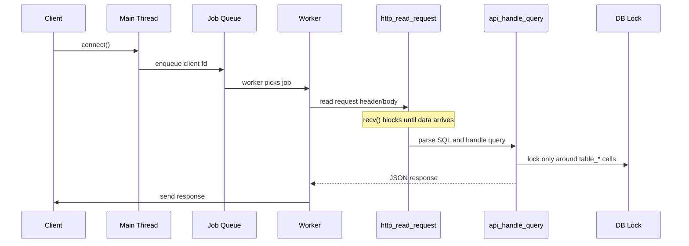

# Blocking I/O로 인한 Worker 고갈 문제 정리

## 1. 문제 요약

현재 서버는 `worker thread pool` 구조를 사용한다.
요청이 들어오면 main thread가 소켓을 받아서 큐에 넣고, worker가 해당 소켓을 처리한다.

문제는 `http_read_request()`가 `recv()`를 반복해서 읽는 **blocking I/O** 방식이라는 점이다.
즉, 클라이언트가 헤더를 천천히 보내거나 body를 중간중간 끊어서 보내면, worker 하나가 그 요청에 오래 묶인다.

이 현상은 DB 락 문제와 별개다.
DB 락을 잘 줄여도, HTTP 입력 단계에서 worker가 오래 막히면 전체 처리량이 떨어지고 worker pool이 고갈될 수 있다.

관련 코드 위치:

- `server/http.c`의 헤더 읽기 루프: [`http.c#L32`](../../../../../../server/http.c#L32)
- `server/http.c`의 body 읽기 루프: [`http.c#L226`](../../../../../../server/http.c#L226)

---

## 2. 왜 이런 일이 생기나

현재 요청 흐름은 대략 아래와 같다.



문제는 `http_read_request()`가 다음 두 구간에서 계속 기다릴 수 있다는 점이다.

1. 헤더 종료(`\r\n\r\n`)가 올 때까지 기다림
2. `Content-Length`만큼 body가 다 올 때까지 기다림

즉, worker는 **DB를 만지기 전 단계**에서도 오래 붙잡힐 수 있다.

---

## 3. 어떤 상황에서 실제로 발생하나

### 3-1. 느린 네트워크

모바일 회선, 불안정한 Wi-Fi, 지연이 큰 VPN 환경에서는 데이터가 한 번에 오지 않을 수 있다.
이 경우 요청은 조각조각 도착한다.

예시:

```text
POST /query HTTP/1.1\r\n
Content-Type: text/plain\r\n
Content-Length: 31\r\n
\r\n
INSERT INTO users VALUES ('A
```

이후 나머지 body가 몇 초 뒤에 도착하면 worker는 그동안 `recv()`에서 대기한다.

### 3-2. 의도적으로 천천히 보내는 클라이언트

악의적이든 아니든, 헤더를 한 글자씩 보내거나 body를 아주 늦게 보내는 클라이언트가 있을 수 있다.
이 패턴은 일반적으로 `slowloris` 계열 문제로 알려져 있다.

예시:

- 헤더는 보내지만 마지막 빈 줄을 일부러 늦게 보냄
- `Content-Length: 1000`만 보내고 실제 body는 10바이트씩 천천히 보냄

### 3-3. TCP 특성상 한 번에 안 오는 경우

TCP는 메시지 경계가 없어서, "요청 한 번 = recv 한 번"이 아니다.
body가 1회 recv로 다 읽히지 않는 것은 매우 정상적인 상황이다.

즉, 지금 구현은 이것을 정상 분할 전송으로 받아들이고 계속 기다린다.

---

## 4. 왜 이게 위험한가

### 4-1. worker pool 고갈

worker 수가 예를 들어 4개라면, 느린 클라이언트 4개만으로도 worker가 전부 묶일 수 있다.
그 뒤에 들어오는 요청은 처리할 worker가 없어서 큐에 쌓이거나, 큐가 차면 503이 된다.

### 4-2. DB가 놀아도 서버는 느릴 수 있다

DB 락을 잘 줄였더라도, HTTP 입력 단계에서 worker가 막히면 병목은 그대로 남는다.
즉, 동시성 문제는 DB 내부뿐 아니라 **네트워크 입출력 단계**에서도 생긴다.

### 4-3. 지연이 폭발적으로 커질 수 있다

느린 클라이언트 하나가 worker 하나를 오래 점유하면,
나머지 정상 클라이언트들의 응답 시간도 점점 밀린다.

간단한 예:

- worker 4개
- 느린 요청 4개가 각각 10초씩 점유
- 그 사이 들어오는 정상 요청은 모두 대기

이 상황에서는 서버가 "죽은 것처럼" 보일 수 있다.

---

## 5. 문제를 어떻게 이해하면 좋은가

이 문제는 단순히 "DB 락을 줄이면 해결"되는 문제가 아니다.

정확히는 아래 두 병목이 분리되어 있다.


- HTTP 입력 단계: 느린 클라이언트 때문에 worker가 묶일 수 있음
- DB lock 단계: 여러 요청이 같은 테이블을 동시에 만지지 못하게 보호함

이번 문제는 **HTTP 입력 단계의 blocking** 때문이다.

---

## 6. 해결 방법들

### 방법 1. 소켓 타임아웃 추가

`recv()`가 너무 오래 기다리지 않도록 read timeout을 둔다.

예:

- `SO_RCVTIMEO`
- `SO_SNDTIMEO`

#### 장점

- 구현이 비교적 단순하다
- 현재 blocking 구조를 크게 바꾸지 않아도 된다
- 느린 클라이언트를 일정 시간 후 끊을 수 있다

#### 단점

- 타임아웃 값을 잘못 잡으면 정상적인 느린 네트워크도 끊을 수 있다
- 근본적으로 blocking 구조 자체는 유지된다
- 고부하 상황에서는 worker 점유 시간이 여전히 길 수 있다

#### 적합한 경우

- 현재 프로젝트처럼 구조를 크게 바꾸기 어려울 때
- MVP나 교육용 서버처럼 빠른 개선이 필요할 때

---

### 방법 2. non-blocking socket + event loop

소켓을 non-blocking으로 바꾸고, `epoll` 또는 `kqueue` 기반 이벤트 루프로 처리한다.
요청이 아직 다 오지 않았으면 worker를 붙잡지 않고 다른 연결을 처리한다.

#### 장점

- 느린 클라이언트에 훨씬 강하다
- worker 고갈 가능성을 크게 줄인다
- 많은 연결을 효율적으로 다룰 수 있다

#### 단점

- 구현 난도가 높다
- HTTP 파서, 상태 머신, 버퍼 관리가 복잡해진다
- 현재 코드 구조를 많이 바꿔야 한다

#### 적합한 경우

- 동시 접속 수가 많아질 가능성이 큰 서비스
- 장기적으로 성능을 더 끌어올리고 싶을 때

---

### 방법 3. front-end I/O thread와 DB worker 분리

네트워크 읽기/쓰기를 전담하는 I/O thread와 SQL 처리 worker를 분리한다.
I/O thread는 요청 조립만 하고, 완성된 요청만 worker pool에 넘긴다.

#### 장점

- 느린 클라이언트가 DB worker를 직접 잡아먹지 않는다
- 병목 지점을 네트워크와 DB로 분리해서 볼 수 있다
- 현재 thread pool 구조를 일부 유지할 수 있다

#### 단점

- 큐가 하나 더 생기고 구조가 복잡해진다
- 요청/응답 전달 경로가 늘어난다
- 메모리 관리와 종료 처리도 더 어려워진다

#### 적합한 경우

- 현재 구조를 완전히 버리진 않되, 병목을 분리하고 싶을 때
- worker pool을 DB 전용으로 만들고 싶을 때

---

### 방법 4. 요청 크기와 수신 시간 제한

헤더 최대 크기, body 최대 크기, 수신 최대 시간을 더 엄격히 제한한다.

#### 장점

- 악성 요청에 빨리 반응할 수 있다
- 메모리와 worker 점유 시간을 제어하기 쉽다
- 구현이 비교적 간단하다

#### 단점

- 정상적인 큰 요청이나 느린 네트워크도 잘릴 수 있다
- 너무 공격적으로 제한하면 사용자 경험이 나빠질 수 있다

#### 적합한 경우

- 작은 API 서버
- 입력 형식이 단순하고 body 크기가 예측 가능한 경우

---

## 7. 방법별 비교

| 방법 | 구현 난이도 | 즉시 효과 | 장기 확장성 | 위험 |
|---|---:|---:|---:|---|
| 소켓 타임아웃 | 낮음 | 높음 | 중간 | 정상 요청도 끊을 수 있음 |
| non-blocking + event loop | 높음 | 매우 높음 | 매우 높음 | 구조 변경이 큼 |
| I/O thread와 DB worker 분리 | 중간~높음 | 높음 | 높음 | 큐/종료 처리 복잡 |
| 요청 제한 강화 | 낮음 | 중간 | 낮음~중간 | 사용자 경험 저하 |

---

## 8. 추천 방식

내 추천은 **1단계로 소켓 타임아웃을 먼저 넣고, 2단계로 I/O와 DB worker 분리를 검토하는 방식**이다.

이유는 다음과 같다.

1. 현재 프로젝트 규모에서는 타임아웃이 가장 현실적이다.
2. 구현량 대비 효과가 크다.
3. 지금의 `thread pool + rwlock` 구조를 유지하면서도 worker 고갈 위험을 줄일 수 있다.
4. 이후에 더 큰 성능 개선이 필요하면, 그때 non-blocking/event loop 또는 I/O 분리로 확장할 수 있다.

즉, 우선순위는 아래처럼 보는 것이 좋다.

```text
1) SO_RCVTIMEO / SO_SNDTIMEO
2) 요청 크기 제한 강화
3) I/O worker와 DB worker 분리
4) 장기적으로 non-blocking + epoll/kqueue
```

---

## 9. 현재 코드에 맞춘 실무적 해석

현재 프로젝트는 DB 락 범위를 줄이는 개선은 이미 잘 되어 있다.
하지만 그 다음 병목인 HTTP 입력 단계는 아직 blocking이다.

따라서 지금 상태는 다음처럼 평가할 수 있다.

- DB 동시성: 개선됨
- 큐 안전성: 양호
- 느린 클라이언트 대응: 부족
- worker pool 고갈 방지: 부족

결론적으로, 다음 보완 대상은 **DB 락이 아니라 HTTP I/O 보호**다.

---

## 10. 한 줄 결론

`recv()` 기반 blocking HTTP 파서는 느린 클라이언트에 worker를 오래 묶어둘 수 있고,
이건 DB 락과 별개로 worker pool 고갈을 만들 수 있다.

가장 현실적인 대응은 **소켓 타임아웃 추가**이며,
장기적으로는 **I/O와 DB worker 분리** 또는 **non-blocking event loop**로 가는 것이 좋다.
