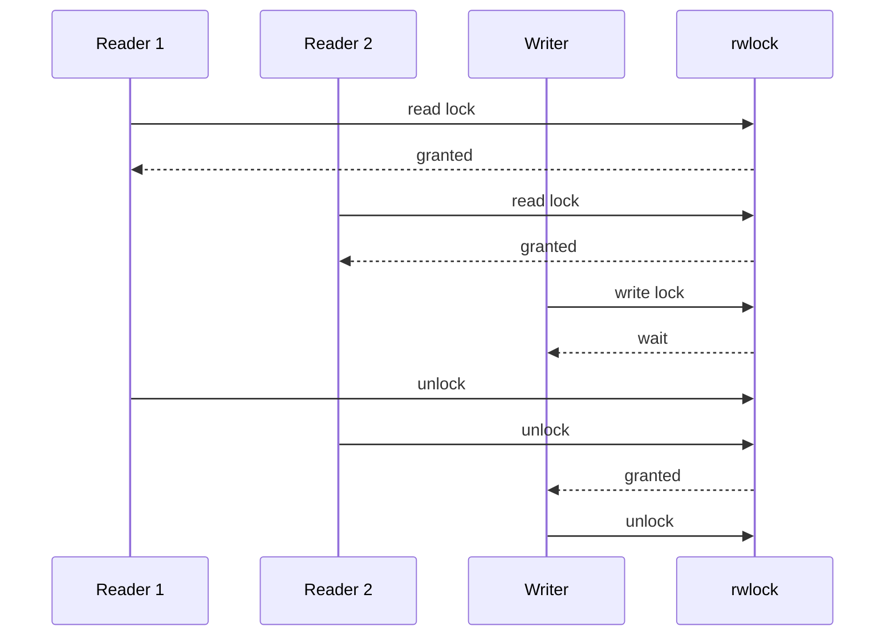
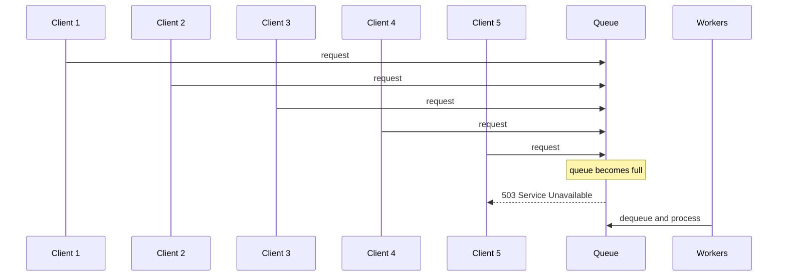
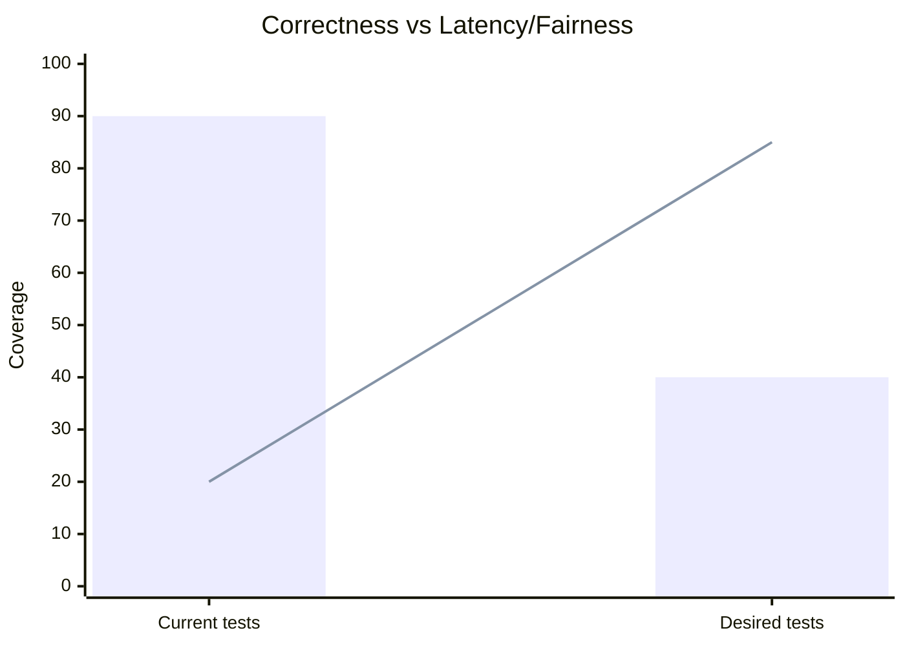
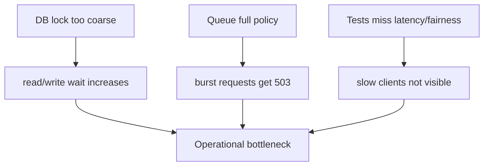

# 동시성 한계와 보완 방향 정리

## 1. 이 문서의 목적

이 문서는 현재 프로젝트에서 동시성 관점으로 아직 남아 있는 세 가지 한계를 정리한다.

1. DB 락이 테이블 전체 단위라서 read/write가 서로 영향을 줄 수 있는 문제
2. queue가 꽉 차면 바로 503을 반환하는 단순한 정책의 한계
3. 현재 테스트가 correctness 중심이라 latency/fairness를 충분히 보지 못하는 문제

이 세 가지는 모두 "데이터가 틀리지는 않는다"는 수준을 넘어서,
"실제 운영에서 얼마나 안정적으로 버틸 수 있는가"와 연결된다.

---

## 2. 큰 그림

현재 서버는 다음과 같은 흐름으로 동작한다.

```mermaid
flowchart LR
    A[Client] --> B[accept()]
    B --> C[Job Queue]
    C --> D[Worker Thread]
    D --> E[http_read_request]
    E --> F[sql_parse]
    F --> G[DB lock]
    G --> H[table_* execution]
    H --> I[JSON response]
    I --> A

    style G fill:#e0f2fe,stroke:#0284c7
    style C fill:#fff7ed,stroke:#c2410c
```

여기서 병목은 크게 세 군데다.

- HTTP 입력 단계
- DB lock 단계
- queue / worker 단계

이번 문서는 그중에서 특히 **DB lock / queue full / 테스트 부족**을 다룬다.

---

## 3. DB 락은 여전히 테이블 전체 단위다

### 3-1. 지금 구조가 의미하는 것

현재 `server/server.c`에는 `pthread_rwlock_t db_lock` 하나가 있고, `Table` 전체를 감싼다.

- 위치: [`server/server.c#L22`](../../../../../../server/server.c#L22)

즉, 이 락은 "users 테이블 전체"를 보호하는 **전역 단위의 read-write lock**이다.

구조적으로는 이런 뜻이다.

```text
SELECT 요청 여러 개
    -> read lock 공유 가능

INSERT 요청 1개
    -> write lock 단독 점유 필요

SELECT가 오래 잡히면
    -> INSERT는 기다려야 함

INSERT가 오래 잡히면
    -> 뒤따르는 SELECT도 대기 가능
```

### 3-2. 왜 read 성능은 좋아 보이는데 완전하지 않은가

`pthread_rwlock_t`는 read가 여러 개 들어오면 같이 들어올 수 있어서, 읽기 위주의 상황에서는 효과가 있다.
하지만 이 락이 **테이블 전체 단위**이기 때문에, 쓰기 입장에서는 여전히 큰 임계구역이다.

예시:

- `SELECT * FROM users;`가 매우 많다.
- read lock이 계속 잡힌다.
- `INSERT`가 write lock을 얻지 못하고 기다린다.

반대도 가능하다.

- `INSERT`가 자주 들어온다.
- 쓰기 락이 길어지면 그 뒤의 `SELECT`가 밀린다.

이 문제는 "DB가 틀린 결과를 주느냐"가 아니라,
"DB 접근이 어떤 순서로 공정하게 진행되느냐"의 문제다.

### 3-3. 공정성은 구현 의존적이다

`pthread_rwlock_t`의 정책은 플랫폼마다 다를 수 있다.
즉, 현재 코드만 보고 "read와 write가 반드시 공정하게 번갈아 처리된다"고 보장할 수는 없다.

이 말은 다음과 같은 현상이 생길 수 있다는 뜻이다.

- read가 너무 많으면 write starvation처럼 보일 수 있다.
- write 우선 정책이면 read latency가 튈 수 있다.

### 3-4. 이해를 돕는 시각 자료



읽기 요청이 많을수록 writer는 기다릴 수 있다.
이건 구조적으로 자연스러운 현상이지만, 운영 관점에서는 latency 문제로 이어진다.

### 3-5. 보완 방법

#### 방법 A. per-table lock

테이블이 여러 개라면 각 테이블마다 lock을 둔다.
지금은 users 하나뿐이지만, 확장하면 table별 분리가 가능하다.

장점:

- 테이블 간 간섭이 줄어든다
- 구조가 비교적 단순하다

단점:

- 현재처럼 테이블이 하나면 효과가 제한적이다
- 테이블 내부의 읽기/쓰기 경쟁은 여전히 남는다

#### 방법 B. index 단위 lock

테이블 전체가 아니라 index나 page 단위로 더 잘게 나눈다.

장점:

- 충돌 범위가 더 줄어든다
- 병렬성이 좋아진다

단점:

- 구현 복잡도가 크게 올라간다
- deadlock 관리가 어려워진다

#### 방법 C. writer-priority rwlock

read가 계속 들어와도 writer가 기아 상태에 빠지지 않게 정책을 둔다.

장점:

- write starvation을 줄일 수 있다
- 정책이 분명해진다

단점:

- read latency가 더 튈 수 있다
- 현재 코드보다 정책 설계가 필요하다

#### 방법 D. MVCC / snapshot isolation / copy-on-write

읽기와 쓰기를 물리적으로 더 분리하는 방식이다.

장점:

- read/write 경합을 크게 줄일 수 있다
- 읽기 성능이 좋아질 수 있다

단점:

- 현재 프로젝트 규모에 비해 무겁다
- 메모리 관리와 버전 관리가 복잡해진다

### 3-6. 추천

지금 프로젝트 기준으로는 **writer-priority rwlock 또는 table 단위 lock의 명시적 정책화**가 가장 현실적이다.

이유:

- 구현 난이도가 과하지 않다
- 지금 구조를 크게 부수지 않는다
- fairness 문제를 어느 정도 줄일 수 있다

장기적으로 더 커지면 그때 MVCC를 보는 것이 맞다.

---

## 4. Queue full 정책은 단순하지만 운영 친화적이지 않다

### 4-1. 현재 정책

현재 `thread_pool_submit()`이 실패하면 서버는 즉시 503을 반환한다.

- 위치: [`server/server.c#L225`](../../../../../../server/server.c#L225)

이 정책은 매우 단순하다.

- queue가 가득 차면 더 받지 않는다
- 처리 불가능한 요청을 쌓지 않는다
- 서버가 무한히 망가지는 것을 막는다

즉, 안전성은 높다.

### 4-2. 그런데 왜 운영 친화적이지 않은가

문제는 순간 트래픽 burst에 민감하다는 것이다.

예를 들어:

- worker 4개
- queue 16개
- 짧은 시간에 요청 20개가 몰림

이 경우 실제로는 몇 개는 금방 처리될 수 있는데도,
queue가 꽉 차는 타이밍에 따라 일부 요청은 503으로 버려질 수 있다.

### 4-3. 시각적으로 보면



이건 시스템이 "죽는 것"은 막지만,
사용자 입장에서는 "잠깐 몰렸는데 요청이 버려졌다"가 된다.

### 4-4. 보완 방법

#### 방법 A. queue 크기와 worker 수를 설정화

지금은 고정값이지만, 환경에 맞게 조정 가능하게 만든다.

장점:

- 운영 환경별 튜닝이 가능하다
- 변화가 적다

단점:

- 설정만 바꾼다고 근본적인 burst 문제는 없어지지 않는다

#### 방법 B. backpressure

서버가 밀리면 클라이언트가 더 보내는 속도를 자연스럽게 늦추도록 유도한다.

장점:

- 서버 보호에 좋다
- 폭주 시 graceful하게 대응할 수 있다

단점:

- 클라이언트 구현에 따라 효과가 다르다
- 설계가 조금 더 필요하다

#### 방법 C. adaptive worker

부하가 늘면 worker 수를 늘리고, 줄면 다시 줄인다.

장점:

- burst 대응력이 좋아진다
- 자원 활용이 유연하다

단점:

- thread 관리가 복잡해진다
- 오버헤드가 생긴다

#### 방법 D. rate limiting

클라이언트별로 초당 요청 수를 제한한다.

장점:

- 악성 burst를 줄일 수 있다
- 전체 시스템 안정성이 올라간다

단점:

- 정상 사용자가 제한될 수 있다
- 정책 설계가 필요하다

### 4-5. 추천

현재 프로젝트에는 **queue 크기 설정화 + 간단한 rate limiting** 조합이 가장 현실적이다.

이유:

- 코드 변경이 비교적 작다
- 503 난사를 줄일 수 있다
- 운영에서 방어막 역할을 할 수 있다

그 다음 단계로 adaptive worker를 고려하면 된다.

---

## 5. 현재 테스트는 correctness 중심이고 latency/fairness는 덜 본다

### 5-1. 지금 테스트가 보는 것

현재 동시성 스트레스 테스트는, 대략 이런 질문에 답한다.

- 동시에 read/write를 보내도 데이터가 깨지지 않는가?
- 최종 row count가 맞는가?
- 응답이 정상 JSON인가?

관련 위치:

- [`scripts/tests/concurrency/rwlock-stress-test.sh#L64`](../../../../../../scripts/tests/concurrency/rwlock-stress-test.sh#L64)

즉, 지금 테스트는 **정확성(correctness)** 확인에 강하다.

### 5-2. 그런데 보이지 않는 것

이 테스트는 아래를 충분히 보여주지 못한다.

- 느린 요청이 있을 때 worker가 얼마나 오래 묶이는지
- write starvation이 실제로 발생하는지
- queue full이 얼마나 자주 나는지
- 요청별 latency 분포가 어떤지

즉, "틀리지 않는다"는 건 보여주지만,
"얼마나 빨리/공정하게 처리하는가"는 잘 안 보인다.

### 5-3. 시각적으로 보면



해석:

- 현재 테스트는 correctness 커버리지는 높다
- latency/fairness는 상대적으로 낮다

### 5-4. 보완 방법

#### 방법 A. slow client 테스트 추가

헤더를 천천히 보내거나 body를 조금씩 보내는 클라이언트를 재현한다.

장점:

- worker 고갈 문제를 직접 확인할 수 있다
- 실제 운영 리스크와 가깝다

단점:

- 테스트 스크립트가 조금 복잡해진다

#### 방법 B. write starvation 테스트 추가

read 요청을 계속 보내는 동안 write가 얼마나 늦어지는지 본다.

장점:

- fairness 문제를 눈으로 확인할 수 있다

단점:

- 재현 조건이 다소 까다롭다

#### 방법 C. 요청별 latency 측정 추가

응답 시간을 수집해서 p50 / p95 / p99 같은 지표를 본다.

장점:

- 운영 관점의 성능을 알 수 있다
- 병목이 눈에 보인다

단점:

- 테스트와 측정 코드가 더 필요하다

### 5-5. 추천

지금 단계에서는 **slow client 테스트 + latency 측정**을 먼저 넣는 것이 좋다.

이유:

- worker starvation을 가장 직접적으로 보여준다
- 구현 난이도가 비교적 낮다
- 지금 구조의 병목을 현실적으로 검증할 수 있다

그 다음 write starvation 테스트를 추가하면 fairness까지 볼 수 있다.

---

## 6. 세 가지를 한 번에 이해하는 그림



세 문제는 서로 다르지만, 결국 같은 결론으로 이어진다.

- 지금 코드는 "정확하게 동작"하는 쪽에는 강하다
- 하지만 "몰릴 때도 안정적으로 버티는가"는 아직 더 다듬을 수 있다

---

## 7. 내 추천 우선순위

현재 프로젝트에 맞는 현실적인 우선순위는 아래와 같다.

### 1순위

`pthread_rwlock_t`의 fairness를 문서상 명확히 하고,
write starvation 가능성을 테스트로 확인한다.

### 2순위

queue full 정책을 그대로 두되,
queue 크기와 worker 수를 설정화하고 rate limiting을 검토한다.

### 3순위

slow client 테스트를 추가해서,
HTTP 입력 단계에서 worker가 묶이는 현상을 정량적으로 본다.

### 4순위

프로젝트가 더 커지면 MVCC나 non-blocking I/O를 검토한다.

---

## 8. 최종 결론

현재 구조는 correctness 면에서는 꽤 안정적이다.
하지만 동시성의 다음 단계에서 중요한 것은 "DB를 정확히 지키는가"뿐 아니라,
"많이 몰릴 때도 공정하고, 지연이 예측 가능하고, 일부 요청이 과도하게 버려지지 않는가"다.

그래서 이 프로젝트의 남은 동시성 보완 포인트는 다음 세 가지로 정리할 수 있다.

1. 테이블 전체 단위 lock의 fairness와 확장성
2. queue full 정책의 운영 친화성
3. latency/fairness를 보는 테스트 보강

한 줄로 요약하면:

**지금은 안전하게 동작하는 단계이고, 다음은 공정하고 예측 가능한 동시성으로 가는 단계다.**
