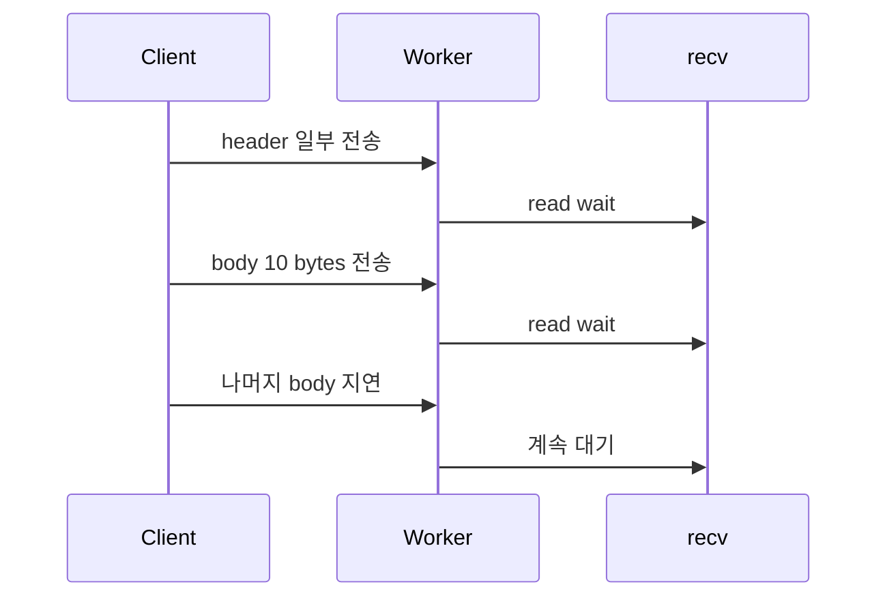
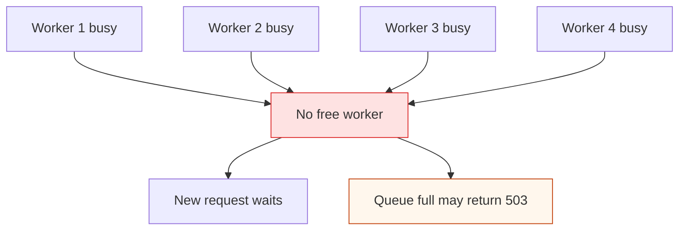
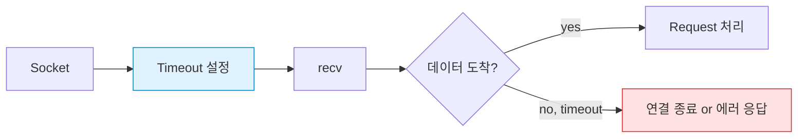

# HTTP blocking I/O로 인한 worker 점유 문제 해결기록

## 목차

1. [문제 정의](#1-문제-정의)
2. [블로킹 I/O 방식이란](#2-블로킹-io-방식이란)
3. [왜 문제가 생기는가](#3-왜-문제가-생기는가)
4. [실제로 어떤 상황에서 나타나는가](#4-실제로-어떤-상황에서-나타나는가)
5. [이 문제가 위험한 이유](#5-이-문제가-위험한-이유)
6. [내가 채택한 해결 방안: 소켓 타임아웃 추가](#6-내가-채택한-해결-방안-소켓-타임아웃-추가)
7. [왜 이 방안을 먼저 선택했는가](#7-왜-이-방안을-먼저-선택했는가)
8. [구체적으로 어떻게 동작하는가](#8-구체적으로-어떻게-동작하는가)
9. [장점](#9-장점)
10. [단점](#10-단점)
11. [다른 해결 방법과 비교](#11-다른-해결-방법과-비교)
12. [해결 방법 비교표](#12-해결-방법-비교표)
13. [추천 결론](#13-추천-결론)
14. [정리](#14-정리)

## 1. 문제 정의

현재 서버는 `worker thread pool` 구조로 동작한다.
main thread가 새 연결을 받아서 job queue에 넣고, worker thread가 해당 소켓을 하나씩 처리한다.

문제는 HTTP 요청을 읽는 함수인 `http_read_request()`가 `recv()`를 반복 호출하는 **blocking I/O** 방식이라는 점이다.

즉, 클라이언트가 다음처럼 행동하면 worker 하나가 오래 묶일 수 있다.

- 헤더를 아주 천천히 보내는 경우
- body를 조금씩 끊어서 보내는 경우
- 아예 요청을 끝까지 보내지 않고 멈추는 경우

이 문제는 DB 락과 별개다.
DB 락을 잘 줄여도, HTTP 입력 단계에서 worker가 오래 막히면 전체 처리량이 떨어지고 worker pool이 고갈될 수 있다.

### 한 줄 요약

`recv()`가 오래 기다리면 worker가 그 시간 동안 다른 요청을 처리하지 못한다.

---

## 2. 블로킹 I/O 방식이란

블로킹 I/O는 호출한 스레드가 작업이 끝날 때까지 멈춰 서는 방식이다.
여기서 `recv()`는 소켓에 읽을 데이터가 생길 때까지 현재 스레드를 기다리게 만든다.

즉, `recv()`가 반환하지 않으면 그 함수를 호출한 worker thread도 같이 멈춘다.

### 핵심 특징

- 호출한 쪽이 결과가 올 때까지 기다린다
- 데이터가 없으면 함수가 바로 끝나지 않는다
- 요청이 늦게 오면 그 시간 동안 스레드가 묶인다
- worker thread pool과 결합되면 스레드 자원이 소모된다

### 이 프로젝트에서의 의미

우리 서버는 요청 하나를 worker 하나가 처리하는 구조다.
따라서 HTTP 입력 단계에서 블로킹이 길어지면:

- worker 하나가 통째로 묶인다
- 다른 요청을 처리할 여유가 줄어든다
- queue와 worker pool 전체의 효율이 떨어진다

### 비블로킹과의 차이

- 블로킹 I/O: 데이터가 올 때까지 현재 스레드가 기다린다
- non-blocking I/O: 데이터가 없으면 즉시 돌아가고, 나중에 다시 시도한다

이 문서는 현재 구조를 크게 바꾸지 않고 문제를 줄이는 방향을 다루므로, 블로킹 I/O 자체를 없애기보다는 오래 붙잡히지 않도록 제한하는 데 초점을 둔다.

---

## 3. 왜 문제가 생기는가

blocking I/O는 "데이터가 올 때까지 기다리는 방식"이다.
이 방식 자체는 단순하고 이해하기 쉽지만, worker thread pool과 결합되면 문제가 생긴다.

### 요청 흐름


위 흐름에서 병목은 `recv()`가 들어있는 HTTP 입력 단계다.
여기서 문제가 생기면, DB를 만지기도 전에 worker가 붙잡힌다.

### 쉽게 비유하면

- worker는 식당 직원
- `recv()`는 손님이 주문서를 다 써서 가져올 때까지 기다리는 시간
- 손님이 주문서를 한 글자씩 아주 천천히 쓰면 직원 1명이 계속 그 자리에서 멈춰 있게 된다

그 결과:

- 다른 손님을 받을 직원이 줄어든다
- 대기열이 길어진다
- 심하면 더 이상 받을 worker가 없어져서 새 요청이 밀리거나 거절된다

---

## 4. 실제로 어떤 상황에서 나타나는가

### 3-1. 헤더를 천천히 보내는 경우

클라이언트가 요청 헤더를 한 번에 보내지 않고 조금씩 나눠 보내면 서버는 계속 다음 바이트를 기다린다.

예를 들면:

```text
POST /query HTTP/1.1\r\n
Host: localhost\r\n
Content-Type: text/plain\r\n
Content-Length: 31\r\n
\r\n
INSERT INTO users VALUES ('A'
```

여기서 body의 나머지가 늦게 오면 `http_read_request()`는 계속 `recv()`를 기다린다.

### 3-2. body를 중간중간 끊어서 보내는 경우

TCP는 메시지를 "한 번에 완성된 덩어리"로 보장하지 않는다.
따라서 body가 여러 조각으로 도착하는 것은 정상적인 상황이다.

문제는 그 조각 사이 간격이 너무 길어질 때다.



### 3-3. 느린 네트워크 또는 의도적 지연

다음 같은 환경에서는 더 쉽게 발생한다.

- 모바일 네트워크
- 불안정한 Wi-Fi
- 프록시/중간 장비가 있는 환경
- 의도적으로 요청을 천천히 보내는 테스트 도구

특히 마지막 경우는 slowloris 패턴과 비슷하다.
헤더를 끝까지 보내지 않거나 body를 매우 느리게 보내서 서버의 worker를 오래 점유시키는 방식이다.

---

## 5. 이 문제가 위험한 이유

### 4-1. worker pool 고갈

worker가 4개이고, 느린 요청 4개가 동시에 들어오면 어떻게 될까?



새 요청을 처리할 worker가 없다.
그러면:

- 요청이 queue에서 오래 기다린다
- queue가 차면 503이 늘어난다
- 전체 응답 시간이 급격히 나빠진다

### 4-2. DB가 멀쩡해도 전체 서버가 느려진다

이 문제는 DB 락과 별개다.
DB 락을 줄여도 HTTP 입력 단계에서 worker가 막혀 있으면, DB는 놀고 있는데 서버는 바쁘게 보일 수 있다.

즉, 병목이 DB가 아니라 네트워크 입력 단계에 있는 것이다.

### 4-3. 악성 요청이 아니어도 발생할 수 있다

이 문제는 꼭 공격일 때만 생기는 것이 아니다.

- 네트워크가 느린 클라이언트
- 요청이 큰 클라이언트
- 잠깐의 패킷 분할

같은 정상 상황에서도 발생할 수 있다.
그래서 "나쁜 요청만 막으면 된다"로 끝나지 않는다.

---

## 6. 내가 채택한 해결 방안: 소켓 타임아웃 추가

핵심은 간단하다.

`recv()`가 너무 오래 기다리지 않도록 **read timeout**을 둔다.

대표적으로 다음 옵션을 쓴다.

- `SO_RCVTIMEO`
- `SO_SNDTIMEO`

### 아이디어



worker가 무한정 기다리지 않고, 일정 시간 이상 멈춰 있으면 연결을 끊거나 에러 처리한다.

---

## 7. 왜 이 방안을 먼저 선택했는가

이 프로젝트는 현재 `worker thread pool + blocking I/O` 구조를 크게 흔들지 않는 쪽이 가장 현실적이다.

타임아웃 추가는 다음 장점이 있다.

- 구현이 비교적 단순하다
- 현재 구조를 거의 유지할 수 있다
- 느린 클라이언트를 일정 시간 후 끊을 수 있다
- worker pool 고갈을 줄일 수 있다

즉, "빠르게 효과를 보는 방어막"에 가깝다.

---

## 8. 구체적으로 어떻게 동작하는가

### 7-1. `SO_RCVTIMEO`

`recv()`가 데이터를 기다리는 최대 시간을 정한다.

예:

- 3초 동안 아무 데이터도 안 오면 timeout
- 5초 이상 body가 안 이어져도 timeout

이렇게 하면 worker가 무한정 멈춰 있지 않는다.

### 7-2. `SO_SNDTIMEO`

`send()`가 응답을 보내는 동안 너무 오래 막히는 것도 방지한다.

보통은 읽기 타임아웃이 더 먼저 중요하지만, 응답 전송도 네트워크가 느리면 막힐 수 있으니 같이 고려할 수 있다.

---

## 9. 장점

### 장점 1. 구현이 비교적 단순하다

기존 `recv()` 루프를 완전히 갈아엎지 않아도 된다.
소켓 옵션만 추가해도 효과를 볼 수 있다.

### 장점 2. 현재 구조를 크게 바꾸지 않는다

`thread pool` 구조, `http_read_request()` 구조를 유지한 채로 대응할 수 있다.
교육용/프로토타입 서버에 특히 맞는다.

### 장점 3. 느린 클라이언트를 일정 시간 후 끊을 수 있다

무한정 기다리지 않으므로 worker 점유 시간을 줄일 수 있다.

### 장점 4. 서버 전체의 방어력이 올라간다

몇 개의 느린 연결이 전체 worker를 점유하는 상황을 줄일 수 있다.

---

## 10. 단점

### 단점 1. 타임아웃 값을 잘못 잡으면 정상 요청도 끊을 수 있다

예를 들어:

- 모바일 네트워크가 느린 사용자
- body가 큰 사용자
- 일시적으로 지연이 있는 사용자

이런 경우도 timeout에 걸릴 수 있다.

즉, 너무 짧으면 오탐이 늘어난다.

### 단점 2. 근본적으로 blocking 구조는 그대로다

타임아웃은 "오래 기다리지 않게 만드는 장치"이지, 구조 자체를 non-blocking으로 바꾸는 것은 아니다.

그래서 부하가 심하면 worker 점유 시간이 여전히 길 수 있다.

### 단점 3. 고부하 상황에서 완전한 해결책은 아니다

느린 요청을 빨리 자를 수는 있지만, 모든 동시성 문제를 해결해 주지는 않는다.

특히:

- 요청 폭주
- 응답 전송 지연
- TCP 레벨 지연

같은 문제는 별도 대응이 필요하다.

---

## 11. 다른 해결 방법과 비교

### 10-1. non-blocking socket + event loop

소켓을 non-blocking으로 바꾸고 `epoll` 또는 `kqueue`로 이벤트를 감시하는 방식이다.

#### 장점

- worker가 I/O 대기에 묶이지 않는다
- 대규모 동시 연결에 강하다
- 느린 클라이언트가 전체 worker를 잡아먹기 어렵다

#### 단점

- 구현 난도가 높다
- HTTP 파싱, 버퍼 관리, 상태 관리가 복잡해진다
- 현재 코드 구조를 많이 바꿔야 한다

#### 적합한 경우

- 장기적으로 더 높은 처리량이 필요할 때
- 서버 구조를 크게 개선할 계획이 있을 때

### 10-2. I/O worker와 DB worker 분리

HTTP 읽기/쓰기만 담당하는 worker와 DB 처리를 담당하는 worker를 분리하는 방식이다.

#### 장점

- I/O가 DB worker를 막지 않는다
- 병목 지점을 분리해서 관리할 수 있다

#### 단점

- thread 간 handoff가 생겨 구조가 복잡해진다
- 메모리/상태 관리가 더 어려워진다

#### 적합한 경우

- 현재 구조를 유지하면서도 병목을 분리하고 싶을 때

### 10-3. 요청 크기/속도 제한

헤더 최대 크기, body 최대 크기, 수신 최대 시간을 함께 제한한다.

#### 장점

- 구현이 비교적 쉽다
- 악성 요청을 더 강하게 제한할 수 있다

#### 단점

- 정상 대형 요청도 제한될 수 있다
- 정책 조정이 필요하다

---

## 12. 해결 방법 비교표

| 방법 | 구현 난이도 | 현재 구조 변경 | 효과 | 단점 |
|---|---:|---:|---:|---|
| 소켓 타임아웃 추가 | 낮음 | 작음 | 즉시 효과 | 느린 정상 클라이언트 오탐 가능 |
| non-blocking + event loop | 높음 | 큼 | 매우 큼 | 구조가 복잡함 |
| I/O worker와 DB worker 분리 | 중간~높음 | 중간~큼 | 큼 | thread handoff와 상태 관리 복잡 |
| 요청 크기/속도 제한 | 낮음~중간 | 작음 | 보조 방어 | 정책 조정 필요 |

---

## 13. 추천 결론

현재 프로젝트에서는 **1단계로 소켓 타임아웃 추가**가 가장 적절하다.

이유는 다음과 같다.

1. 현재 `thread pool + blocking I/O` 구조를 크게 바꾸지 않아도 된다
2. 구현 대비 효과가 빠르다
3. worker pool 고갈 문제를 먼저 막는 데 적합하다
4. 교육용/초기 서버에는 충분히 실용적이다

### 추천 순서

```text
1) SO_RCVTIMEO / SO_SNDTIMEO 추가
2) 헤더/바디 최대 크기 제한 추가
3) 요청별 latency 측정 도입
4) 필요하면 non-blocking/event loop 구조 검토
```

즉, 지금은 "큰 구조 변경"보다 "작게 막아서 전체 서버를 살리는 방식"이 맞다.

---

## 14. 정리

이 문제의 핵심은 DB가 아니라 **HTTP 입력 단계에서 worker가 오래 묶이는 것**이다.

따라서 해결의 첫걸음은:

- `recv()`가 무한정 기다리지 않도록 하고
- 느린 클라이언트를 일정 시간 후 끊고
- worker pool 고갈을 막는 것이다

소켓 타임아웃은 완벽한 종착점은 아니지만, 현재 구조에서는 가장 현실적이고 효과적인 방어책이다.

### 9-1. timeout 값을 5초로 잡은 이유

`SO_RCVTIMEO`와 `SO_SNDTIMEO`는 현재 5초로 두는 것이 가장 무난하다.

- 1~2초처럼 너무 짧게 잡으면 모바일 네트워크나 잠깐의 지연에도 정상 요청이 끊길 수 있다.
- 5초 정도면 일반적인 HTTP 요청에서는 충분히 여유가 있고, 느린 클라이언트가 worker를 오래 묶는 상황은 줄일 수 있다.
- 우리 프로젝트는 업로드형 API가 아니라 짧은 텍스트 기반 SQL 요청이 중심이라, 5초를 넘기는 정상 요청 가능성은 낮다.

즉, 5초는 "느린 공격/느린 클라이언트는 끊되, 정상적인 사용자 경험은 크게 해치지 않는" 현실적인 균형점이다.

이 값은 완전한 정답이라기보다 시작점이다. 실제 서비스라면 트래픽과 네트워크 환경을 보면서 3초, 5초, 10초 같은 값으로 조정하는 것이 맞다.
