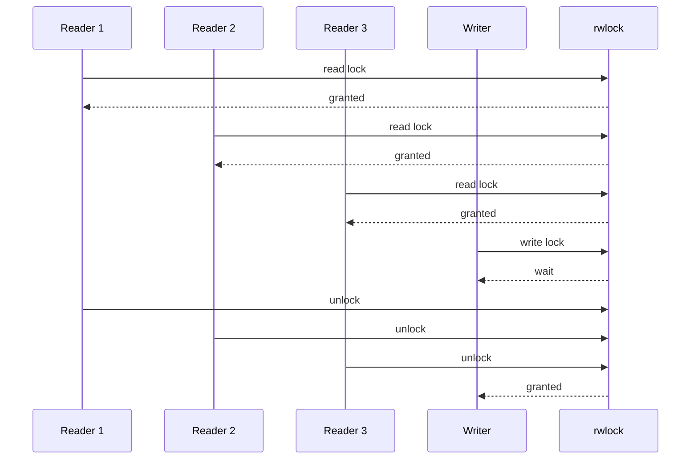

# 락 정책과 공정성 문제 해결기록

## 목차

1. [문제 상황](#1-문제-상황)
2. [현재 구조가 의미하는 것](#2-현재-구조가-의미하는-것)
3. [왜 문제가 생기는가](#3-왜-문제가-생기는가)
4. [락 정책별 차이](#4-락-정책별-차이)
5. [우리 프로젝트의 현재 상태](#5-우리-프로젝트의-현재-상태)
6. [공정락을 적용하면 어떻게 달라지는가](#6-공정락을-적용하면-어떻게-달라지는가)
7. [해결 방안별 장단점](#7-해결-방안별-장단점)
8. [추천 방향](#8-추천-방향)
9. [정리](#9-정리)

---

## 1. 문제 상황

현재 프로젝트는 멀티스레드 서버 구조를 사용한다.
main thread가 소켓을 받아 job queue에 넣고, worker thread가 HTTP 요청을 처리한다.

문제는 DB 접근 단계에서 `pthread_rwlock_t` 기반의 락 정책이 명시적으로 정해져 있지 않다는 점이다.
즉, 읽기와 쓰기 중 누가 더 우선인지, 오래 기다리는 writer를 어떻게 다룰지에 대한 정책이 없다.

이 때문에 다음과 같은 상황이 생길 수 있다.

- `SELECT` 요청이 많아 읽기 락이 계속 잡힌다.
- `INSERT` 요청이 들어와도 write lock을 얻지 못하고 기다린다.
- `SELECT *` 같은 전체 조회가 길어지면 writer가 더 오래 밀린다.
- 읽기 요청이 계속 들어오면 writer starvation처럼 보이는 현상이 생긴다.

이 문제는 데이터가 깨지는 문제와는 다르다.
정확성은 유지되더라도, **어떤 요청이 얼마나 공정하게 처리되는가**가 흔들린다.

한 줄 요약:

> 지금 문제는 "DB가 틀린 값을 주느냐"가 아니라 "읽기와 쓰기가 공정하게 진행되느냐"의 문제다.

---

## 2. 현재 구조가 의미하는 것

현재 `sql_processor/table.c`에서는 테이블을 버킷 단위로 나누고, 각 버킷마다 `pthread_rwlock_t`를 둔다.
그리고 `server/server.c`와 `server/api.c`는 이 테이블에 대해 별도 공정성 정책 없이 락을 사용한다.

관련 코드 위치:

- [`server/server.c`](/workspaces/week8-team2-network/server/server.c)
- [`server/api.c`](/workspaces/week8-team2-network/server/api.c)
- [`sql_processor/table.c`](/workspaces/week8-team2-network/sql_processor/table.c)
- [`sql_processor/table.h`](/workspaces/week8-team2-network/sql_processor/table.h)

이 구조를 그림으로 보면 다음과 같다.

즉, 현재 코드는 "누가 먼저 들어왔는지"나 "writer가 기다리고 있는지"를 따로 기록하지 않는다.
그냥 `pthread_rwlock_t`의 기본 동작에 맡겨져 있다.

---

## 3. 왜 문제가 생기는가

### 3-1. 읽기와 쓰기의 특성이 다르기 때문이다

읽기 요청은 여러 개가 동시에 들어올 수 있다.
반면 쓰기 요청은 독점적으로 락을 잡아야 한다.

그래서 다음이 발생한다.

- 읽기 요청이 많으면 읽기는 잘 통과한다.
- 쓰기 요청은 그 사이에 끼어들기 어렵다.
- 읽기 요청이 계속 이어지면 writer가 오래 기다릴 수 있다.

### 3-2. `SELECT *`가 특히 무겁기 때문이다

우리 프로젝트의 `SELECT *`는 단순히 한 row만 읽는 것이 아니라, 전체 버킷을 순회하면서 결과를 모은다.
즉, 읽기 락을 짧게 잡고 끝나는 쿼리가 아니라, **읽기 경합이 오래 이어질 수 있는 쿼리**다.

### 3-3. 공정성은 기본 rwlock에 맡겨져 있기 때문이다

현재 코드에는 writer가 대기 중일 때 새로운 reader를 막는 별도 정책이 없다.
즉, **read-heavy 상황에서 writer가 계속 밀릴 가능성**이 있다.

이건 잘못된 구현이라기보다, **정책이 비어 있는 상태**에 가깝다.

---

## 4. 락 정책별 차이

### 읽기 우선

읽기 요청이 들어오면 계속 통과시키고, writer는 뒤로 미루는 방식이다.

장점:

- 읽기 처리량이 좋다
- 조회 위주 서비스에서는 빠르게 보인다

단점:

- writer starvation이 쉽게 생긴다
- 읽기가 많아질수록 쓰기가 굶을 수 있다

### 쓰기 우선

writer가 기다리고 있으면 새로운 reader를 막는 방식이다.

장점:

- writer starvation을 줄인다
- 쓰기 요청이 필요한 시스템에서 안정적이다

단점:

- 읽기 latency가 늘 수 있다
- read-heavy workload에서는 평균 응답이 흔들릴 수 있다

### 공정 락

읽기와 쓰기를 최대한 공평하게 순서대로 처리하는 방식이다.

장점:

- starvation을 가장 잘 줄인다
- 읽기와 쓰기 사이의 균형이 좋다

단점:

- 구현이 복잡하다
- 성능이 단순 rwlock보다 나빠질 수 있다

---

## 5. 우리 프로젝트의 현재 상태

우리 프로젝트는 **명시적으로 읽기 우선 / 쓰기 우선 / 공정 락 중 하나를 선택한 상태가 아니다.**

현재 상태를 정확히 말하면:

- 버킷 단위로 `pthread_rwlock_t`를 사용한다.
- 별도의 writer priority 정책이 없다.
- 별도의 fairness queue도 없다.
- 따라서 정책은 기본 `pthread_rwlock_t` 구현에 맡겨져 있다.

이 말은 곧, **관찰상 읽기 쪽이 유리해질 가능성**이 있다는 뜻이다.

특히 다음 조건이 겹치면 writer starvation 가능성이 커진다.

- `SELECT *`가 많다
- 동시 요청이 많다
- writer보다 reader가 먼저 계속 들어온다
- 락을 짧게 끊지 못하는 전체 조회가 있다

즉, 현재 프로젝트는 "깨지지는 않지만, 공정성이 자동으로 보장되는 상태는 아니다"라고 보는 게 맞다.

---

## 6. 공정락을 적용하면 어떻게 달라지는가

공정락을 넣는다는 것은, 간단히 말하면:

> reader가 많아도 writer가 대기 중이면 새 reader의 진입을 조절해서, writer가 영원히 굶지 않게 만드는 것

이다.

### 6-1. 기대 효과

- writer starvation이 줄어든다.
- `INSERT`가 계속 밀리는 현상이 완화된다.
- 읽기와 쓰기가 섞인 부하에서 결과가 더 예측 가능해진다.
- 스트레스 테스트가 2분 안에 끝나지 않던 문제도 개선될 가능성이 있다.

### 6-2. 테스트 관점 변화

현재 실패한 버킷 락 테스트는 read-heavy가 아니라 **read/write 혼합 폭주**에 가깝다.
공정락이 들어가면 다음이 달라질 수 있다.

- `SELECT *`가 계속 와도 writer가 대기열에서 너무 오래 기다리지 않는다.
- 최종 row count가 더 안정적으로 맞는다.
- `wait`가 오래 걸려 테스트가 timeout 나는 현상이 줄어든다.

### 6-3. 예상되는 부작용

공정락은 writer starvation을 줄이는 대신, 읽기 성능을 조금 희생할 수 있다.

- reader가 바로바로 지나가지 못할 수 있다.
- read-only workload에서는 평균 latency가 늘 수 있다.
- 구현이 더 복잡해진다.

즉, 공정락은 "무조건 빠른 락"이 아니라 **"고르게 처리하는 락"** 이다.

---

## 7. 해결 방안별 장단점

### 방법 A. 읽기 우선 유지

장점:

- 구현이 가장 단순하다
- 읽기 성능이 좋다

단점:

- writer starvation이 계속 생길 수 있다
- 우리 테스트처럼 read/write가 섞인 상황에 약하다

### 방법 B. 쓰기 우선으로 변경

장점:

- writer starvation을 상당히 줄일 수 있다
- 지금 구조를 크게 뒤집지 않아도 된다

단점:

- 읽기 latency가 늘 수 있다
- 조회 위주 부하에서는 체감 성능이 떨어질 수 있다

### 방법 C. 공정락 적용

장점:

- starvation을 가장 잘 줄인다
- mixed workload에서 균형이 좋다

단점:

- 구현 난이도가 높다
- 성능 튜닝이 필요하다

### 방법 D. MVCC / snapshot 기반

장점:

- 읽기와 쓰기를 물리적으로 분리할 수 있다
- 가장 근본적인 해결에 가깝다

단점:

- 현재 프로젝트 규모에 비해 무겁다
- 버전 관리와 메모리 회수가 복잡하다

---

## 8. 추천 방향

지금 프로젝트 기준으로는 다음 순서가 현실적이다.

1. 공정락 또는 writer-priority 정책을 명시한다.
2. `SELECT *`처럼 오래 걸리는 조회는 락 점유 시간을 줄이는 방향으로 개선한다.
3. 테스트에 writer starvation과 latency 측정 항목을 추가한다.
4. 필요하면 snapshot 또는 MVCC를 검토한다.

내가 보는 추천은 이렇다.

- **단기 해결**: 공정락
- **조금 더 단순한 대안**: writer 우선
- **장기 확장**: snapshot / MVCC

왜 공정락을 추천하냐면:

- 현재 문제는 단순히 writer만 살리면 끝나는 게 아니라
- read/write 혼합 부하에서 요청이 오래 밀리는 현상까지 같이 보이기 때문이다.

즉, 공정락은 이 프로젝트에서 **"정확성은 유지하면서 공정성도 보여주기 좋은 선택"** 이다.

---

## 9. 정리

현재 프로젝트의 락 정책은 **명시적인 공정성 정책이 없는 기본 `pthread_rwlock_t` 의존 상태**다.
그래서 read-heavy 상황에서는 writer starvation이 생기기 쉽다.

이 문제를 해결하는 방식은 크게 세 가지다.

- 읽기 우선 유지
- 쓰기 우선으로 변경
- 공정락 적용

이 중에서 우리 프로젝트처럼 `SELECT *`와 `INSERT`가 섞여 있고, 동시성 테스트에서 writer가 밀리는 현상이 드러난 경우에는 **공정락**이 가장 균형 잡힌 선택에 가깝다.

한 줄로 요약하면:

> 지금 프로젝트는 “안전한 락”은 어느 정도 갖췄지만, “공정한 락”은 아직 명시적으로 선택하지 않은 상태이고, 다음 개선 후보로는 공정락이 가장 자연스럽다.
