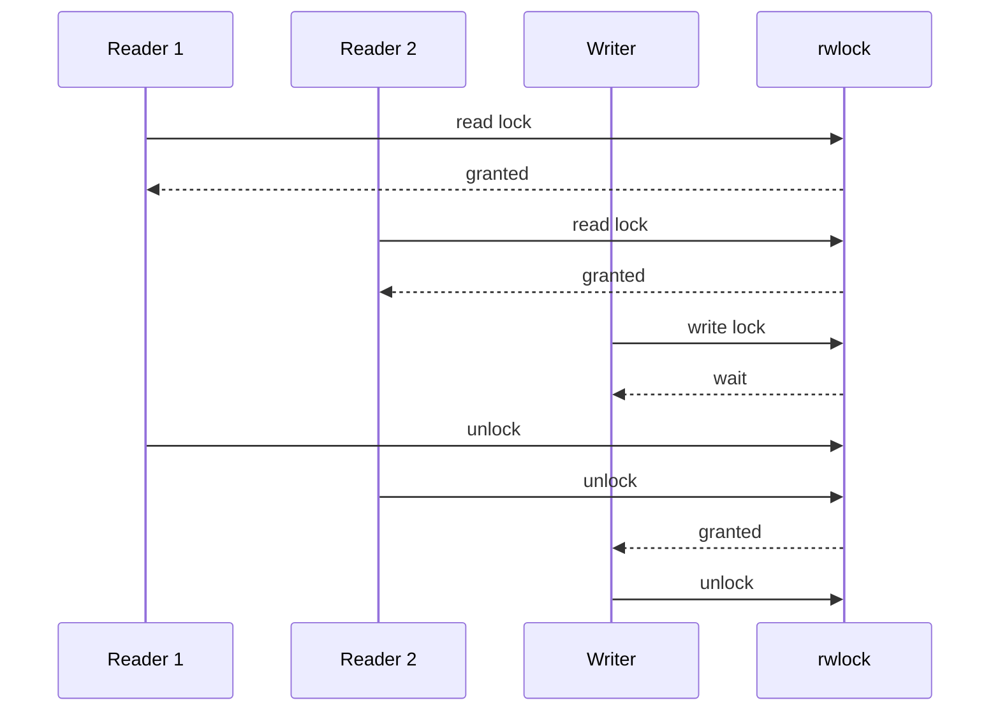

# 테이블 전체 rwlock의 동시성 한계 문제정리

## 목차

1. [문제 정의](#1-문제-정의)
2. [지금 구조가 의미하는 것](#2-지금-구조가-의미하는-것)
3. [왜 read 성능은 좋아 보이지만 완전하지 않은가](#3-왜-read-성능은-좋아-보이지만-완전하지-않은가)
4. [공정성은 구현 의존적이다](#4-공정성은-구현-의존적이다)
5. [보완 방법](#5-보완-방법)
6. [추천](#6-추천)
7. [정리](#7-정리)

---

## 1. 문제 정의

현재 서버의 `server/server.c`에는 `pthread_rwlock_t db_lock` 하나가 있고, 이 락이 `Table` 전체를 감싼다.

- 위치: [`server/server.c#L22`](../../../../../../server/server.c#L22)

즉, 이 락은 `"users 테이블 전체"`를 보호하는 전역 단위의 read-write lock이다.

구조적으로는 다음 뜻이다.

- `SELECT` 요청 여러 개는 read lock을 공유할 수 있다.
- `INSERT` 요청 1개는 write lock을 단독으로 점유해야 한다.
- `SELECT`가 오래 잡히면 `INSERT`는 기다려야 한다.
- `INSERT`가 오래 잡히면 뒤따르는 `SELECT`도 대기할 수 있다.

한 줄로 요약하면,

> 읽기는 잘 늘어나 보이지만, 쓰기와의 경합을 줄이기에는 아직 큰 단위의 락이다.

---

## 2. 지금 구조가 의미하는 것

현재 구조를 흐름으로 보면 아래와 같다.

즉, 이 락은 세밀한 자원 보호가 아니라 **테이블 전체를 한 번에 보호하는 큰 락**이다.

그래서 읽기 요청이 많을 때는 잘 버티는 것처럼 보이지만, 실제로는 다음 문제가 생긴다.

- 읽기와 쓰기가 같은 테이블 전체에서 충돌한다.
- 특정 쿼리가 오래 잡으면 같은 테이블의 다른 쿼리도 밀린다.
- 테이블 수가 늘어나도, 현재처럼 전역 락 하나면 분리 효과가 없다.

---

## 3. 왜 read 성능은 좋아 보이지만 완전하지 않은가

`pthread_rwlock_t`는 read가 여러 개 들어오면 같이 들어올 수 있어서, 읽기 위주의 상황에서는 효과가 있다.
하지만 이 락이 테이블 전체 단위이기 때문에, 쓰기 입장에서는 여전히 큰 임계구역이다.

### 예시

- `SELECT * FROM users;`가 매우 많다.
- read lock이 계속 잡힌다.
- `INSERT`가 write lock을 얻지 못하고 기다린다.

반대도 가능하다.

- `INSERT`가 자주 들어온다.
- 쓰기 락이 길어지면 그 뒤의 `SELECT`가 밀린다.

이 문제는 "DB가 틀린 결과를 주느냐"가 아니라,  
"DB 접근이 어떤 순서로 공정하게 진행되느냐"의 문제다.

### 시각 자료

읽기 요청이 많을수록 writer는 기다릴 수 있다.  
이건 구조적으로 자연스러운 현상이지만, 운영 관점에서는 latency 문제로 이어진다.

---

## 4. 공정성은 구현 의존적이다

`pthread_rwlock_t`의 정책은 플랫폼마다 다를 수 있다.
즉, 현재 코드만 보고 `"read와 write가 반드시 공정하게 번갈아 처리된다"`고 보장할 수는 없다.

이 말은 다음과 같은 현상이 생길 수 있다는 뜻이다.

- read가 너무 많으면 write starvation처럼 보일 수 있다.
- write 우선 정책이면 read latency가 튈 수 있다.

이 문제는 코드가 잘못됐다기보다, **락 정책 자체가 얼마나 공정하게 동작하느냐**의 문제다.

---

## 5. 보완 방법

### 방법 A. per-table lock

테이블이 여러 개라면 각 테이블마다 lock을 둔다.  
지금은 users 하나뿐이지만, 확장하면 table별 분리가 가능하다.

#### 장점

- 테이블 간 간섭이 줄어든다.
- 구조가 비교적 단순하다.

#### 단점

- 현재처럼 테이블이 하나면 효과가 제한적이다.
- 테이블 내부의 읽기/쓰기 경쟁은 여전히 남는다.

### 방법 B. index 단위 lock

테이블 전체가 아니라 index나 page 단위로 더 잘게 나눈다.

여기서 중요한 점은, `테이블 1개`라고 해서 무조건 `락 1개`만 써야 하는 것은 아니라는 것이다.
한 테이블 안에서도 **어떤 기준으로 데이터를 나눌지**를 정하면, 그 단위마다 락을 따로 둘 수 있다.

#### 테이블 하나를 나누는 기준

우리 프로젝트처럼 테이블이 하나일 때는 보통 아래 기준 중 하나를 쓴다.

##### 1) primary key 기준

`id` 같은 고유 키를 기준으로 범위를 나눈다.

- 예: `id 1~1000`, `1001~2000`, `2001~3000`
- 각 구간마다 별도 lock을 둔다.

이 방식은 range lock 또는 partition lock처럼 생각할 수 있다.

##### 2) hash 기준

`id % N` 같은 해시값으로 bucket을 나눈다.

- 예: `id % 4 == 0`, `1`, `2`, `3`
- 각 bucket마다 lock을 둔다.

이 방식은 데이터가 고르게 퍼질 때 효과가 좋다.

##### 3) B+Tree / page 기준

DB 내부 구조가 B+Tree라면 leaf node나 page 단위로 락을 둘 수 있다.

- 같은 index라도 서로 다른 leaf/page에 있으면 락 충돌이 줄어든다.
- 실제 상용 DB에서 자주 쓰는 방향이다.

##### 4) hot spot 기준

특정 row나 특정 범위에 요청이 몰린다면 그 부분만 따로 분리한다.

- 예: 특정 `id` 범위만 자주 읽히거나 수정되는 경우
- 자주 충돌하는 부분만 별도 락을 둔다.

#### 우리 프로젝트처럼 테이블이 하나일 때의 의미

테이블이 하나라도 의미가 아예 없는 것은 아니다.
다만 **모든 경우에 효과적인 것은 아니다**.

예를 들어:

- `SELECT * FROM users WHERE id = 1`처럼 특정 row만 자주 보는 경우
- `INSERT`와 `SELECT`가 서로 다른 row 범위에 많이 몰리는 경우

이런 상황이면 `id 기준 분할`이나 `hash 기준 분할`이 도움이 될 수 있다.

반대로:

- 항상 `SELECT * FROM users`처럼 전체를 읽는 경우
- 전체 테이블을 한 번씩 훑는 쿼리가 많을 경우

이런 경우는 index/page로 나눠도 이득이 제한적이다.

즉, **나누는 기준은 "어떤 row들이 동시에 자주 접근되는가"를 보고 정한다.**

#### 기준을 어떻게 정하나

실무적으로는 다음을 본다.

- 어떤 쿼리가 가장 자주 오는가
- 어떤 row 범위가 가장 많이 읽히거나 쓰이는가
- 충돌이 어디서 가장 자주 나는가
- 전체 스캔이 많은지, 특정 row 접근이 많은지

결국 기준은 `데이터 분포`와 `접근 패턴`이다.
무작정 잘게 쪼개는 것이 아니라, **경합이 자주 생기는 지점을 기준으로 쪼갠다**.

#### 우리 프로젝트 기준 결론

지금처럼 테이블이 하나이고, 쿼리 패턴도 단순한 상황에서는
index/page 단위 lock은 개념적으로는 가능하지만, 체감 효과가 크지 않을 수 있다.

그래서 지금 단계에서는

- 실제로 경합이 자주 생기는지 먼저 보고
- 필요하면 `id 기준 분할`이나 `hash 기준 분할`을 검토하고
- 더 커질 때 page/index 단위로 진화시키는 흐름이 자연스럽다.

#### 장점

- 충돌 범위가 더 줄어든다.
- 병렬성이 좋아진다.

#### 단점

- 구현 복잡도가 크게 올라간다.
- deadlock 관리가 어려워진다.

### 방법 C. writer-priority rwlock

read가 계속 들어와도 writer가 기아 상태에 빠지지 않게 정책을 둔다.

#### 장점

- write starvation을 줄일 수 있다.
- 정책이 분명해진다.

#### 단점

- read latency가 더 튈 수 있다.
- 현재 코드보다 정책 설계가 필요하다.

### 방법 D. MVCC / snapshot isolation / copy-on-write

읽기와 쓰기를 물리적으로 더 분리하는 방식이다.

#### 장점

- read/write 경합을 크게 줄일 수 있다.
- 읽기 성능이 좋아질 수 있다.

#### 단점

- 현재 프로젝트 규모에 비해 무겁다.
- 메모리 관리와 버전 관리가 복잡해진다.

### 비교표

| 방법 | 구현 난이도 | 현재 구조 변경 | 효과 | 단점 |
|---|---:|---:|---:|---|
| per-table lock | 낮음~중간 | 작음 | 중간 | 테이블 내부 경합은 남음 |
| index 단위 lock | 높음 | 큼 | 큼 | deadlock과 관리 복잡도 증가 |
| writer-priority rwlock | 낮음~중간 | 작음 | 중간 | read latency가 흔들릴 수 있음 |
| MVCC / snapshot isolation | 매우 높음 | 매우 큼 | 매우 큼 | 메모리와 버전 관리가 복잡함 |

---

## 6. 추천

지금 프로젝트 기준으로는 **writer-priority rwlock 또는 table 단위 lock의 명시적 정책화**가 가장 현실적이다.

### 이유

- 구현 난이도가 과하지 않다.
- 지금 구조를 크게 부수지 않는다.
- fairness 문제를 어느 정도 줄일 수 있다.
- 장기적으로 더 커지면 그때 MVCC를 보는 것이 맞다.

즉, 지금은 **큰 구조 개편보다 락 정책을 분명히 하는 쪽**이 좋다.

---

## 7. 정리

현재 DB 락은 여전히 테이블 전체 단위다.

이 말은 곧,

- 읽기에는 유리하지만
- 쓰기와의 경합을 완전히 해결하지는 못하고
- 공정성은 구현에 따라 달라질 수 있다는 뜻이다.

그래서 이 문제는 **정확성 문제**가 아니라 **동시성의 효율과 공정성 문제**로 보는 것이 맞다.

지금 단계에서는 writer-priority rwlock 또는 명시적 정책화가 가장 현실적이고,
더 커지면 MVCC 같은 분리형 구조로 넘어가는 것이 적절하다.

