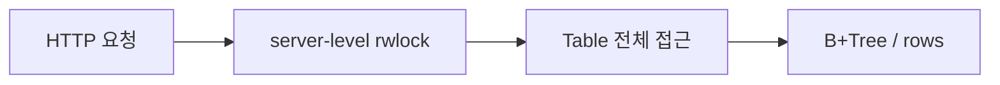

# 테이블 전체 락 문제와 해시 버킷 인덱스 락 전환 기록

## 목차

1. [문제 요약](#1-문제-요약)
2. [기존 코드 분석](#2-기존-코드-분석)
3. [수정 목표](#3-수정-목표)
4. [변경 플랜](#4-변경-플랜)
5. [실제 구현 내용](#5-실제-구현-내용)
6. [테스트 결과](#6-테스트-결과)
7. [TTL/timeout 기준](#7-ttltimeout-기준)
8. [정리](#8-정리)

---

## 1. 문제 요약

기존 구조는 `server/server.c`에서 `pthread_rwlock_t db_lock` 하나로 `Table` 전체를 감싸는 방식이었다.

이 구조는 단순하고 이해하기 쉽지만, 동시성 측면에서는 다음 문제가 있었다.

- `SELECT` 여러 개가 동시에 들어와도 결국 같은 전역 락을 공유했다.
- `INSERT`가 길어지면 다른 요청도 같이 지연될 수 있었다.
- 서로 다른 row를 만지는 요청도 같은 임계 구역에서 경쟁했다.
- 요청이 늘어날수록 hot spot이 생겨 전체 응답 시간이 흔들릴 수 있었다.

즉, 테이블 전체를 하나의 큰 자물쇠로 잠그는 구조라서, 작은 변경에도 전체가 영향을 받는 상태였다.

---

## 2. 기존 코드 분석

변경 전 코드는 다음 흐름이었다.

- `server/server.c`
  - `pthread_rwlock_t db_lock`를 생성하고 해제했다.
  - 요청 처리마다 `api_handle_query(table, &db_lock, sql, result)` 형태로 넘겼다.
- `server/api.c`
  - SQL 파싱 결과를 보고 `read lock` 또는 `write lock`을 직접 잡았다.
  - 락을 잡은 뒤 `sql_execute_plan()`을 호출했다.
- `sql_processor/table.c`
  - `rows` 배열 하나에 모든 record를 넣었다.
  - `pk_index`도 테이블 전체에 하나만 있었다.

이 구조를 그림으로 보면 다음과 같다.

문제는 `SELECT`가 읽기 요청이라도, 결국 테이블 전체 단위 락을 오래 쥐고 있으면 다른 요청이 같이 밀린다는 점이었다.

---

## 3. 수정 목표

이번 전환의 목표는 단순히 락 타입만 바꾸는 것이 아니었다.

목표는 세 가지였다.

1. 테이블 전체 락을 없앤다.
2. `id` 해시를 기준으로 버킷 단위 락을 둔다.
3. 기존 SQL/HTTP 테스트 결과는 최대한 그대로 유지한다.

핵심 아이디어는 다음과 같다.

- `id % TABLE_BUCKET_COUNT`로 버킷을 고른다.
- 각 버킷은 자기 `rows`, 자기 `B+Tree`, 자기 `pthread_rwlock_t`를 가진다.
- `SELECT`와 `INSERT`는 전역 락이 아니라 해당 버킷만 잠근다.

즉, 락의 단위를 `table-wide`에서 `bucket-unit`으로 내리는 것이다.

---

## 4. 변경 플랜

실제 수정은 아래 순서로 진행했다.

### 4-1. 자료구조 분리

- `Table` 안에 `TableBucket` 배열을 둔다.
- 각 `TableBucket`은 다음을 가진다.
  - `pthread_rwlock_t lock`
  - `Record **rows`
  - `size_t size`
  - `size_t capacity`
  - `BPTree *pk_index`

### 4-2. ID 발급 분리

- `next_id`는 여전히 전역적으로 증가해야 한다.
- 대신 ID 발급만 `pthread_mutex_t next_id_lock`으로 보호한다.
- 실제 row 접근은 버킷 락이 담당한다.

### 4-3. 조회 경로 정리

- `WHERE id = ...`는 해당 버킷의 B+Tree에서 바로 찾는다.
- `SELECT *`, `WHERE name`, `WHERE age`, `WHERE id >= ...` 같은 경로는 모든 버킷을 순회한다.
- 최종 결과는 id 오름차순으로 정렬해서 반환한다.

### 4-4. 서버 락 제거

- `server/server.c`와 `server/api.c`에서 전역 `db_lock`을 제거한다.
- SQL 실행은 테이블 내부 버킷 락에만 의존한다.

### 4-5. 테스트 보강

- 단위 테스트에 버킷 경계 테스트를 추가한다.
- 동시성 스트레스 테스트는 해시 충돌이 생기도록 조금 더 강하게 돌린다.

---

## 5. 실제 구현 내용

이번 변경의 핵심은 `sql_processor/table.h`와 `sql_processor/table.c`다.

### 5-1. 테이블 구조 변경

`Table`은 이제 전역 배열 하나가 아니라 버킷 배열을 가진다.

- `TABLE_BUCKET_COUNT = 16`
- `id % 16`으로 버킷 선택
- `next_id`는 `pthread_mutex_t`로 보호

### 5-2. 왜 버킷 수를 16으로 잡았나

버킷 수는 너무 적어도 안 되고, 너무 많아도 안 된다.

이번 프로젝트에서는 16이 가장 무난했다.

이유는 다음과 같다.

- **동시성 분산 효과가 있다**
  - 단일 락보다 훨씬 더 잘 쪼개진다.
  - 서로 다른 id가 같은 락에 몰릴 확률이 줄어든다.
- **구현과 디버깅이 단순하다**
  - 16개면 사람이 추적하기에도 지나치게 많지 않다.
  - 테스트와 설명 문서에도 버킷 충돌 패턴을 이해하기 쉽다.
- **메모리 오버헤드가 작다**
  - 각 버킷마다 별도 `rows`, `B+Tree`, `rwlock`이 있지만 16개 정도면 충분히 가볍다.
- **현재 과제 규모에 맞는다**
  - 이 프로젝트는 대규모 OLTP가 아니라 교육용 단일 테이블 서버다.
  - 따라서 16개 버킷이면 구조 개선 효과를 보여주기에 충분하다.

정리하면, 16은 “엄청 큰 수라서 성능이 좋아 보이는 숫자”가 아니라,
**지금 프로젝트 규모에서 동시성과 단순성의 균형이 가장 좋은 값**이다.

### 5-3. 버킷 락 방식

버킷마다 read-write lock을 두었다.

- `SELECT`는 해당 버킷의 read lock을 잡는다.
- `INSERT`는 해당 버킷의 write lock을 잡는다.
- 서로 다른 버킷이면 동시에 진행될 수 있다.

### 5-4. 조회 방식

조회 경로는 다음처럼 동작한다.

- `table_find_by_id()`
  - `id`가 속한 버킷만 읽는다.
  - 그 버킷의 B+Tree에서 바로 찾는다.
- `table_collect_all()`
  - 모든 버킷을 하나씩 읽어서 record 포인터를 모은다.
  - 최종 결과는 id 순으로 정렬한다.
- `table_find_by_name_matches()`
  - 모든 버킷을 순회하고 이름이 일치하는 row를 모은다.
- `table_find_by_age_condition()`
  - 모든 버킷을 순회하고 age 조건에 맞는 row를 모은다.

### 5-5. 서버 쪽 변경

- `server/api.h`
  - `api_handle_query()`에서 `db_lock` 인자를 제거했다.
- `server/api.c`
  - SQL 파싱 후 바로 `sql_execute_plan()`을 호출한다.
  - 더 이상 서버 전역 락을 잡지 않는다.
- `server/server.c`
  - `pthread_rwlock_t db_lock` 필드를 삭제했다.
  - `server_create()` / `server_destroy()`의 락 초기화·해제 코드도 삭제했다.

### 5-6. 보조 코드 수정

테이블 내부 구조가 바뀌면서 다음 보조 코드도 같이 손봤다.

- `sql_processor/unit_test.c`
- `sql_processor/cond10.c`
- `sql_processor/condition_perf_test.c`
- `sql_processor/Makefile`

특히 `sql_processor/Makefile`에는 `-pthread` 링크를 추가했다.

---

## 6. 테스트 결과

테스트는 다음 기준으로 정리했다.

### 6-1. 단위 테스트

추가한 확인 포인트:

- 버킷 경계를 넘는 insert/search가 정상인지
- `table_collect_all()`이 저장 순서와 무관하게 id 순으로 정렬하는지
- 기존 `SELECT` 결과가 깨지지 않는지

### 6-2. 동시성 스트레스 테스트

`scripts/tests/concurrency/rwlock-stress-test.sh`는 더 많은 `SELECT` / `INSERT`를 동시에 보낸다.

- 32쌍의 `SELECT` / `INSERT`
- 최종적으로 `row_count == 33`인지 확인
- 해시 충돌이 생겨도 결과가 누락되지 않는지 확인

### 6-3. 기대 효과

이 구조가 주는 실질적인 효과는 다음과 같다.

- 서로 다른 버킷은 동시에 처리될 수 있다.
- 테이블 전체를 잠그는 병목이 줄어든다.
- 기존 SQL 응답 포맷은 유지된다.
- 테스트도 버킷 경계와 동시성 상황을 더 잘 보게 된다.

---

## 7. TTL/timeout 기준

여기서 말하는 TTL은 캐시 만료 시간이 아니라,
실제 운영에서 락과 요청이 너무 오래 붙잡히지 않도록 보는 **시간 기준**으로 이해하는 것이 맞다.

이번 구조에 맞는 기준은 다음처럼 잡는 것이 현실적이다.

### 7-1. 버킷 락 보유 시간

- 정상적인 `INSERT` / `SELECT`는 버킷 락을 짧게만 쥐어야 한다.
- 로컬 개발 기준으로는 보통 수 ms 수준이면 충분하다.
- 특정 버킷이 계속 길게 잡히면 그 버킷이 hot spot이거나 SQL 경로가 지나치게 무거운 것이다.

### 7-2. HTTP 요청 타임아웃

- 느린 클라이언트 때문에 worker가 무한히 묶이면 안 된다.
- 그래서 소켓 read/write 타임아웃은 별도로 유지하는 것이 좋다.
- 현재 프로젝트 규모에서는 짧은 수 초 단위 timeout이 가장 무난하다.

### 7-3. 테스트 관점 기준

테스트에서 TTL/timeout을 볼 때는 다음처럼 판단하면 된다.

- 한 요청이 락 대기 때문에 오래 멈추지 않는가
- 특정 버킷에만 요청이 몰려도 전체 서버가 멈추지 않는가
- timeout이 지나치게 짧아서 정상 요청까지 끊지 않는가

정리하면, 이번 구조에서 중요한 건 “데이터 TTL”이 아니라 “락을 얼마나 오래 잡고 있느냐”다.

---

## 8. 정리

이번 변경으로 테이블 전체를 하나의 락으로 감싸던 구조를 버리고, `id` 해시를 기준으로 버킷 단위 락을 거는 구조로 바꿨다.

결과적으로:

- 전역 병목이 줄었다.
- 서로 다른 row 접근의 동시성이 좋아졌다.
- 기존 SQL/HTTP 응답 포맷은 유지했다.
- 테스트도 버킷 경계와 동시성 상황을 더 잘 보게 정리했다.

이제 이 프로젝트의 동시성 모델은 “테이블 전체를 한 번에 잠그는 방식”이 아니라,
“버킷 단위로 필요한 만큼만 잠그는 방식”으로 정리할 수 있다.
