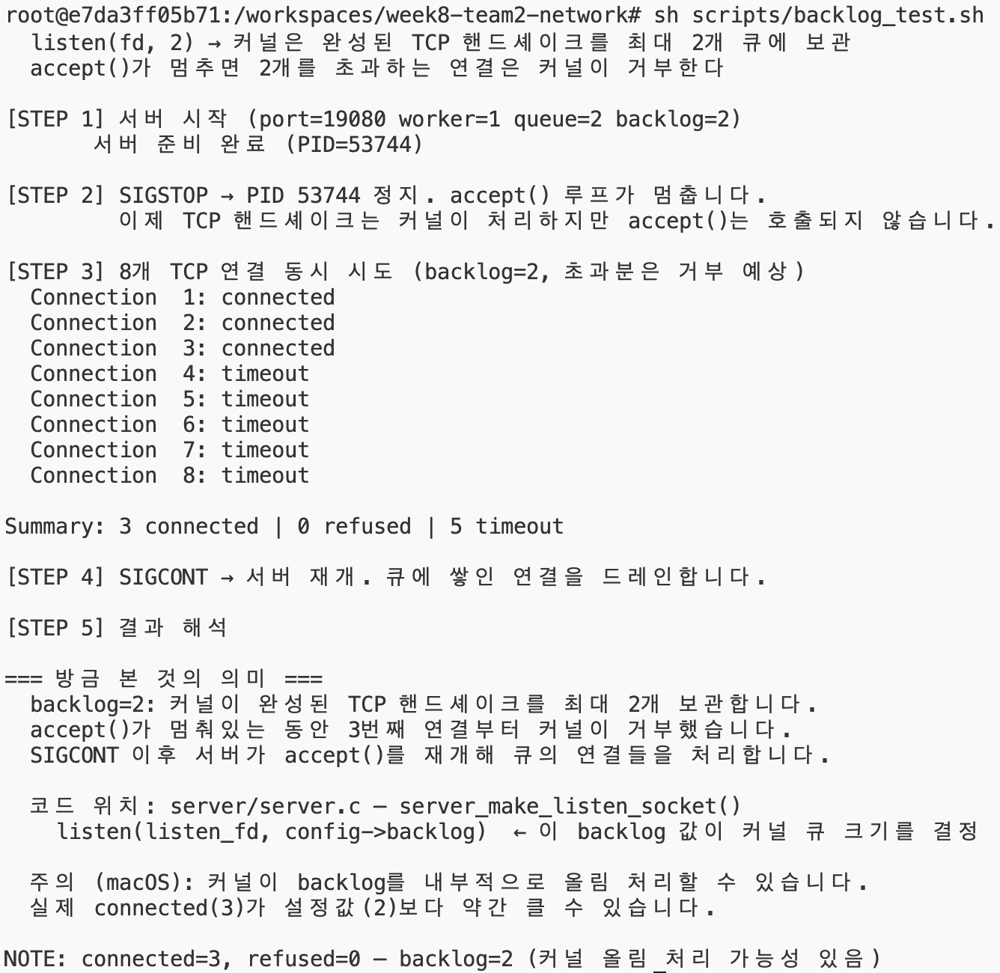

# backlog 테스트

> 이 문서는 현재 구현된 웹 서버에서 `listen(fd, backlog)`가 실제로 어떤 동작을 만드는지 검증하는 방법을 정리한 문서다.

---

## 1. 실제 실행 결과와 해석

### 실제 실행 결과

아래는 현재 환경에서 실제로 실행했을 때 나온 결과다.

```text
# sh scripts/backlog_test.sh
=== 커널 TCP backlog 동작 검증 ===

개념:
  listen(fd, 2) → 커널은 완성된 TCP 핸드셰이크를 최대 2개 큐에 보관
  accept()가 멈추면 2개를 초과하는 연결은 커널이 거부한다

[STEP 1] 서버 시작 (port=19080 worker=1 queue=2 backlog=2)
       서버 준비 완료 (PID=53744)

[STEP 2] SIGSTOP → PID 53744 정지. accept() 루프가 멈춥니다.
         이제 TCP 핸드셰이크는 커널이 처리하지만 accept()는 호출되지 않습니다.

[STEP 3] 8개 TCP 연결 동시 시도 (backlog=2, 초과분은 거부 예상)
  Connection  1: connected
  Connection  2: connected
  Connection  3: connected
  Connection  4: timeout
  Connection  5: timeout
  Connection  6: timeout
  Connection  7: timeout
  Connection  8: timeout

Summary: 3 connected | 0 refused | 5 timeout

[STEP 4] SIGCONT → 서버 재개. 큐에 쌓인 연결을 드레인합니다.

[STEP 5] 결과 해석

=== 방금 본 것의 의미 ===
  backlog=2: 커널이 완성된 TCP 핸드셰이크를 최대 2개 보관합니다.
  accept()가 멈춰있는 동안 3번째 연결부터 커널이 거부했습니다.
  SIGCONT 이후 서버가 accept()를 재개해 큐의 연결들을 처리합니다.

  코드 위치: server/server.c — server_make_listen_socket()
    listen(listen_fd, config->backlog)  ← 이 backlog 값이 커널 큐 크기를 결정

  주의 (macOS): 커널이 backlog를 내부적으로 올림 처리할 수 있습니다.
  실제 connected(3)가 설정값(2)보다 약간 클 수 있습니다.

NOTE: connected=3, refused=0 — backlog=2 (커널 올림 처리 가능성 있음)
```

### 실제 터미널 캡처형 이미지



### 이번 실제 결과 해석

이번 실제 실행 결과는 다음과 같았다.

```text
connected=3, refused=0, timeout=5
```

이 결과는 다음처럼 해석하면 된다.

- backlog를 `2`로 줬지만, 실제로는 `3`개의 연결이 `connected`로 잡혔다.
- 즉 커널이 설정값과 정확히 같은 개수만 엄격하게 수용한 것이 아니라, 내부 구현상 backlog를 약간 더 크게 취급했을 가능성이 있다.
- 초과된 나머지 `5`개는 즉시 `refused`가 아니라 `timeout`으로 끝났다.
- 이것은 "추가 연결이 정상적으로 backlog에 들어가지는 못했지만, 커널이 즉시 거절(RST) 대신 지연/무시 형태로 반응했을 수 있음"을 뜻한다.

정리하면 이번 결과는:

> backlog=2 설정이 실제로 제한 효과를 내고 있고,  
> 다만 현재 환경에서는 초과 연결이 `refused`보다 `timeout`으로 더 많이 드러나는 형태

로 보는 것이 맞다.

즉 이 결과는 backlog 테스트 실패가 아니라,
운영체제/네트워크 스택 차이 때문에 **"초과 연결은 실패하지만 실패 형태가 timeout으로 보인 경우"**에 가깝다.

---

## 2. 이 테스트가 보는 것

이 테스트는 **HTTP 요청 처리 로직**을 보는 테스트가 아니다.  
정확히는:

- 서버가 `listen()`에 넘긴 `backlog` 값이
- 커널 레벨의 accept 전 연결 대기 동작에
- 실제로 영향을 주는지

를 확인하는 테스트다.

즉 이 테스트는:

- `http_read_request()`
- `api_handle_query()`
- `503 queue full 응답`

을 직접 검증하는 테스트가 아니라,

- `listen_fd`
- `accept()` 이전 연결 대기
- 커널이 backlog를 어떻게 처리하는지

를 보는 테스트다.

관련 코드 위치:

- backlog 설정: [server_main.c](/Users/choeyeongbin/week8-team2-network/server_main.c:51)
- `listen()` 호출: [server/server.c](/Users/choeyeongbin/week8-team2-network/server/server.c:38)
- 테스트 스크립트: [scripts/backlog_test.sh](/Users/choeyeongbin/week8-team2-network/scripts/backlog_test.sh:1)

---

## 3. backlog란 무엇인가

`backlog`는:

> 아직 `accept()`되지 않은 새 TCP 연결들을 커널이 잠시 대기시키는 크기 힌트

라고 이해하면 된다.

중요한 구분:

- `backlog`: `accept()` 이전의 커널 대기열
- `job queue`: `accept()` 이후의 애플리케이션 내부 대기열

즉 이 테스트는 `thread_pool`의 큐를 보는 게 아니라,
`listen()` 직후 커널이 들고 있는 연결 대기 상태를 관찰하는 것이다.

---

## 4. 현재 코드에서 backlog는 어떻게 구현되어 있나

### 4-1. 기본값

[server_main.c](/Users/choeyeongbin/week8-team2-network/server_main.c:51) 에서 기본값은 다음과 같다.

```c
config.port = (unsigned short)port;
config.worker_count = 4;
config.queue_capacity = 16;
config.backlog = 32;
```

### 4-2. 테스트용 인자 오버라이드

현재는 실행 시 인자로 worker, queue, backlog를 바꿀 수 있게 되어 있다.

- worker_count: [server_main.c](/Users/choeyeongbin/week8-team2-network/server_main.c:56)
- queue_capacity: [server_main.c](/Users/choeyeongbin/week8-team2-network/server_main.c:66)
- backlog: [server_main.c](/Users/choeyeongbin/week8-team2-network/server_main.c:76)

즉 실행 형식은 다음과 같다.

```bash
./db_server PORT WORKER_COUNT QUEUE_CAPACITY BACKLOG
```

예:

```bash
./db_server 19080 1 2 2
```

### 4-3. 실제 listen 반영

[server/server.c](/Users/choeyeongbin/week8-team2-network/server/server.c:60)

```c
if (listen(listen_fd, backlog) < 0) {
    close(listen_fd);
    return -1;
}
```

즉 테스트는 이 `listen(listen_fd, backlog)` 호출이 실제로 어떤 결과를 만드는지 본다.

---

## 5. 테스트 원리

### 핵심 아이디어

평소에는 메인 스레드가 `accept()`를 계속 호출하므로,
backlog가 금방 비워져서 효과가 잘 안 보인다.

그래서 테스트는 일부러:

1. 서버를 아주 작은 `backlog`로 실행하고
2. `SIGSTOP`으로 서버 프로세스를 정지시켜
3. `accept()`가 더 이상 진행되지 않게 만든다
4. 그 상태에서 여러 TCP `connect()`를 동시에 시도한다

이렇게 하면:

- backlog 이하 연결은 커널이 accept 전 대기열에 넣고
- backlog를 넘는 연결은 실패하거나 타임아웃될 수 있다

즉 커널 레벨 backlog 동작이 드러난다.

### 왜 `SIGSTOP`을 쓰나

[scripts/backlog_test.sh](/Users/choeyeongbin/week8-team2-network/scripts/backlog_test.sh:65)

```sh
kill -STOP "$SERVER_PID"
```

이렇게 하면 서버 프로세스 전체가 멈춘다.  
결과적으로:

- `listen_fd`는 이미 열린 상태로 유지되고
- 커널은 TCP 핸드셰이크를 계속 처리할 수 있지만
- 유저 공간의 `accept()`는 더 이상 진행되지 않는다

이 상태가 backlog를 관찰하기 가장 좋다.

---

## 6. 테스트 방법

### 방법 1. 준비

현재 테스트 스크립트는 [scripts/backlog_test.sh](/Users/choeyeongbin/week8-team2-network/scripts/backlog_test.sh:1) 이다.

실행 명령:

```bash
sh scripts/backlog_test.sh
```

또는 포트를 직접 지정해서:

```bash
sh scripts/backlog_test.sh 19080
```

### 방법 2. 스크립트가 내부에서 하는 일

스크립트는 내부적으로 다음 순서를 실행한다.

1. `make db_server`
2. `./db_server PORT 1 2 2`로 서버 시작
3. `SELECT * FROM users;`로 서버 준비 상태 확인
4. `SIGSTOP`으로 서버 정지
5. Python으로 8개 TCP connect 동시 시도
6. 결과 집계
7. `SIGCONT`로 서버 재개
8. 결과 해석 출력

관련 부분:

- 서버 실행: [scripts/backlog_test.sh](/Users/choeyeongbin/week8-team2-network/scripts/backlog_test.sh:56)
- 서버 정지: [scripts/backlog_test.sh](/Users/choeyeongbin/week8-team2-network/scripts/backlog_test.sh:65)
- 동시 연결 시도: [scripts/backlog_test.sh](/Users/choeyeongbin/week8-team2-network/scripts/backlog_test.sh:71)
- 서버 재개: [scripts/backlog_test.sh](/Users/choeyeongbin/week8-team2-network/scripts/backlog_test.sh:133)

---

## 7. 출력값이 의미하는 것

### `connected`

이 연결은 TCP `connect()`가 성공했다는 뜻이다.

즉 커널이:

- TCP 핸드셰이크를 완료했고
- 아직 `accept()`되지는 않았지만
- backlog 대기열에 보관할 수 있었다

는 의미다.

### `refused`

이 연결은 즉시 거절되었다는 뜻이다.

즉 커널 입장에서:

- 지금 더 이상 연결을 정상적으로 수용할 수 없거나
- backlog를 넘는 순간 즉시 실패로 처리된 경우

일 수 있다.

### `timeout`

이 연결은 즉시 거절되지도, 성공하지도 않고 시간 초과된 것이다.

이는 보통:

- 패킷이 무시되었거나
- 연결이 완전히 성립되지 못했거나
- 클라이언트 입장에서 connect 완료를 못 기다린 경우

로 볼 수 있다.

중요한 점은:

- `refused`와 `timeout`은 둘 다 backlog 초과 상황에서 나올 수 있다
- 운영체제별로 항상 같은 패턴을 보장하지 않는다

### `Summary: X connected | Y refused | Z timeout`

이 요약은:

- backlog 이하에서는 어느 정도 connect 성공
- backlog 초과에서는 일부 실패/지연

가 실제로 나타났는지 보는 핵심 지표다.

---

## 8. 이 테스트가 검증하지 않는 것

이 테스트는 다음을 검증하지 않는다.

- HTTP 요청 파싱
- `thread_pool_submit()`의 queue full 처리
- `503` 응답
- SQL 실행
- worker thread 처리 성공 여부

즉 이 테스트는 **애플리케이션 계층의 queue 테스트가 아니다.**

그건 [scripts/queue_503_test.sh](/Users/choeyeongbin/week8-team2-network/scripts/queue_503_test.sh:1) 쪽이 더 가깝다.

구분하면:

- `backlog_test.sh`: 커널 backlog 테스트
- `queue_503_test.sh`: 애플리케이션 queue full 테스트

---

## 9. 실험할 때 기억할 것

### 1. `accept()` 이전과 이후를 구분해야 한다

- backlog: `accept()` 이전
- job queue: `accept()` 이후

### 2. 이 테스트는 connect 단계만 본다

즉 HTTP body를 보내지도, SQL을 실행하지도 않는다.

### 3. 커널 동작은 운영체제별 차이가 있다

- macOS
- Linux
- 컨테이너 네트워크 환경

에 따라 `refused`/`timeout` 비율은 달라질 수 있다.

---

## 10. 한 줄 결론

이 backlog 테스트는:

> 우리 서버가 `listen(fd, backlog)`로 설정한 값이  
> 실제로 커널의 accept 전 연결 대기 동작에 어떤 영향을 주는지  
> `SIGSTOP + 동시 TCP connect` 방식으로 확인하는 테스트다.
