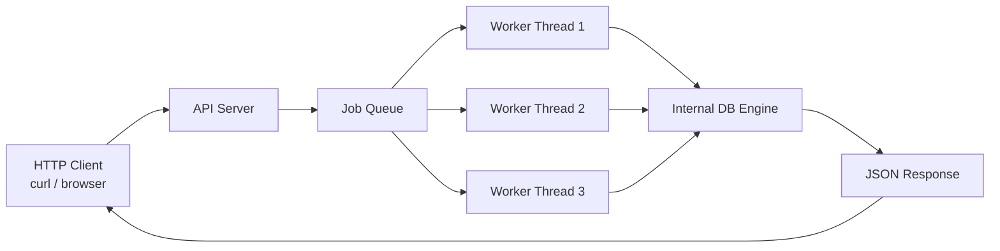
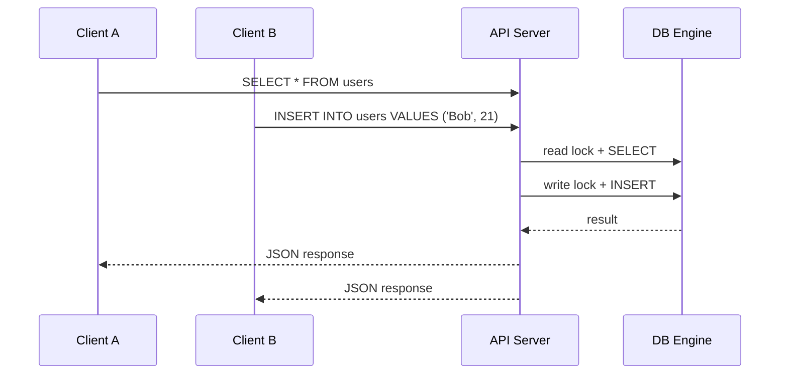
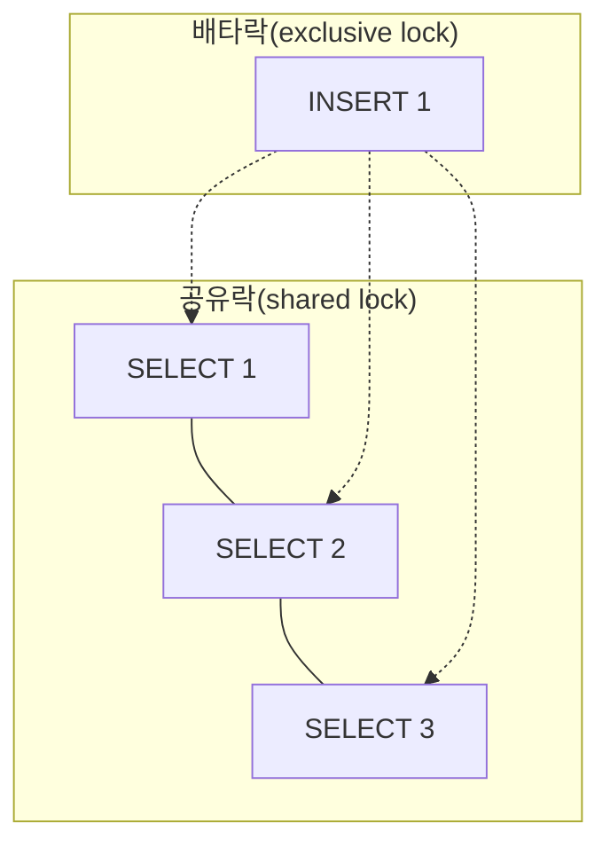

# 데모 시나리오

이 문서는 아래 3가지를 한 번의 시연 안에서 자연스럽게 보여주기 위한 발표용 시나리오다.

- 멀티 스레드 동시성 이슈
- 내부 DB 엔진과 외부 API 서버 사이 연결
- API 서버 아키텍처

목표는 단순히 "기능이 된다"를 보여주는 것이 아니라,

- 왜 락이 필요한지
- 요청이 어떻게 서버를 통과하는지
- 어떤 구조로 병렬 처리를 하고 있는지

를 짧은 시간 안에 납득시키는 것이다.

## 1. 배치/셸 데모 실행

발표에서는 손으로 한 줄씩 치는 방식보다, 배치 또는 셸 런처 하나로 순서대로 돌리는 편이 훨씬 보기 좋다.

### 공통 실행

```bash
make demo
```

기본 데모는 3초 안팎으로 끝나는 `rwlock quick demo`를 포함한다.
긴 동시성 스트레스는 `DEMO_INCLUDE_LONG_CONCURRENCY=1 make demo`일 때만 추가로 돌린다.

### Windows 실행

```bat
scripts\demo\demo_scenario.bat
```

### macOS 실행

```bash
sh scripts/demo/demo_scenario.sh
```

포트를 바꾸고 싶으면 둘 다 인자를 넘길 수 있다.

```bat
scripts\demo\demo_scenario.bat 18080
```

```bash
sh scripts/demo/demo_scenario.sh 18080
```

전제 조건:

- Windows와 macOS 모두 Docker가 설치되어 있어야 한다.
- Docker Desktop 또는 Docker 엔진이 실행 중이어야 한다.
- Docker Compose가 동작해야 한다.
- 저장소 루트에서 실행해야 한다.
- 컨테이너 안에서 `make`, `curl`, `db_server` 빌드 환경이 준비되어야 한다.

### 기대 결과값

실행이 정상적으로 끝나면 콘솔에는 아래 흐름이 순서대로 보여야 한다.

#### 1) 내부 DB 엔진과 API 서버 연결

```text
==========================================
[1/3] Internal DB engine and API server link
==========================================
```

이 뒤에 `manual-query.sh` 출력이 나오고, 핵심은 다음 값이다.

- `INSERT INTO users VALUES ('Alice', 20);`
  - `ok: true`
  - `action: insert`
  - `inserted_id: 1`
  - `row_count: 1`
- `SELECT * FROM users WHERE id = 1;`
  - `ok: true`
  - `action: select`
  - `row_count: 1`
  - `rows` 안에 `Alice`

예상 응답 형태는 대략 아래처럼 보인다.

```json
{
  "ok": true,
  "action": "insert",
  "inserted_id": 1,
  "row_count": 1
}
```

```json
{
  "ok": true,
  "action": "select",
  "row_count": 1,
  "rows": [
    {
      "id": 1,
      "name": "Alice",
      "age": 20
    }
  ]
}
```

#### 2) 멀티 스레드 동시성 이슈

```text
==========================================
[2/3] Multithread concurrency issue
==========================================
```

이 단계의 성공 기준은 아래와 같다.

- 동시 요청이 모두 정상 처리된다.
- 최종 검증에서 row 수가 기대값과 맞는다.
- 마지막에 `rwlock quick demo test passed.`가 출력된다.

즉, 이 단계에서는 읽기와 쓰기가 동시에 와도 결과가 깨지지 않는다는 점을 짧게 보여준다.

긴 스트레스 테스트는 발표 본편이 아니라 옵션 부록이다.

#### 3) API 서버 아키텍처

```text
==========================================
[3/3] API server architecture
==========================================
```

이 단계의 성공 기준은 아래와 같다.

- `workers=4`
- `queue=16`
- `total_capacity=20`
- `Summary: 20 OK | 5 503 | 0 other`
- 마지막에 `PASS`

또한 서버 로그에서 아래 키워드가 보이면 아키텍처 설명이 쉽다.

- `[QUEUE] submit`
- `[QUEUE] dequeue`
- `[QUEUE] done`
- `[QUEUE] FULL`
- `503`

#### 최종 종료 메시지

정상 종료라면 마지막에 아래 문구가 나온다.

```text
Demo finished successfully
```

### 발표 때 강조할 포인트

- 1단계는 "외부 HTTP 요청이 내부 DB 엔진으로 연결된다"는 것을 보여주는 장면이다.
- 2단계는 "읽기/쓰기 동시성도 짧게 확인된다"는 것을 보여주는 장면이다.
- 3단계는 "스레드풀과 큐로 API 서버의 병렬 처리와 과부하 제어를 한다"는 것을 보여주는 장면이다.

## 2. 데모 한 줄 요약

사용자가 HTTP로 SQL을 보내면, API 서버가 요청을 받아 worker thread에 넘기고, 내부 DB 엔진이 락과 함께 SQL을 실행한 뒤, JSON 응답으로 다시 돌려준다.

즉, 이 프로젝트는 단순한 DB가 아니라

- 외부 요청을 받는 API 서버
- 그 안에서 병렬 요청을 처리하는 스레드풀
- 내부에서 실제 데이터를 다루는 DB 엔진

이 세 층이 맞물려 돌아가는 구조다.

## 3. 데모에서 보여줄 핵심 포인트

### 포인트 1. 멀티 스레드 동시성 이슈

같은 시점에 여러 요청이 들어오면, 읽기와 쓰기가 서로 충돌할 수 있다.

- `SELECT`는 읽기 요청이다.
- `INSERT`는 쓰기 요청이다.
- 읽기는 동시에 가능하지만, 쓰기는 독점적으로 처리해야 한다.

이 장면을 통해 "왜 락이 필요한가"를 보여준다.

### 포인트 2. 내부 DB 엔진과 외부 API 서버의 연결

클라이언트는 DB 엔진을 직접 건드리지 않는다.
HTTP 요청만 보낸다.

즉,

- 외부에서는 `curl` 같은 HTTP 클라이언트가 접근하고
- 내부에서는 API 서버가 SQL을 받아
- 최종적으로 DB 엔진이 실행한다.

이 흐름을 보여주면 "서버와 엔진이 어떻게 분리되어 있는지"가 분명해진다.

### 포인트 3. API 서버 아키텍처

하나의 요청이 들어오면 서버는 다음처럼 동작한다.

1. 메인 thread가 연결을 받는다.
2. job queue에 요청을 넣는다.
3. worker thread가 요청을 꺼낸다.
4. worker가 SQL을 실행한다.
5. 결과를 JSON으로 응답한다.

이 흐름을 통해 스레드풀과 락이 각각 어떤 역할을 하는지 보여준다.

## 4. 전체 데모 흐름

추천 순서는 아래와 같다.

### 1단계. 서버 기동

서버를 먼저 실행한다.

```bash
make db_server
./db_server 18080
```

설명 포인트:

- 서버가 HTTP 요청을 받는 외부 진입점이다.
- 내부에서는 worker thread가 요청을 처리한다.
- 이 시점에서 이미 API 서버 아키텍처를 암시할 수 있다.

### 2단계. 초기 데이터 1개 준비

데모를 보기 쉽게 seed row를 하나 넣는다.

```bash
curl -sS -X POST http://localhost:18080/query \
  -H "Content-Type: text/plain" \
  --data-raw "INSERT INTO users VALUES ('Seed', 1);"
```

설명 포인트:

- 지금부터 이 row가 기준점이 된다.
- 이후 읽기와 쓰기 결과를 비교할 때 눈으로 확인하기 쉽다.

### 3단계. 읽기와 쓰기를 동시에 보낸다

아래처럼 `SELECT`와 `INSERT`를 동시에 보낸다.

```bash
curl -sS -X POST http://localhost:18080/query \
  -H "Content-Type: text/plain" \
  --data-raw "SELECT * FROM users;" &

curl -sS -X POST http://localhost:18080/query \
  -H "Content-Type: text/plain" \
  --data-raw "INSERT INTO users VALUES ('Bob', 21);" &

wait
```

설명 포인트:

- `SELECT`는 read lock을 잡는다.
- `INSERT`는 write lock을 잡는다.
- read lock은 공유 가능하지만, write lock은 배타적이다.
- 따라서 "읽기는 같이, 쓰기는 혼자"라는 개념이 실제로 어떻게 동작하는지 보여준다.

### 4단계. 결과를 다시 확인한다

```bash
curl -sS -X POST http://localhost:18080/query \
  -H "Content-Type: text/plain" \
  --data-raw "SELECT * FROM users;"
```

설명 포인트:

- 최종 row가 2개 이상이 되면 쓰기 요청이 정상 반영된 것이다.
- 동시에 보낸 요청이 서버를 깨뜨리지 않고 순서 있게 처리되었는지 확인할 수 있다.

### 5단계. 에러 요청도 짧게 보여준다

옵션이지만, 시간이 허용되면 아래 같은 요청도 한 번 보여주면 좋다.

```bash
curl -sS -X GET http://localhost:18080/query
```

설명 포인트:

- HTTP 메서드 검증이 되는지 확인할 수 있다.
- 서버가 단순히 SQL만 처리하는 것이 아니라 프로토콜 수준의 방어도 하고 있음을 보여준다.

## 5. 세 요소를 한 장면으로 연결하는 방법

이 데모는 각 요소를 따로 설명하지 말고, 아래 순서로 연결하면 이해가 빠르다.

### 장면 A. 멀티 스레드 동시성 이슈

"지금 동시에 두 요청을 보냈다. 읽기와 쓰기가 겹치면 데이터가 꼬일 수 있다."

여기서 락의 필요성을 말한다.

### 장면 B. 내부 DB 엔진과 외부 API 서버의 연결

"사용자는 DB 엔진에 직접 들어오지 않고, HTTP API 서버를 통해 들어온다."

여기서 외부 API 서버와 내부 DB 엔진의 경계를 보여준다.

### 장면 C. API 서버 아키텍처

"요청은 main thread가 받고, worker thread가 실행하며, queue와 lock으로 병렬성을 관리한다."

여기서 전체 구조를 정리한다.

## 6. 구조도

### 전체 흐름



### 락이 필요한 장면



### 공유락과 배타락



## 7. 발표 멘트 예시

아래처럼 말하면 흐름이 자연스럽다.

1. "이 프로젝트는 단순한 DB가 아니라 HTTP API 서버와 내부 DB 엔진이 분리된 구조입니다."
2. "요청은 스레드풀로 분산되고, 실제 SQL 실행은 락을 통해 보호됩니다."
3. "읽기 요청은 공유 가능하지만, 쓰기 요청은 배타적이어야 해서 read lock과 write lock을 구분했습니다."
4. "그래서 동시에 `SELECT`와 `INSERT`를 보내도 데이터가 꼬이지 않고 정상적으로 처리됩니다."

## 8. 데모에서 강조할 결과

데모가 끝났을 때 청중이 기억해야 하는 결론은 아래 3개다.

- 멀티 스레드 환경에서는 락이 없으면 읽기와 쓰기가 충돌할 수 있다.
- API 서버는 클라이언트와 DB 엔진 사이의 중간 계층으로 동작한다.
- 이 프로젝트는 thread pool, queue, rwlock을 사용해 병렬성과 안정성을 함께 잡았다.

## 9. 추천 데모 길이

- 짧게: 3분
- 보통: 5분
- 길게: 7분

발표 시간이 짧으면 1단계부터 4단계까지만 보여도 충분하다.

## 10. 같이 보면 좋은 파일

- [`server/server.c`](../../../server/server.c)
- [`server/api.c`](../../../server/api.c)
- [`sql_processor/sql.c`](../../../sql_processor/sql.c)
- [`scripts/rwlock_stress_test.sh`](../../../scripts/rwlock_stress_test.sh)
- [`docs/test/demo/rwlock-test.md`](rwlock-test.md)

## 11. 한 줄 결론

이 데모는 "동시성 문제를 락으로 제어하고, 외부 HTTP 요청을 내부 DB 엔진으로 안전하게 연결하는 API 서버 구조"를 보여주는 시나리오다.

## 12. 배치/셸 런처로 돌리는 버전

발표용 데모는 손으로 한 줄씩 입력하기보다, 배치 또는 셸 런처 하나로 순서대로 돌리는 편이 훨씬 보기 좋다.

권장 실행 래퍼:

- [`scripts/demo/demo_scenario.bat`](../../../scripts/demo/demo_scenario.bat)
- [`scripts/demo/demo_scenario.sh`](../../../scripts/demo/demo_scenario.sh)

이 실행 파일들은 Docker Compose를 통해 데모 전용 컨테이너를 띄운 뒤, 그 안에서 실제 시나리오를 순서대로 실행한다.

1. 내부 DB 엔진과 API 서버 연결을 먼저 보여준다.
2. 이어서 `rwlock_stress_test`로 멀티 스레드 동시성 이슈를 보여준다.
3. 마지막으로 `multi_client_demo.sh`로 API 서버 아키텍처와 큐/워커 흐름을 보여준다.

출력에서 특히 봐야 할 부분은 아래와 같다.

- `SQL>`와 JSON 응답이 함께 보이면, HTTP API를 통해 DB 엔진과 연결된다는 뜻이다.
- `SELECT`와 `INSERT`를 동시에 보내도 결과가 정상이라면, read lock / write lock이 제대로 작동한 것이다.
- `[STEP 1]`, `[STEP 2]`, `[STEP 3]` 같은 구분선이 있으면 발표자가 장면 전환을 설명하기 쉽다.
- `[QUEUE]`, `Worker`, `503` 같은 로그가 보이면 API 서버 아키텍처와 부하 제어 포인트를 강조하기 좋다.

배치파일을 쓸 때의 장점은 다음과 같다.

- 발표자가 입력 실수할 가능성이 줄어든다.
- 같은 순서로 항상 재현된다.
- 출력에 강조할 장면이 명확하게 남는다.
