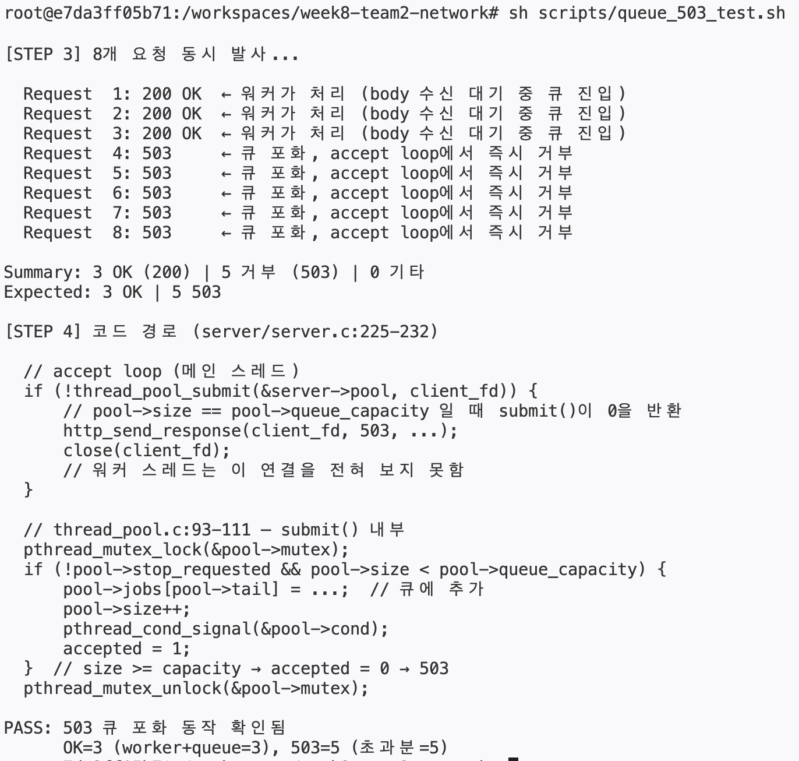

# queue full / 503 테스트 가이드

> 이 문서는 현재 구현된 웹 서버에서 `thread_pool_submit()` 실패 시 `HTTP 503`을 즉시 반환하는 동작을 실제로 어떻게 확인할 수 있는지 정리한 문서다.

---

## 1. 실제 실행 결과

아래는 현재 환경에서 실제로 실행했을 때 나온 결과다.

```text
# sh scripts/queue_503_test.sh
=== thread_pool 큐 포화 / HTTP 503 동작 검증 ===

[STEP 1] 서버 시작 (port=19081 worker=1 queue=2)
       서버 준비 완료 (PID=58647)

[STEP 2] 용량 계산
  workers=1 + queue=2 = 3  (최대 동시 처리 가능 요청 수)
  4번째 연결부터 thread_pool_submit()이 0을 반환 → HTTP 503

  슬로우 바디 트릭:
    헤더만 먼저 전송 (Content-Length 선언) → 워커가 recv()에서 블로킹
    4초 후 body 전송 → 워커 해제

[STEP 3] 8개 요청 동시 발사...

  Request  1: 200 OK  ← 워커가 처리 (body 수신 대기 중 큐 진입)
  Request  2: 200 OK  ← 워커가 처리 (body 수신 대기 중 큐 진입)
  Request  3: 200 OK  ← 워커가 처리 (body 수신 대기 중 큐 진입)
  Request  4: 503     ← 큐 포화, accept loop에서 즉시 거부
  Request  5: 503     ← 큐 포화, accept loop에서 즉시 거부
  Request  6: 503     ← 큐 포화, accept loop에서 즉시 거부
  Request  7: 503     ← 큐 포화, accept loop에서 즉시 거부
  Request  8: 503     ← 큐 포화, accept loop에서 즉시 거부

Summary: 3 OK (200) | 5 거부 (503) | 0 기타
Expected: 3 OK | 5 503

[STEP 4] 코드 경로 (server/server.c:225-232)

  // accept loop (메인 스레드)
  if (!thread_pool_submit(&server->pool, client_fd)) {
      // pool->size == pool->queue_capacity 일 때 submit()이 0을 반환
      http_send_response(client_fd, 503, ...);
      close(client_fd);
      // 워커 스레드는 이 연결을 전혀 보지 못함
  }

  // thread_pool.c:93-111 — submit() 내부
  pthread_mutex_lock(&pool->mutex);
  if (!pool->stop_requested && pool->size < pool->queue_capacity) {
      pool->jobs[pool->tail] = ...;  // 큐에 추가
      pool->size++;
      pthread_cond_signal(&pool->cond);
      accepted = 1;
  }  // size >= capacity → accepted = 0 → 503
  pthread_mutex_unlock(&pool->mutex);

PASS: 503 큐 포화 동작 확인됨
      OK=3 (worker+queue=3), 503=5 (초과분=5)
```

### 실제 터미널 캡처형 이미지



---

## 2. 실제 결과 해석

이번 실제 결과의 핵심 숫자는 다음이다.

```text
3 OK (200) | 5 거부 (503) | 0 기타
```

이 값은 현재 테스트 설정과 정확히 맞아떨어진다.

- `worker=1`
- `queue=2`
- 따라서 최대 동시 수용 가능 연결 수는 `1 + 2 = 3`

즉:

- 첫 3개 연결은 서버가 받아서 처리 경로로 진입할 수 있었고
- 나머지 5개 연결은 `thread_pool_submit()`에서 거절되어 `503`을 받았다

### 왜 첫 3개가 모두 `200 OK`인가

이 테스트는 “슬로우 바디 트릭”을 사용한다.

- 헤더만 먼저 보내고
- body는 4초 뒤에 보낸다

그러면 첫 번째 요청은 실제 워커가 `recv()`에서 블로킹되고,
두 번째와 세 번째 요청은 큐에 쌓여 있다가 나중에 처리된다.

즉 결과적으로:

- 워커가 하나 처리 중
- 큐에 두 개 대기 중
- 총 세 개가 수용된 상태가 된다

### 왜 4번째부터 `503`인가

메인 스레드의 accept loop는 새 연결을 받자마자
`thread_pool_submit(&server->pool, client_fd)`를 호출한다.

이때 큐가 이미 꽉 차 있으면:

- `thread_pool_submit()`이 `0`을 반환하고
- 서버는 즉시 `503` 응답을 보내고
- `client_fd`를 닫는다

즉 이 결과는 **애플리케이션 내부 queue full 정책이 정확히 발동한 것**이다.

### 이 결과는 실제 코드가 측정한 값인가

결론부터 말하면:

- `Request 1~8`의 상태값
- `Summary`
- `PASS/NOTE`

이 부분은 Python 코드가 실제로 각 연결의 결과를 측정해서 동적으로 출력한 값이다.

반면 아래 부분은 설명용으로 고정 출력한 문구다.

- `[STEP 2] 용량 계산`
- `슬로우 바디 트릭` 설명
- `[STEP 4] 코드 경로` 아래의 코드 블록 설명

즉 이 테스트 출력은:

- **실측 결과**
- **해석을 돕는 설명 문구**

가 함께 섞여 있는 구조다.

---

## 3. 이 테스트가 실제로 검증하는 것

이 테스트는 backlog 테스트가 아니라 **애플리케이션 계층 queue full 테스트**다.

정확히는:

- 메인 스레드가 `accept()`로 연결을 받음
- `thread_pool_submit()`으로 job queue에 넣으려 시도
- 큐가 가득 차면 `503`을 반환

이 흐름을 검증한다.

관련 코드 위치:

- `accept()`와 503 분기: [server/server.c](/Users/choeyeongbin/week8-team2-network/server/server.c:214)
- `thread_pool_submit()` 내부: [server/thread_pool.c](/Users/choeyeongbin/week8-team2-network/server/thread_pool.c:93)
- 테스트 스크립트: [scripts/queue_503_test.sh](/Users/choeyeongbin/week8-team2-network/scripts/queue_503_test.sh:1)

---

## 4. 테스트 원리

### 핵심 아이디어

현재 서버에서 queue full을 보기 어려운 이유는,
요청이 너무 빨리 처리되면 큐가 쉽게 비기 때문이다.

그래서 테스트는 일부러 워커를 오래 점유한다.

### 슬로우 바디 트릭

[scripts/queue_503_test.sh](/Users/choeyeongbin/week8-team2-network/scripts/queue_503_test.sh:97)

Python 쪽에서 HTTP 헤더만 먼저 보내고, body는 나중에 보낸다.

```python
s.sendall(headers)
...
time.sleep(HOLD)
s.sendall(SQL)
```

이렇게 하면:

- 워커가 `http_read_request()` 안에서 body를 기다리며 블로킹되고
- 그동안 메인 스레드는 새 연결을 계속 받아 큐에 넣으려 시도한다

그래서 queue가 꽉 찬 순간 이후의 연결은 `503`을 받게 된다.

### 이 테스트가 backlog 테스트와 다른 점

- backlog 테스트: `accept()` 이전의 커널 대기열을 봄
- queue 503 테스트: `accept()` 이후의 애플리케이션 내부 큐를 봄

즉 이 테스트는 `listen(backlog)`가 아니라
`thread_pool_submit()`의 실패 경로를 검증한다.

---

## 5. 테스트 방법

### 실행 명령

레포 루트에서 실행한다.

```bash
sh scripts/queue_503_test.sh
```

또는 포트를 직접 지정해서:

```bash
sh scripts/queue_503_test.sh 19081
```

### 스크립트가 내부에서 하는 일

스크립트는 내부적으로 다음 순서를 실행한다.

1. `make db_server`
2. `./db_server PORT 1 2 5`로 서버 시작
3. `SELECT * FROM users;`로 서버 준비 상태 확인
4. Python으로 8개 요청을 동시에 발사
5. 헤더만 먼저 보내 worker를 점유
6. 나머지 연결이 queue full로 `503`을 받는지 확인
7. 결과를 집계해 `PASS` 또는 `NOTE` 출력

관련 코드:

- 서버 실행: [scripts/queue_503_test.sh](/Users/choeyeongbin/week8-team2-network/scripts/queue_503_test.sh:56)
- 동시 요청 발사: [scripts/queue_503_test.sh](/Users/choeyeongbin/week8-team2-network/scripts/queue_503_test.sh:75)
- 최종 assert: [scripts/queue_503_test.sh](/Users/choeyeongbin/week8-team2-network/scripts/queue_503_test.sh:191)

---

## 6. 실제 출력값이 의미하는 것

### `200 OK`

이 연결은:

- 큐 진입에 성공했고
- 결국 워커가 처리해서
- 정상 HTTP 응답을 돌려준 경우다.

### `503`

이 연결은:

- 메인 스레드가 `accept()`는 했지만
- `thread_pool_submit()`에서 큐가 가득 차서 실패했고
- 서버가 즉시 `503`을 보낸 경우다.

### `기타`

이 값은 현재 기대하지 않는 결과다.

예를 들어:

- 연결 실패
- 예상 못 한 HTTP 상태
- 타이밍 이슈

가 있을 때 집계될 수 있다.

---

## 7. 이 테스트가 검증하지 않는 것

이 테스트는 다음을 직접 검증하지 않는다.

- 커널 backlog 동작
- `listen(fd, backlog)`의 효과
- `accept()` 이전 연결 대기열

즉 이 테스트는 **backlog 테스트가 아니라 queue full 테스트**다.

구분하면:

- `backlog_test.sh`: 커널 backlog 테스트
- `queue_503_test.sh`: 애플리케이션 queue 503 테스트

---

## 8. 한 줄 결론

이 테스트는:

> 현재 웹 서버에서 worker 하나와 queue 두 칸을 인위적으로 꽉 채운 뒤,  
> 초과 연결이 `thread_pool_submit()` 실패 경로를 타서 실제로 `503`을 반환하는지 확인하는 테스트다.
