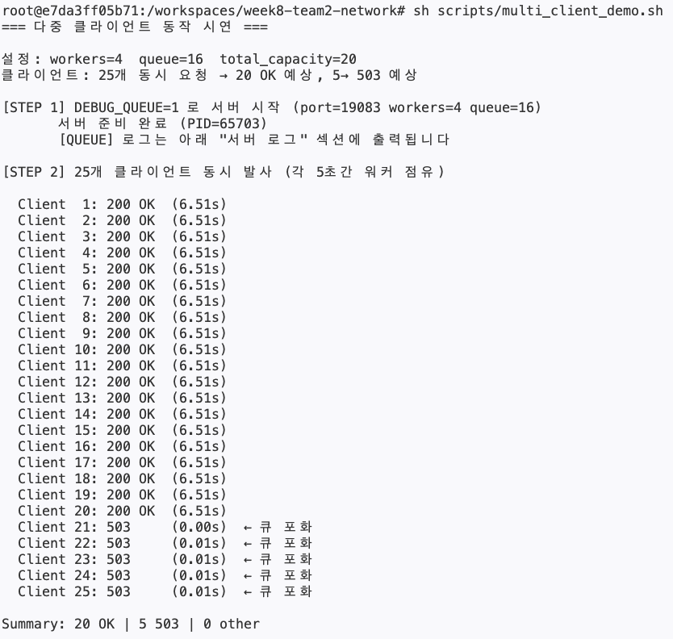
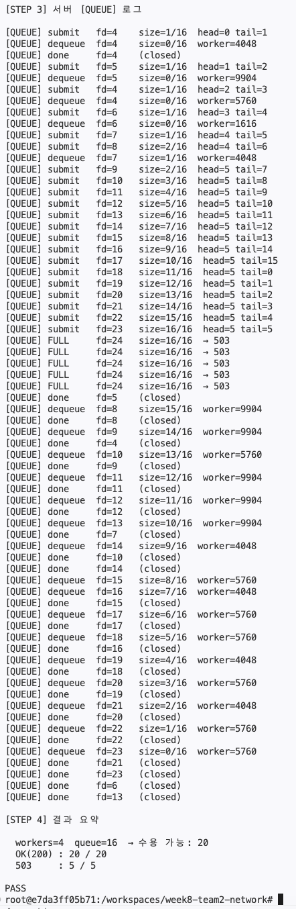
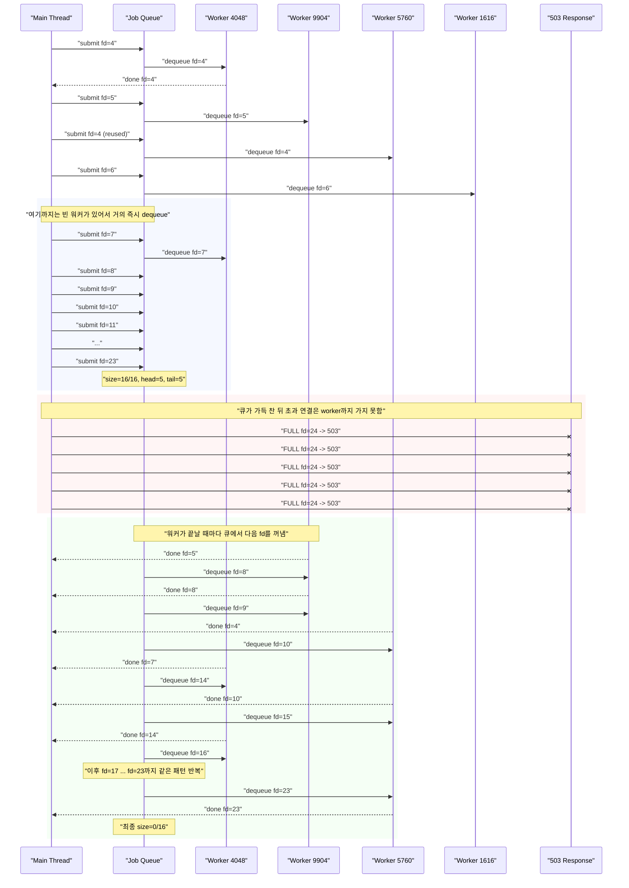

# multi client / queue log 시연 가이드

> 이 문서는 `DEBUG_QUEUE=1` 상태에서 여러 클라이언트가 동시에 접속했을 때, 메인 스레드가 `client_fd`를 큐에 넣고 워커 스레드가 작업을 꺼내 처리하는 흐름을 실제 로그로 확인하는 자료다.

---

## 1. 실제 실행 결과

아래는 현재 환경에서 실제로 실행했을 때 나온 결과다.

```text
# sh scripts/multi_client_demo.sh
=== 다중 클라이언트 동작 시연 ===

설정: workers=4  queue=16  total_capacity=20
클라이언트: 25개 동시 요청 → 20 OK 예상, 5→ 503 예상

[STEP 1] DEBUG_QUEUE=1 로 서버 시작 (port=19083 workers=4 queue=16)
       서버 준비 완료 (PID=65703)
       [QUEUE] 로그는 아래 "서버 로그" 섹션에 출력됩니다

[STEP 2] 25개 클라이언트 동시 발사 (각 5초간 워커 점유)

  Client  1: 200 OK  (6.51s)
  Client  2: 200 OK  (6.51s)
  Client  3: 200 OK  (6.51s)
  Client  4: 200 OK  (6.51s)
  Client  5: 200 OK  (6.51s)
  Client  6: 200 OK  (6.51s)
  Client  7: 200 OK  (6.51s)
  Client  8: 200 OK  (6.51s)
  Client  9: 200 OK  (6.51s)
  Client 10: 200 OK  (6.51s)
  Client 11: 200 OK  (6.51s)
  Client 12: 200 OK  (6.51s)
  Client 13: 200 OK  (6.51s)
  Client 14: 200 OK  (6.51s)
  Client 15: 200 OK  (6.51s)
  Client 16: 200 OK  (6.51s)
  Client 17: 200 OK  (6.51s)
  Client 18: 200 OK  (6.51s)
  Client 19: 200 OK  (6.51s)
  Client 20: 200 OK  (6.51s)
  Client 21: 503     (0.00s)  ← 큐 포화
  Client 22: 503     (0.01s)  ← 큐 포화
  Client 23: 503     (0.01s)  ← 큐 포화
  Client 24: 503     (0.01s)  ← 큐 포화
  Client 25: 503     (0.01s)  ← 큐 포화

Summary: 20 OK | 5 503 | 0 other

[STEP 3] 서버 [QUEUE] 로그

[QUEUE] submit   fd=4    size=1/16  head=0 tail=1
[QUEUE] dequeue  fd=4    size=0/16  worker=4048
[QUEUE] done     fd=4    (closed)
[QUEUE] submit   fd=5    size=1/16  head=1 tail=2
[QUEUE] dequeue  fd=5    size=0/16  worker=9904
[QUEUE] submit   fd=4    size=1/16  head=2 tail=3
[QUEUE] dequeue  fd=4    size=0/16  worker=5760
[QUEUE] submit   fd=6    size=1/16  head=3 tail=4
[QUEUE] dequeue  fd=6    size=0/16  worker=1616
[QUEUE] submit   fd=7    size=1/16  head=4 tail=5
[QUEUE] submit   fd=8    size=2/16  head=4 tail=6
[QUEUE] dequeue  fd=7    size=1/16  worker=4048
[QUEUE] submit   fd=9    size=2/16  head=5 tail=7
[QUEUE] submit   fd=10   size=3/16  head=5 tail=8
[QUEUE] submit   fd=11   size=4/16  head=5 tail=9
[QUEUE] submit   fd=12   size=5/16  head=5 tail=10
[QUEUE] submit   fd=13   size=6/16  head=5 tail=11
[QUEUE] submit   fd=14   size=7/16  head=5 tail=12
[QUEUE] submit   fd=15   size=8/16  head=5 tail=13
[QUEUE] submit   fd=16   size=9/16  head=5 tail=14
[QUEUE] submit   fd=17   size=10/16  head=5 tail=15
[QUEUE] submit   fd=18   size=11/16  head=5 tail=0
[QUEUE] submit   fd=19   size=12/16  head=5 tail=1
[QUEUE] submit   fd=20   size=13/16  head=5 tail=2
[QUEUE] submit   fd=21   size=14/16  head=5 tail=3
[QUEUE] submit   fd=22   size=15/16  head=5 tail=4
[QUEUE] submit   fd=23   size=16/16  head=5 tail=5
[QUEUE] FULL     fd=24   size=16/16  → 503
[QUEUE] FULL     fd=24   size=16/16  → 503
[QUEUE] FULL     fd=24   size=16/16  → 503
[QUEUE] FULL     fd=24   size=16/16  → 503
[QUEUE] FULL     fd=24   size=16/16  → 503
[QUEUE] done     fd=5    (closed)
[QUEUE] dequeue  fd=8    size=15/16  worker=9904
[QUEUE] done     fd=8    (closed)
[QUEUE] dequeue  fd=9    size=14/16  worker=9904
[QUEUE] done     fd=4    (closed)
[QUEUE] dequeue  fd=10   size=13/16  worker=5760
[QUEUE] done     fd=9    (closed)
[QUEUE] dequeue  fd=11   size=12/16  worker=9904
[QUEUE] done     fd=11   (closed)
[QUEUE] dequeue  fd=12   size=11/16  worker=9904
[QUEUE] done     fd=12   (closed)
[QUEUE] dequeue  fd=13   size=10/16  worker=9904
[QUEUE] done     fd=7    (closed)
[QUEUE] dequeue  fd=14   size=9/16  worker=4048
[QUEUE] done     fd=10   (closed)
[QUEUE] done     fd=14   (closed)
[QUEUE] dequeue  fd=15   size=8/16  worker=5760
[QUEUE] dequeue  fd=16   size=7/16  worker=4048
[QUEUE] done     fd=15   (closed)
[QUEUE] dequeue  fd=17   size=6/16  worker=5760
[QUEUE] done     fd=17   (closed)
[QUEUE] dequeue  fd=18   size=5/16  worker=5760
[QUEUE] done     fd=16   (closed)
[QUEUE] dequeue  fd=19   size=4/16  worker=4048
[QUEUE] done     fd=18   (closed)
[QUEUE] dequeue  fd=20   size=3/16  worker=5760
[QUEUE] done     fd=19   (closed)
[QUEUE] dequeue  fd=21   size=2/16  worker=4048
[QUEUE] done     fd=20   (closed)
[QUEUE] dequeue  fd=22   size=1/16  worker=5760
[QUEUE] done     fd=22   (closed)
[QUEUE] dequeue  fd=23   size=0/16  worker=5760
[QUEUE] done     fd=21   (closed)
[QUEUE] done     fd=23   (closed)
[QUEUE] done     fd=6    (closed)
[QUEUE] done     fd=13   (closed)

[STEP 4] 결과 요약

  workers=4  queue=16  → 수용 가능: 20
  OK(200) : 20 / 20
  503     : 5 / 5

PASS
root@e7da3ff05b71:/workspaces/week8-team2-network#
```

### 실제 실행 이미지

첫 번째 이미지는 클라이언트 결과 중심, 두 번째 이미지는 `[QUEUE]` 로그 중심으로 확인하면 된다.





---

## 2. fd 흐름 시각화

아래 그림은 방금 본 `[QUEUE]` 로그를 `fd` 기준으로 단순화해 그린 것이다.

- `submit`: 메인 스레드가 큐에 넣음
- `dequeue`: 워커가 큐에서 꺼냄
- `done`: 처리 완료 후 소켓 종료
- `FULL`: 큐 포화로 즉시 `503`



### 이 그림에서 봐야 할 핵심

- 처음 4개 `fd`는 워커 4개가 바로 가져간다.
- 그 다음 들어온 `fd=7`부터 `fd=23`까지는 큐에 순서대로 쌓인다.
- `fd=23` 시점에 큐가 `16/16`으로 꽉 찬다.
- 그 뒤 도착한 연결은 워커에게 전달되지 못하고 즉시 `503`으로 끝난다.
- 워커가 하나 끝날 때마다 큐의 앞쪽 `fd`를 하나씩 꺼내 간다.

### `fd=4`가 두 번 보이는 이유

로그에서 `fd=4`가 다시 등장하는 것은 같은 클라이언트가 다시 온 것이 아니라, 이전 소켓이 닫힌 뒤 운영체제가 같은 파일 디스크립터 번호를 재사용했기 때문이다.

즉:

- 첫 번째 `fd=4`와
- 나중에 다시 나온 `fd=4`

는 서로 다른 연결일 수 있다.

---

## 3. 실제 결과 해석

이번 결과의 핵심은 아래 두 줄이다.

```text
Summary: 20 OK | 5 503 | 0 other
workers=4  queue=16  → 수용 가능: 20
```

현재 설정에서는 동시에 감당할 수 있는 요청 수가 `4 + 16 = 20`이다.

- 워커 4개는 즉시 실행 중인 요청 4개를 처리한다.
- 큐 16칸은 아직 워커가 가져가지 않은 요청 16개를 잠시 보관한다.
- 그래서 총 20개까지는 받아들일 수 있다.

이번 실행에서는 클라이언트가 25개였으므로:

- 앞의 20개는 `200 OK`
- 초과한 5개는 `503`

가 나온다.

### 왜 503이 거의 즉시 돌아오는가

`503`을 받은 요청은 워커가 처리하다 실패한 것이 아니라, 메인 스레드가 큐에 넣는 단계에서 바로 거절된 것이다.

즉 흐름은 다음과 같다.

1. `accept()`로 새 TCP 연결을 받는다.
2. `thread_pool_submit()`으로 큐에 넣으려 한다.
3. 이미 `size == queue_capacity`면 큐에 넣지 못한다.
4. 서버가 즉시 `503` 응답을 보내고 소켓을 닫는다.

그래서 `Client 21~25`는 `0.00s`, `0.01s`처럼 거의 바로 끝난다.

### 왜 200 OK는 전부 6.51초 정도 걸렸는가

스크립트는 각 요청이 바로 끝나지 않도록 일부러 워커를 오래 점유한다.

- 헤더를 먼저 보내고
- body는 `5초` 뒤에 보내며
- 그동안 워커는 `recv()`에서 body를 기다린다

그래서 처음 처리되는 요청뿐 아니라 큐에 대기하던 요청들도 전체적으로 비슷한 완료 시간대로 보인다.

---

## 4. [QUEUE] 로그가 뜻하는 것

이 데모의 핵심은 `[QUEUE] submit`, `[QUEUE] dequeue`, `[QUEUE] done`, `[QUEUE] FULL` 네 종류의 로그를 실제로 보는 것이다.

### `submit`

예:

```text
[QUEUE] submit   fd=17   size=10/16  head=5 tail=15
```

뜻:

- 메인 스레드가 새 `client_fd`를 큐에 넣었다
- 현재 큐 크기는 `10/16`
- `tail`은 다음 삽입 위치를 가리킨다

### `dequeue`

예:

```text
[QUEUE] dequeue  fd=17   size=6/16  worker=5760
```

뜻:

- 어떤 워커 스레드가 큐에서 `fd=17`을 꺼냈다
- 이제 그 워커가 해당 연결을 실제 처리하러 간다
- `size`가 줄어든 것은 큐에서 하나 빠졌기 때문이다

### `done`

예:

```text
[QUEUE] done     fd=17   (closed)
```

뜻:

- 워커가 요청 처리를 끝냈다
- 응답 전송까지 마치고 소켓을 닫았다

### `FULL`

예:

```text
[QUEUE] FULL     fd=24   size=16/16  → 503
```

뜻:

- 큐가 이미 꽉 찼다
- 메인 스레드가 이 연결을 큐에 넣지 못했다
- 이 연결은 워커에게 전달되지 않고 즉시 `503`이 반환된다

---

## 5. 이 로그로 확인할 수 있는 구현 포인트

이 자료는 현재 코드가 단순히 “스레드 여러 개를 만든다” 수준이 아니라, 실제로 **공용 큐 기반 producer-consumer 패턴**으로 동작한다는 것을 보여준다.

확인 포인트는 다음과 같다.

- 메인 스레드가 producer 역할을 한다.
- 워커 스레드들이 consumer 역할을 한다.
- 메인 스레드는 특정 워커를 직접 선택하지 않는다.
- 큐에 작업을 넣고 `pthread_cond_signal()`로 대기 중인 워커 하나를 깨운다.
- 깨어난 워커가 큐에서 작업 하나를 꺼내 처리한다.

관련 코드 위치:

- accept 후 submit: [server/server.c](/Users/choeyeongbin/week8-team2-network/server/server.c:214)
- 큐 삽입과 signal: [server/thread_pool.c](/Users/choeyeongbin/week8-team2-network/server/thread_pool.c:112)
- 워커의 cond_wait/dequeue: [server/thread_pool.c](/Users/choeyeongbin/week8-team2-network/server/thread_pool.c:22)

---

## 6. 테스트 원리

이 데모는 짧은 요청을 그냥 많이 보내는 방식이 아니라, 큐가 눈에 보일 만큼 차도록 워커를 의도적으로 점유시키는 방식으로 구현되어 있다.

### 슬로우 바디 방식

[scripts/multi_client_demo.sh](/Users/choeyeongbin/week8-team2-network/scripts/multi_client_demo.sh:63)

스크립트 안 Python 코드는:

- TCP 연결을 연다
- HTTP 헤더만 먼저 전송한다
- 잠시 기다린다
- body를 나중에 전송한다

이렇게 하면 워커가 `recv()`에서 body를 기다리며 잠시 묶인다.

그 결과:

- 새로운 연결들이 계속 큐에 쌓이고
- 큐가 가득 차면 초과 연결은 `503`
- 이후 워커가 하나씩 dequeue 하며 처리

라는 흐름이 눈에 보이게 된다.

---

## 7. 테스트 방법

레포 루트에서 실행한다.

```bash
sh scripts/multi_client_demo.sh
```

포트를 바꾸고 싶으면:

```bash
sh scripts/multi_client_demo.sh 19083
```

스크립트는 내부적으로 다음 순서로 동작한다.

1. `make db_server`
2. `DEBUG_QUEUE=1`로 서버 실행
3. 준비 요청으로 서버 기동 확인
4. 25개 클라이언트를 동시에 전송
5. 결과 상태와 실행 시간 집계
6. 서버의 `[QUEUE]` 로그 출력
7. 기대치와 실제 결과 비교 후 `PASS` 출력

---

## 8. 한 줄 결론

이 데모는 현재 웹 서버가 `accept() → queue submit → worker dequeue → 처리 완료` 흐름으로 실제 동작하며, `workers + queue_capacity`를 초과한 연결은 워커에 가기 전 단계에서 즉시 `503`으로 거절된다는 것을 실측 로그로 보여준다.
